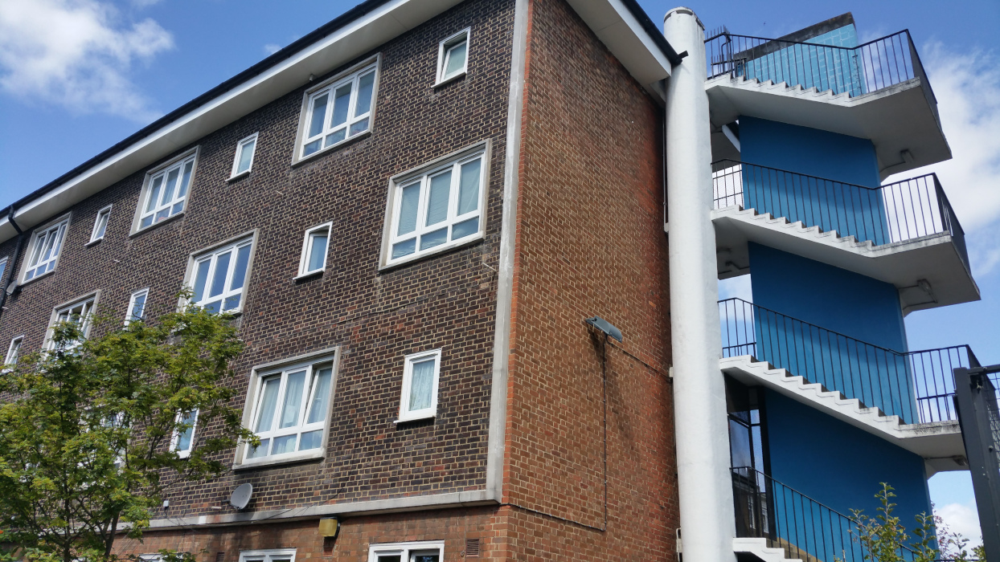
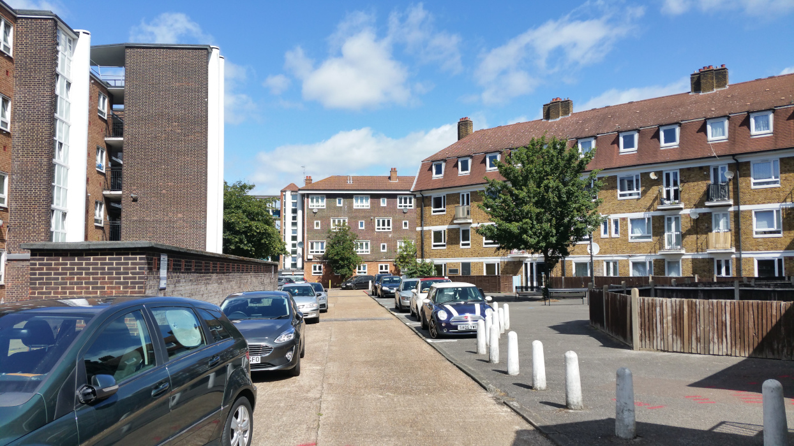
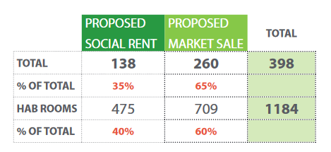
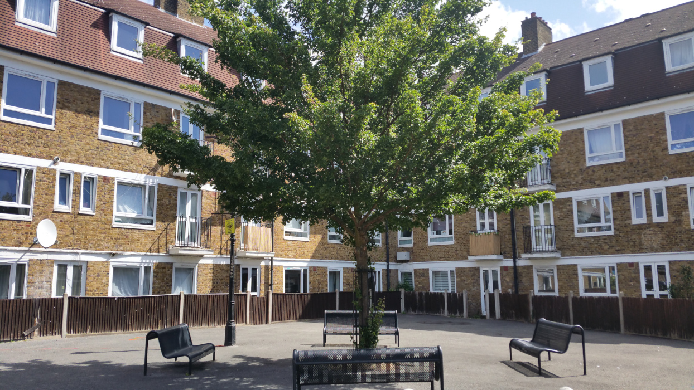
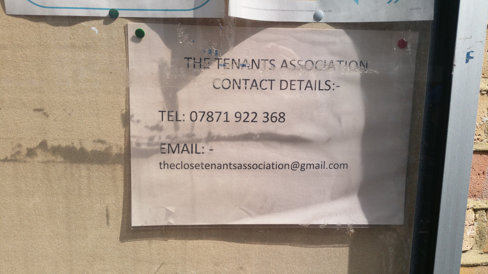
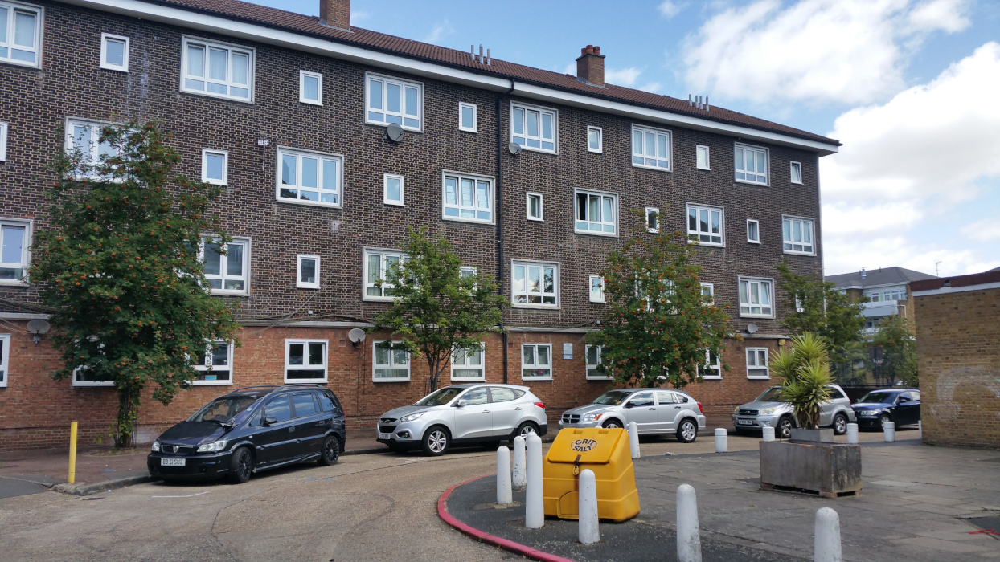
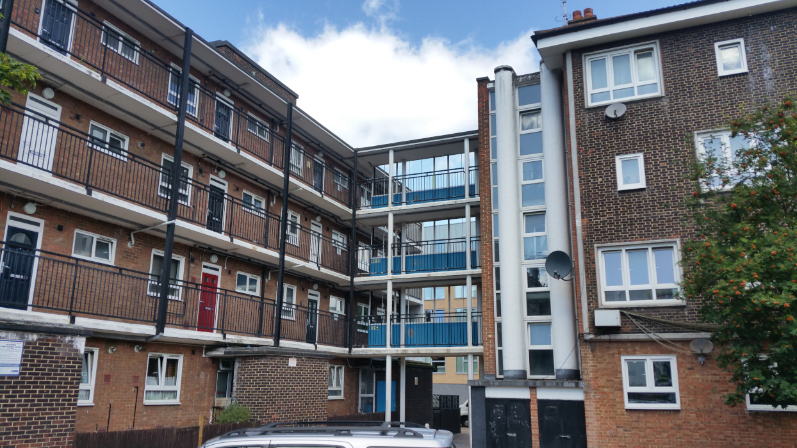
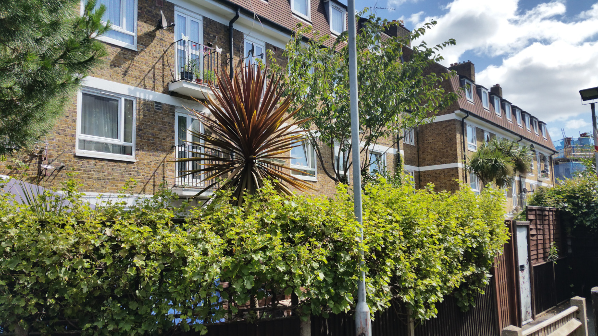
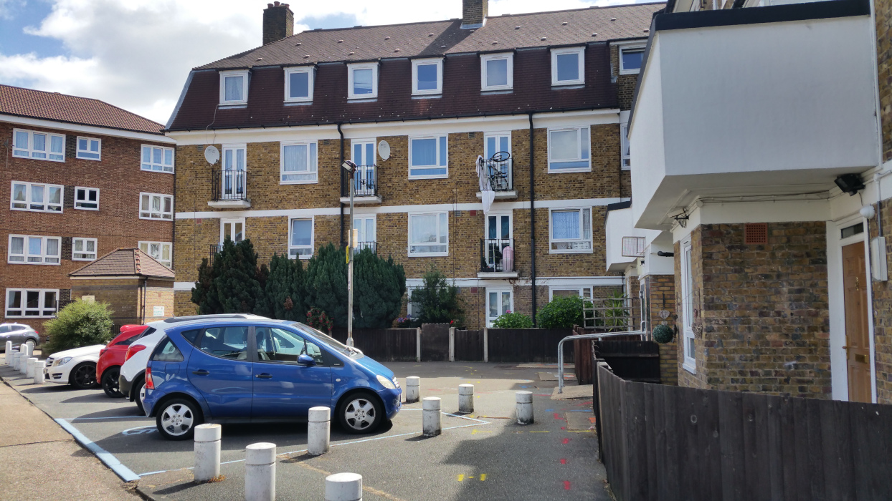

134 homes are earmarked for demolition on Lambeth's Geoffrey Close estate near Coldharbour Lane.

Housing association Riverside Homes, which manages the estate, [wants to replace it](https://www.riverside.org.uk/redevelopment-projects/lambeth-estate-revitalising-your-neighbourhood/about-the-redevelopment-of-the-lambeth-estate/) with 400 new homes, 135 of which at London Affordable Rent.

In December 2018, 67% of residents who voted in the ballot voted in favour of redevelopment. The scheme is being [funded](https://www.london.gov.uk/programmes-strategies/housing-and-land/homes-londoners/estate-regeneration/estate-regeneration-data) by the Mayor in a joint venture between Riverside and Bellway Homes.

In November 2020, Riverside applied for planning permission to demolish the estate's 134 homes and replace them with 441 homes of which just 135 social rent.

In December, the Mayor published his [stage 1 planning report](https://gla.force.com/pr/s/planning-application/a0i4J000002TXIGQA4/20206691?tabset-c2f3b=2) in response to the planning application. 

The report is critical of Riverside's proposal to gate the entire development (para 39) and failure to re-provide the ball court (para 43). It also criticises the uplift of just one social rented home, despite a near fourfold increase in the total number of homes - _"It is disappointing that, given the significant uplift in housing across the site, the uplift in affordable housing is just one unit."_ (para 49)

The report also takes issue with Riverside's failure to consider alternatives to demolition (para 31) and has requested more information to be submitted, but it is otherwise silent on the application's failure to meet the Mayor's key policy requirement of min 50% affordable housing, which applies to all estate redevelopments.

Interestingly, the report does raise the issue that residents were balloted on a different tenure mix to that now being proposed (para 30).

The tenure mix in Riverside's [Landlord Offer](http://estatewatch.london/images/geoffreycloseoffer.pdf) to residents at the time of the ballot was as follows:

But the tenure mix proposed in its planning application includes an extra 43 homes in total, while reducing the number of social rented habitable rooms by 44 to 431 and increasing the number of market sale habitable rooms by 72 to 781.

While it is good to see the Mayor's planning report pick this up, it is disappointing to see that the Mayor proposes to take no action. The Mayor has provisionally granted £10M funding to this scheme. He ought to be using this leverage to ensure it complies with his basic policy requirements, not just on ballots and affordable housing tenure mix, but also on the more fundamental question of whether these buildings need to be demolished in the first place.

You can view the Mayor's report [here](https://gla.force.com/pr/s/planning-application/a0i4J000002TXIGQA4/20206691?tabset-c2f3b=2), the full planning application documents (except the financial viability assessment which hasn't been published) on Lambeth's planning portal [here](https://planning.lambeth.gov.uk/online-applications/applicationDetails.do?activeTab=documents&keyVal=QHD9R4BO08M00).

---

__Links:__  
Riverside Homes website: [https://www.riverside.org.uk/redevelopment-projects/lambeth-estate-revitalising-your-neighbourhood/about-the-redevelopment-of-the-lambeth-estate/](https://www.riverside.org.uk/redevelopment-projects/lambeth-estate-revitalising-your-neighbourhood/about-the-redevelopment-of-the-lambeth-estate/)

---

<!------------THE CODE BELOW RENDERS THE MAP - DO NOT EDIT! ---------------------------->

---

  
  
  
  
  
  
  
  
