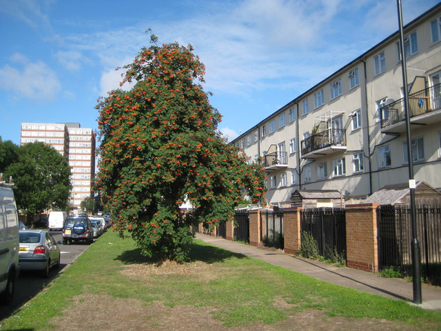
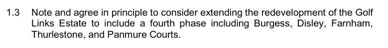
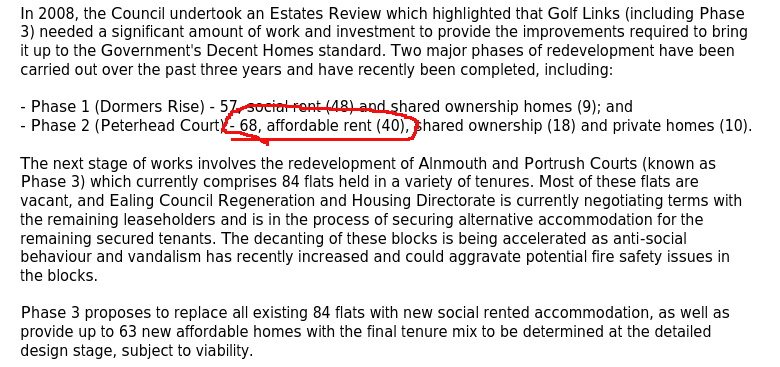
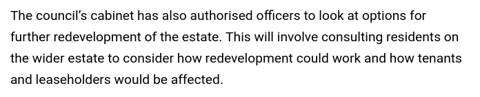

Circa 500 homes on the Golf Links estate in Ealing are under threat of demolition.

The regeneration of the Golf Links estate in Ealing was originally supposed to involve the redevelopment of just four low-rise blocks in 3 phases - (Phase 1 - Dormers Rise, Phase 2 - Peterhead Court, phase 3 - Alnmouth & Portrush blocks). 

In October 2018, Ealing Council [resolved](https://ealing.cmis.uk.com/ealing/Document.ashx?czJKcaeAi5tUFL1DTL2UE4zNRBcoShgo=T29KJkkv6%2B%2FEOf%2F4pv0XwtQAUSiI7enW%2FlmOaGncZVyUQOQgHSXqXw%3D%3D&rUzwRPf%2BZ3zd4E7Ikn8Lyw%3D%3D=pwRE6AGJFLDNlh225F5QMaQWCtPHwdhUfCZ%2FLUQzgA2uL5jNRG4jdQ%3D%3D&mCTIbCubSFfXsDGW9IXnlg%3D%3D=hFflUdN3100%3D&kCx1AnS9%2FpWZQ40DXFvdEw%3D%3D=hFflUdN3100%3D&uJovDxwdjMPoYv%2BAJvYtyA%3D%3D=ctNJFf55vVA%3D&FgPlIEJYlotS%2BYGoBi5olA%3D%3D=NHdURQburHA%3D&d9Qjj0ag1Pd993jsyOJqFvmyB7X0CSQK=ctNJFf55vVA%3D&WGewmoAfeNR9xqBux0r1Q8Za60lavYmz=ctNJFf55vVA%3D&WGewmoAfeNQ16B2MHuCpMRKZMwaG1PaO=ctNJFf55vVA%3D) to extend the regeneration involving the further demolition of circa 100 homes in a fourth phase. 

[Planning documents](https://pam.ealing.gov.uk/online-applications/files/1A94F26AEA7C2972AE82D84340938FCF/pdf/195348OUT-195348OUT_OFFICER_REPORT.PDF-3329656.pdf) confirm that the Peterhead Court phase was replaced with affordable rented homes (up to 80% market rent) rather than social rent and that the tenure mix of phase 3 will determined at detailed application stage 'subject to viability'.

The [planning application](https://pam.ealing.gov.uk/online-applications/applicationDetails.do?previousCaseType=Property&keyVal=Q2PTX9JMFLT00&previousCaseNumber=NOJRHB00DT01J&previousCaseUprn=000012015925&activeTab=summary&previousKeyVal=NOJRHB00DT01K) for phase 3 was approved by Ealing Council on 30 April 2020 (ref:195348OUT).

The ballot had taken place in March 2022 and the results were 82% in favour of the redevelopment of the estate (turnout unknown). However, a top-up ballot was agreed to be held at the request of the GLA where residents of phases 1 and 2, and of Sheringham Tower, would be asked to vote on the proposals. The results of this ballot have not been made public.

Ealing Council subsequently [announced](https://www.ealing.gov.uk/info/201104/housing_regeneration/372/golf_links_estate/2) that it is looking at options for the further redevelopment of the estate beyond phase 4:

---

<!------------THE CODE BELOW RENDERS THE MAP - DO NOT EDIT! ---------------------------->

---
