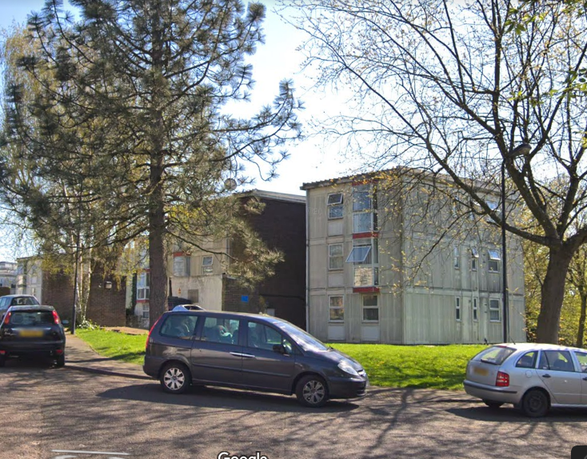
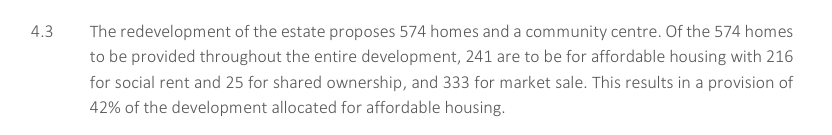
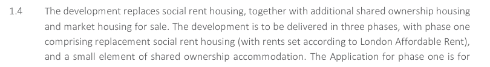
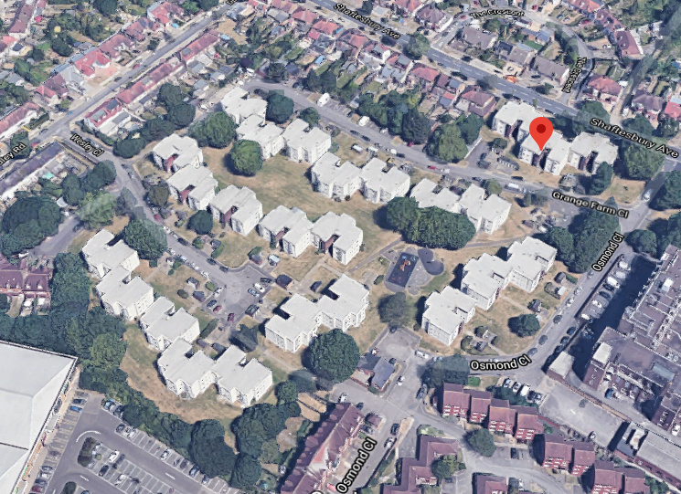

282 homes have been earmarked for demolition on Harrow's Grange Farm estate.

The scheme is being [progressed with Mayoral funding](/approved/funding) despite not having balloted residents on the demolition of their homes or applying for an [exemption](/approved/ballotexemptions). The Mayor says that ballots are a requirement for receiving funding but appears to have turned a blind eye to this estate regeneration. 

Planning permission was granted in March 2019, with detailed consent for Phase 1 (89 homes) and outline consent for Phases 2 and 3.

Harrow's [planning application documents](https://planningsearch.harrow.gov.uk/civica/Resource/Civica/Handler.ashx/Doc/pagestream?cd=inline&pdf=true&docno=10424727) provide details of the proposed tenure mix of the 574 new homes:

It also confirms that the replacement 'social' housing will be at London Affordable Rent levels.

This appears to contradict the conclusions in the [Mayor's report](https://www.london.gov.uk/sites/default/files/public%3A//public%3A//PAWS/media_id_460660///grange_farm_estate_report.pdf) which says that it has been secured at 'target rent' levels.

There is no publicly available section 106 agreement to confirm the exact tenure of the replacement 'social' housing or whether it has been secured in perpetuity.

In September 2020, Harrow [served a compulsory purchase order](https://www.harrow.gov.uk/housing-property/grange-farm-estate/2) on the estate's remaining residents.

---

__Links:__

[Planning application documents](https://planningsearch.harrow.gov.uk/planning/search-applications#VIEW?RefType=GFPlanning&KeyNo=852234&KeyText=Subject)

[GLA stage 1 and stage 2 reports](https://www.london.gov.uk/sites/default/files/public%3A//public%3A//PAWS/media_id_460660///grange_farm_estate_report.pdf)

---

<!------------THE CODE BELOW RENDERS THE MAP - DO NOT EDIT! ---------------------------->

---

 