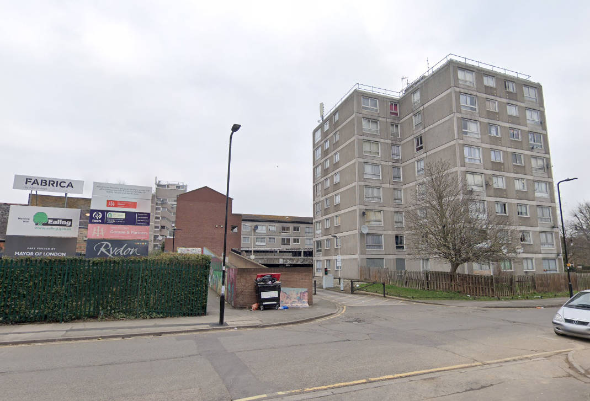
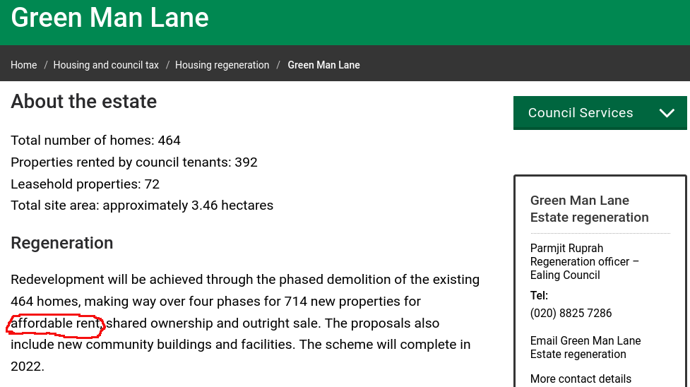

A handful of the 464 homes on Ealing's Green Man Lane estate remain earmarked for demolition.

The Green Man Lane estate regeneration was launched in 2005 and was initially a joint venture between Ealing Council and developer 'Real' involving the phased demolition of the estate's 464 homes in four phases over 10 years.

Ealing Council [describes](https://www.ealing.gov.uk/info/201104/housing_regeneration/373/green_man_lane/2) the replacement social housing as 'affordable rent' tenure, which can mean anything up to 80% market rent.

In December 2016, Ealing [granted planning permission](https://pam.ealing.gov.uk/online-applications/applicationDetails.do?activeTab=summary&keyVal=ODI3M8JM09L00) for phase 3 of the regeneration. There are no publicly available section 106 agreements for the scheme so it is not possible to confirm the precise tenure of the replacement 'affordable' housing.

Phase 4 (the final phase) of the scheme was approved in January 2023. Demolition of the final phase was expected to start in 2025, but in January 2024, it was [reported](https://www.ealingtoday.co.uk/default.asp?section=info&page=eahousing007.htm) that the Council's development partner for the scheme has gone into administration.

A Compulsory Purchase Order was confirmed in July 2024, which gives Ealing Council the right to evict remaining leaseholders on the final phase.

In August 2025, it was [announced](https://www.insidehousing.co.uk/news/a2dominion-and-london-council-reach-deal-to-restart-delayed-estate-regeneration-93220) that the final phase of the scheme would be completed in a joint venture between Ealing Council and A2Dominion housing association. It was reported that the final phase will comprise 413 homes.

A2Dominion explained that 127 of these home will have rents set at _“genuinely affordable”_ prices, with 54 available at intermediate rent.

A further 52 homes will be provided as shared ownership, with the remaining 180 properties to be sold on the open market.

---

<!------------THE CODE BELOW RENDERS THE MAP - DO NOT EDIT! ---------------------------->

---
