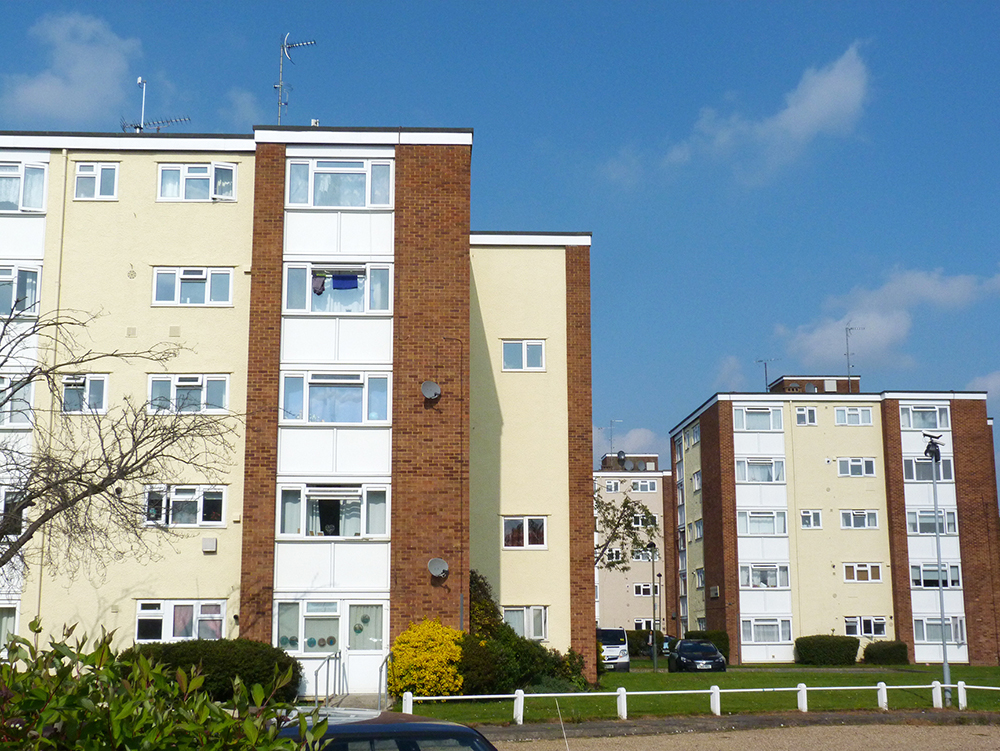
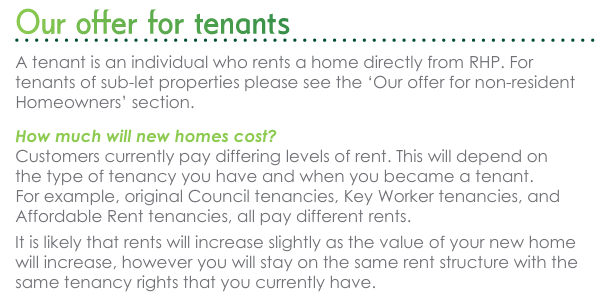
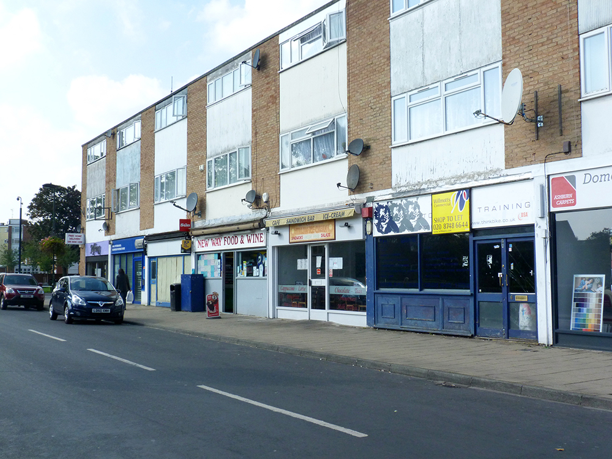
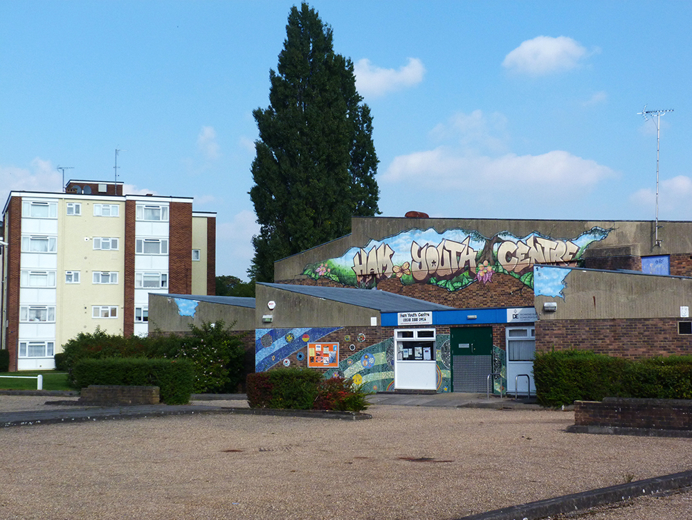
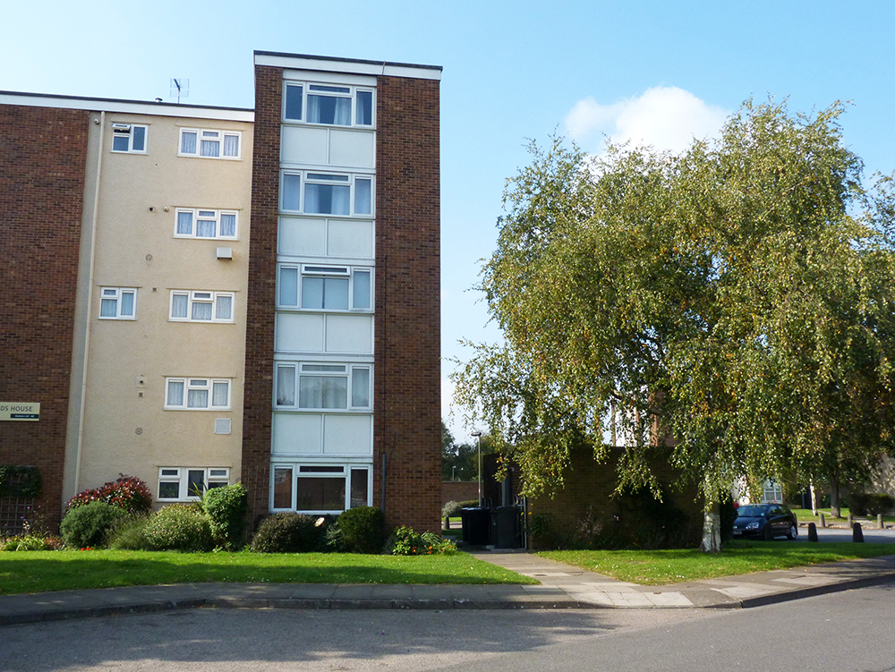
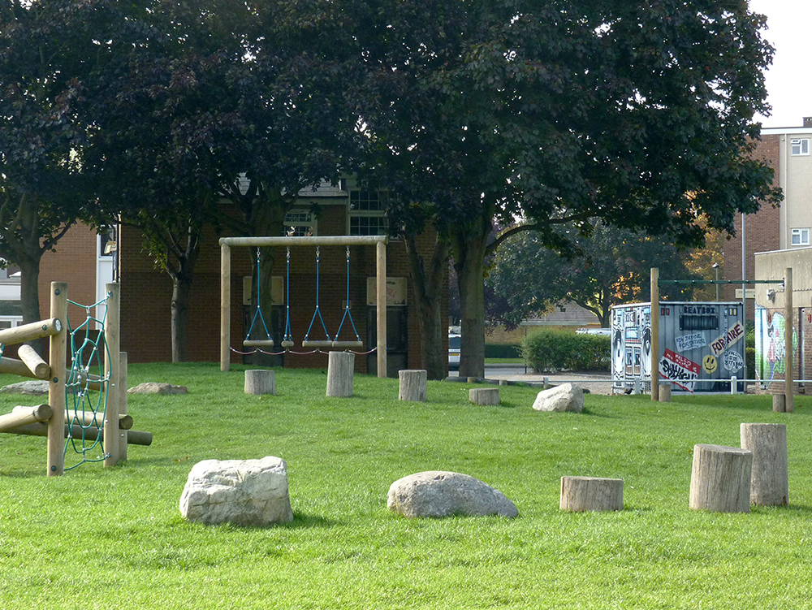

192 homes are under threat of demolition at Richmond's Ham Close estate.

Ham Close estate was built by Richmond council in the 1960s and comprises 192 homes across 14 blocks. It was handed over to Richmond Housing Partnership (RHP) 20 years ago when the council transferred all of its housing stock to the group.

In 2013, RHP started consulting residents on options for the estate which included refurbishment, infill, partial and full redevelopment.

In 2016, RHP [decided](https://754dc77b-a377-429d-9516-ae12db0b724d.filesusr.com/ugd/64a226_d3c5a071382d41cba0f3f38e201f2b4c.pdf) to take the refurbishment option off the table because it wouldn't provide any additional revenue for RHP: _"The cost estimate for full refurbishment at Ham Close is around £8 million. RHP does not regard this as an acceptable amount to spend when we’re cutting back on funding other asset management schemes.The £8 million would not result in any new additional income for RHP."_

RHP's [offer](https://754dc77b-a377-429d-9516-ae12db0b724d.filesusr.com/ugd/64a226_f9cd40099c6f42b28c4fa219aa05723f.pdf) to residents says that tenants will be offered the same rent structure as they currently enjoy but acknowledges that rents will be an increase because of increased property values.

The scheme is being [funded](https://www.london.gov.uk/sites/default/files/2021.03.18._estate_regen_projects_approved_before_18_july_2018_march_2021.pdf) by the Mayor and has been granted an [exemption](https://www.london.gov.uk/sites/default/files/list_of_exemptions_-_27_november_2020.pdf) from his requirement to ballot residents on the demolition of their homes.

In June 2021, RHP [selected](https://www.rhp.org.uk/news/news/rhp-chooses-hill-as-partner-in-ham-regeneration/) developer Hill as its development partner for the scheme.

A planning application was approved in December 2022 for 452 new homes of which 164 provided as 'low cost rent'.

More information is available on RHP's dedicated website for the scheme [https://www.hamclose.co.uk/](https://www.hamclose.co.uk/).

It was [reported](https://richmond.nub.news/news/local-news/ham-close-estate-residents-desperate-for-regeneration-after-living-amongst-damp-and-mould-198786) in September 2023 that residents would _"be moved from August 2025 depending on their housing need, location, and availability of the correct sized home."_

---

<!------------THE CODE BELOW RENDERS THE MAP - DO NOT EDIT! ---------------------------->

---

  
  
  
  
