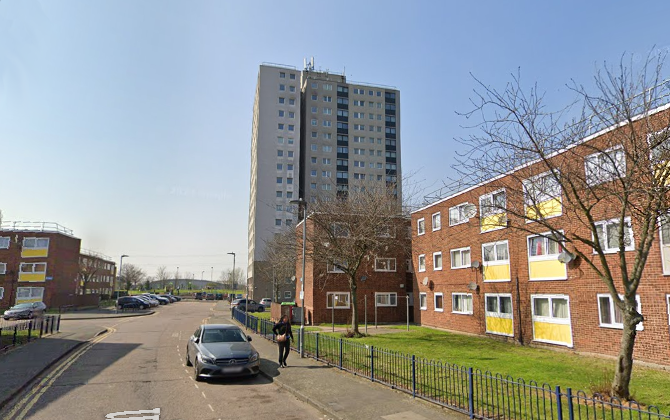
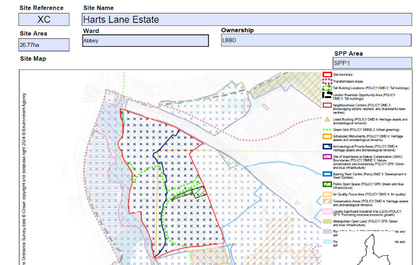

Circa 500 homes have been earmarked for potential redevelopment on Barking's Harts Lane estate.

The estate has been listed as a potential development site with capacity for 1,300 new homes in LBBD's new [2024 Local Plan](https://www.lbbd.gov.uk/sites/default/files/2024-10/Barking%20and%20Dagenham%20Local%20Plan%202037%20Appendix%202%20Site%20Allocation%20Proformas.pdf):

It is not known if residents have been made aware of the listing.

---

<!------------THE CODE BELOW RENDERS THE MAP - DO NOT EDIT! ---------------------------->

---