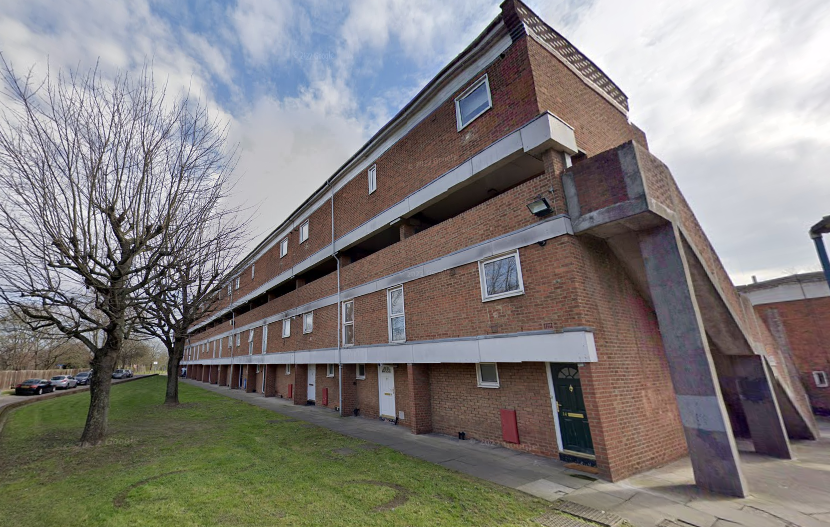

123 homes have been earmarked for demolition at the Heston Grange estate in Hounslow.

The estate overlooks Heston Park and is managed by MTVH housing association.

A ballot was held in 2024 in which 71.9% of residents that voted, voted for demolition on a 79.1% turnout.

The [Landlord Offer](src/images/hestongrangeoffer.pdf) failed to provide any details of the proposed tenure mix (as required by the Mayor's ballot requirement) and made it clear that if residents voted against demolition then the estate would be faced with ongoing neglect and the possibilty of re-running the ballot until the desired result is achieved:

---
__Links:__

[https://www.hestongrange.co.uk/](https://www.hestongrange.co.uk/)

---

<!------------THE CODE BELOW RENDERS THE MAP - DO NOT EDIT! ---------------------------->

---