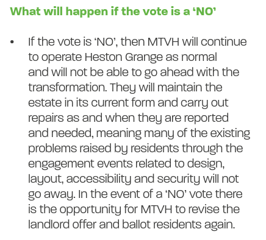

123 homes have been earmarked for demolition at the Heston Grange estate in Hounslow.

The estate overlooks Heston Park and is managed by [Metropolitan Thames Valley Housing association](https://www.mtvh.co.uk/).

A ballot was held in 2024 in which 71.9% of residents that voted, voted for demolition on a 79.1% turnout.

The [Landlord Offer](https://estatewatch.london/images/hestongrangeoffer.pdf) failed to provide any details of the precise tenures of replacement homes (as required by the Mayor's ballot requirement); it simply says that new homes will be _"100% affordable"_.

The Landlord Offer also made it clear that if residents voted against demolition then the estate would be faced with ongoing neglect and the possibilty of re-running the ballot until the desired result is achieved:

---
__Links:__

[https://www.hestongrange.co.uk/](https://www.hestongrange.co.uk/)

Planning consultant: [iceniprojects.com](https://www.iceniprojects.com)

---

<!------------THE CODE BELOW RENDERS THE MAP - DO NOT EDIT! ---------------------------->

---