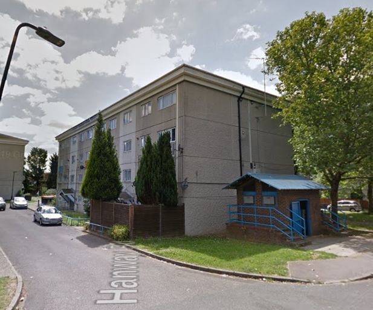
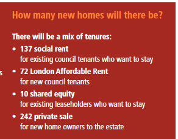
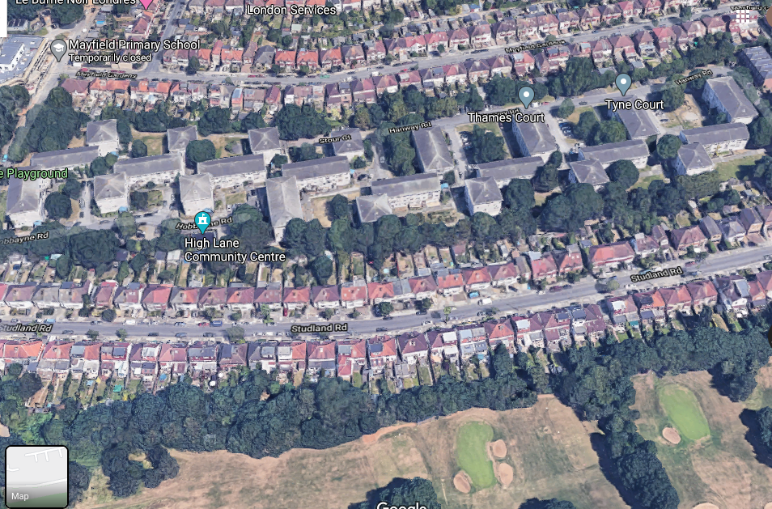

 

264 council homes are earmarked for demolition on Ealing's High Lane estate in Hanwell.

Located near the river Brent and Brent Valley Park, the estate comprises 264 homes in a mixture of two bed maisonettes and three bed flats, of which 51 households are leasehold owned.

In 2017, Ealing Council [resolved](https://www.ealing.gov.uk/download/downloads/id/14285/high_lane_estate_regeneration_-_selection_of_a_preferred_partner.pdf) to enter into a joint venture agreement with developer Rydon for the redevelopment of the estate.

In order to qualify for Mayoral funding, a ballot was held at the end of 2018 and the majority of those voting voted in favour of the council's proposals.

In January 2021, Ealing's development partner Rydon submitted a planning application. The application proposes demolition of all 264 homes on the High Lane estate and replacement with 505 homes, of which just 142 social rent.

The application also proposes 75 homes at London Affordable Rent and 10 shared equity homes (for the estate's 51 leaseholders..) and 278 private market homes.

We note that the proposed tenure mix is different from the tenure mix presented in Ealing's formal [Landlord Offer](http://estatewatch.london/images/highlaneoffer.pdf) to residents at the time of the ballot, with an extra 44 homes proposed in total, most of which (36) are private sale units.

This raises a question about the integrity of the Mayor's ballot requirement. The Mayor's [policy on ballots](https://www.london.gov.uk/sites/default/files/gla_cfg_section_8._resident_ballots_-_18_july_2018.pdf) is clear that he may terminate funding for schemes, which have deviated from the original tenure mix that residents were balloted on (see para 8.7.3). It remains to be seen whether the Mayor will pick this up or take any action.

In July 2021, Ealing's planning committee [approved](https://ealing.cmis.uk.com/ealing/Document.ashx?czJKcaeAi5tUFL1DTL2UE4zNRBcoShgo=bUieVZnWOS0tTI3Bj9sRKXwmZtamxCf6KTAbFBvU6FZ9z58fxKuigQ%3d%3d&rUzwRPf%2bZ3zd4E7Ikn8Lyw%3d%3d=pwRE6AGJFLDNlh225F5QMaQWCtPHwdhUfCZ%2fLUQzgA2uL5jNRG4jdQ%3d%3d&mCTIbCubSFfXsDGW9IXnlg%3d%3d=hFflUdN3100%3d&kCx1AnS9%2fpWZQ40DXFvdEw%3d%3d=hFflUdN3100%3d&uJovDxwdjMPoYv%2bAJvYtyA%3d%3d=ctNJFf55vVA%3d&FgPlIEJYlotS%2bYGoBi5olA%3d%3d=NHdURQburHA%3d&d9Qjj0ag1Pd993jsyOJqFvmyB7X0CSQK=ctNJFf55vVA%3d&WGewmoAfeNR9xqBux0r1Q8Za60lavYmz=ctNJFf55vVA%3d&WGewmoAfeNQ16B2MHuCpMRKZMwaG1PaO=ctNJFf55vVA%3d) its development partner Rydon's application for the demolition of the estate. 

As continues to be the case with these ongoing estate redevelopment applications, the Mayor's minimum policy requirements have been routinely ignored. The Mayor's supposed no net loss of social rent, the 50% affordable housing requirement, the requirement to explore alternatives to demolition have all been completely ignored, as well as the Mayor's requirement to publish the viability assessment explaining with the affordable housing offer falls short of the policy quota.

You can view the planning application documents on Ealing's planning portal [here](https://pam.ealing.gov.uk/online-applications/applicationDetails.do?activeTab=documents&keyVal=QMEOPIJM0GW00).

The Mayor's stage 1 planning report giving 'in principle' approval to the scheme is available on the GLA planning portal here: [https://gla.force.com/pr/s/planning-application/a0i4J000002V7cwQAC/20210031?tabset-c2f3b=2](https://gla.force.com/pr/s/planning-application/a0i4J000002V7cwQAC/20210031?tabset-c2f3b=2)

The site was granted outline planning permission in March 2023 but works are yet to commence.

---

__Links:__  
Ealing Council website - [https://www.ealing.gov.uk/info/201104/housing_regeneration/2346/high_lane_estate/1](https://www.ealing.gov.uk/info/201104/housing_regeneration/2346/high_lane_estate/1)

[July 2021 planning committee report](https://ealing.cmis.uk.com/ealing/Document.ashx?czJKcaeAi5tUFL1DTL2UE4zNRBcoShgo=bUieVZnWOS0tTI3Bj9sRKXwmZtamxCf6KTAbFBvU6FZ9z58fxKuigQ%3d%3d&rUzwRPf%2bZ3zd4E7Ikn8Lyw%3d%3d=pwRE6AGJFLDNlh225F5QMaQWCtPHwdhUfCZ%2fLUQzgA2uL5jNRG4jdQ%3d%3d&mCTIbCubSFfXsDGW9IXnlg%3d%3d=hFflUdN3100%3d&kCx1AnS9%2fpWZQ40DXFvdEw%3d%3d=hFflUdN3100%3d&uJovDxwdjMPoYv%2bAJvYtyA%3d%3d=ctNJFf55vVA%3d&FgPlIEJYlotS%2bYGoBi5olA%3d%3d=NHdURQburHA%3d&d9Qjj0ag1Pd993jsyOJqFvmyB7X0CSQK=ctNJFf55vVA%3d&WGewmoAfeNR9xqBux0r1Q8Za60lavYmz=ctNJFf55vVA%3d&WGewmoAfeNQ16B2MHuCpMRKZMwaG1PaO=ctNJFf55vVA%3d).

Planning application docs - [https://pam.ealing.gov.uk/online-applications/applicationDetails.do?activeTab=documents&keyVal=QMEOPIJM0GW00](https://pam.ealing.gov.uk/online-applications/applicationDetails.do?activeTab=documents&keyVal=QMEOPIJM0GW00)

Mayor's stage 1 report - [https://gla.force.com/pr/s/planning-application/a0i4J000002V7cwQAC/20210031?tabset-c2f3b=2](https://gla.force.com/pr/s/planning-application/a0i4J000002V7cwQAC/20210031?tabset-c2f3b=2)

---

<!------------THE CODE BELOW RENDERS THE MAP - DO NOT EDIT! ---------------------------->

---

