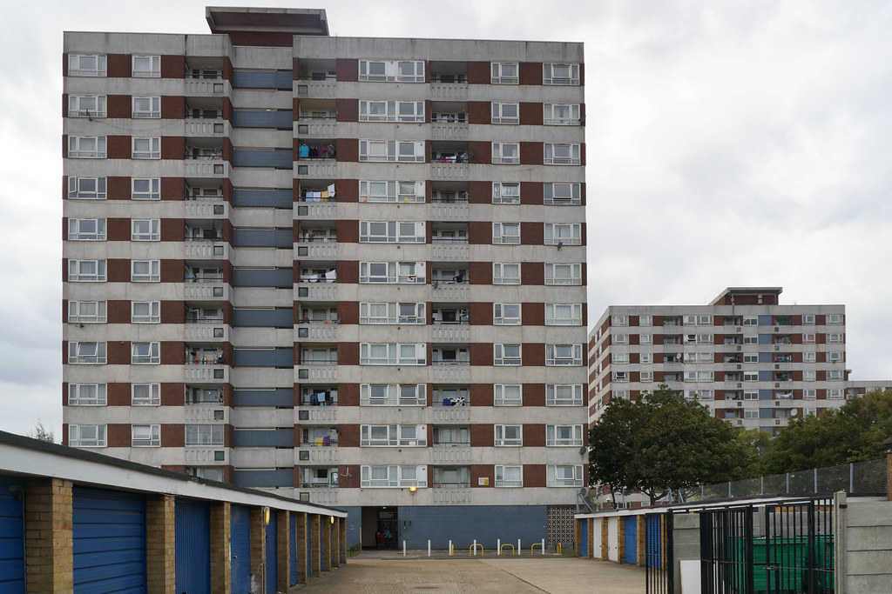
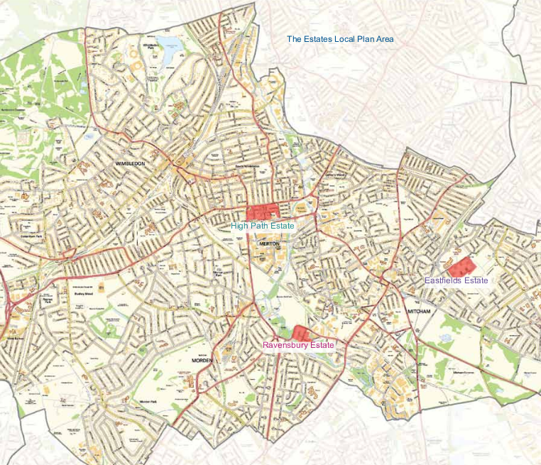
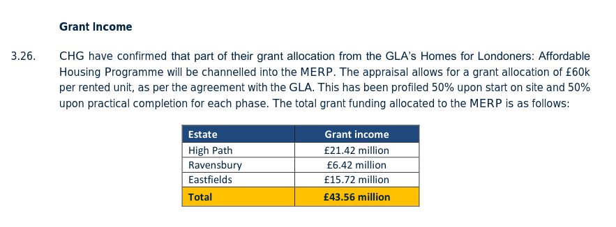
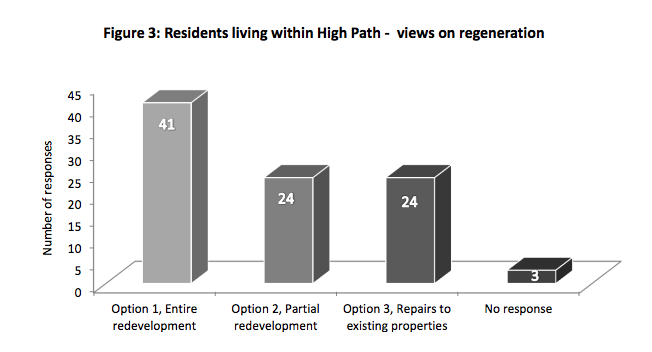
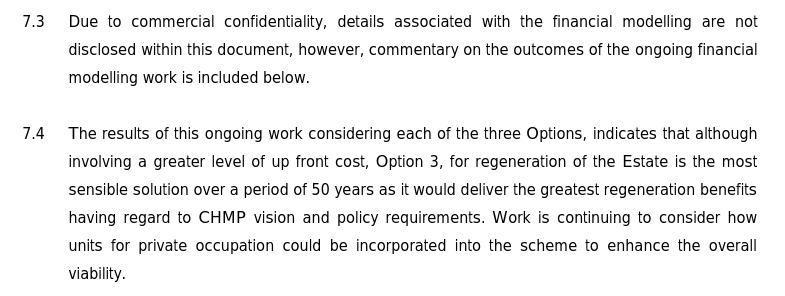
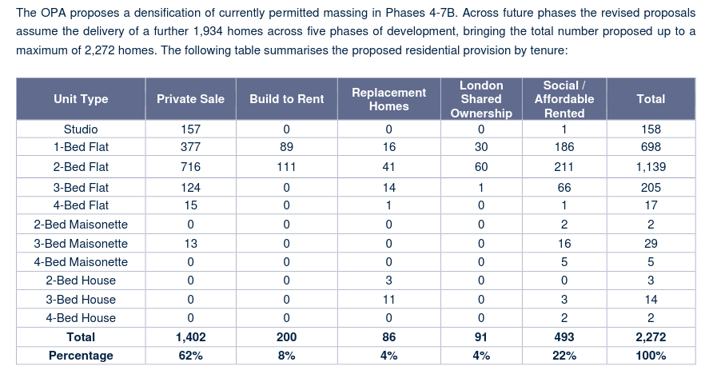
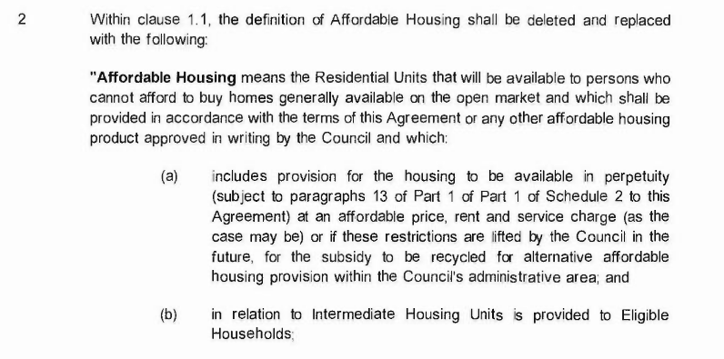

In Nov 2018, the Mayor approved the demolition of 608 homes on Merton's High Path estate, to be replaced by 1,570 homes of which 20% affordable - all at up to 80% market rent or LHA rates (whichever is lower). 

The estate is located next to South Wimbledon underground station and comprises three 12-storey residential towers, a number of 2 to 4-storey low rise blocks, some houses and some sheltered flats. A small convenience store and church are also located within the estate. 251 of the 608 homes on the estate are under leasehold ownership.

The Mayor's initial [stage 1 report](https://www.london.gov.uk/sites/default/files/public%3A//public%3A//PAWS/media_id_382375///high_path_estate_report.pdf) said that _"84% of current tenancies are on a social rent basis, with the balance comprising affordable rent tenancies set at 62.5% of market rent."_ (para 24)

The [section 106 agreement](/images/mertons106.pdf) secures the right of any tenants who wish to return to the estate to do so under a social rented tenancy, but enables subsequent re-lets at affordable rent (up to 80 % market rent or LHA rates - whichever is lower).

Phase 1 of the scheme is currently underway and phase 2 was granted detailed planning permission in Sep 2019. Consultation for the detailed plans of phase 3 has just started.

The scheme is being progressed by Clarion Housing Association (formerly Circle/Affinity Sutton), which took over the Council's housing estate under a 2010 stock transfer agreement. The agreement required Clarion to bring the homes up to Decent Homes Standard by the end of 2015, but Clarion subsequently [persuaded](https://www.merton.gov.uk/assets/Documents/04_merton_report_of_consultation_stage_2_estates_local_plan.pdf) the Council to agree to waiver this requirement for two estates which it claimed would benefit from full redevelopment - High Path estate and the [Eastfields estate](/estates/merton/eastfields) and the partial redevelopment of the smaller Ravensbury estates. 

The three Merton schemes have been [awarded](https://planning.merton.gov.uk/MVM.DMS/Planning%20Application/1000098000/1000098159/17P1721_Clarions%20Financial%20Viability%20Appraisal%20Summary%20Report.pdf) £43m funding by the Mayor from his current affordable housing programme (of which £21m for the High Path estate) and have been [granted an exemption](https://www.london.gov.uk/sites/default/files/12.04.19_for_website_-_list_of_exemptions.pdf) from his requirement to ballot residents.

Residents were given the chance to express their views as part of Merton's [consultation](https://www.merton.gov.uk/assets/Documents/04_merton_report_of_consultation_stage_2_estates_local_plan.pdf) on the scheme. Of the 92 residents who responded, only 41 respondents favoured “entire redevelopment”, 24 preferred “partial redevelopment”, and another 24 chose refurbishment.

The [options appraisal](/images/highpathsavills.pdf) was carried out by Savills and made several interesting conclusions, firstly that residents were satisfied with their current homes: _"There is a strong community spirit and many of the residents of the High Path Estate enjoy living on the Estate (evidenced by low turnover of tenants, as well as feedback received from residents.)"_ - (para 2.1).

Secondly, that whilst the cost of redevelopment was higher than that of refurbishment, the difference wasn't disclosed because of 'commercial confidentiality':

Savills was later also instructed to produce a [financial viability appraisal](https://planning.merton.gov.uk/MVM.DMS/Planning%20Application/1000098000/1000098159/17P1721_Clarions%20Financial%20Viability%20Appraisal%20Summary%20Report.pdf) justifying Clarion's claim that it couldn't provide a policy-compliant level of affordable housing for the scheme.

It is worth noting that the three merton schemes provide something that no other regeneration scheme has offered - namely, a very generous [re-housing offer](http://35percent.org/img/mertonoffer.pdf) to leaseholders which gives them full equity of a replacement home after 11 years. Although these have reported that the replacement homes offered are smaller than their current homes.

In 2023, a new Outline Planning Application (OPA) for the remaining phases (4-7B) of the estate was submitted and approved. This permitted the further densification of development in the later phases of the scheme, with the express intention of 'optimising development capacity'. 

This incresed the permitted development to include a total of 2,272 homes of which 493 are described as 'social/affordable rent': 

The [revised section 106 agreement](https://planning.merton.gov.uk/MVM.DMS/Planning%20Application/1000120000/1000120762/22P3686_Section%20106%20Agreement.pdf) replaces the previous definition of affordable housing with a much looser definition:

This is confirmed in the scheme's [viability assessment](https://planning.merton.gov.uk/MVM.DMS/Planning%20Application/1000120000/1000120762/22P3686_Financial%20Viability%20Assessment%2003.pdf) which says _"We have been advised by Clarion to assume that all rented homes will be let as Social Rent tenure homes, although note that the Section 106 agreement allows for a more flexible range of tenures to be provided."_ (para 6.2.4)

---

__Links:__

Merton's planning application docs - [ref:17/P1721](https://planning.merton.gov.uk/MVM/Online/DMS/DocumentViewer.aspx?pk=1000098159&SearchType=Planning%20Application)

Mayor's [stage 2 report](https://www.london.gov.uk/what-we-do/planning/planning-applications-and-decisions/planning-application-search/high-path-estate) - approved Nov 2018

[Exhibition boards](https://www.myclarionhousing.com/-/media/57A74ED432A347FE8636BFE20B10AB19.pdf?la=en&sc_revision=de07b12b190e4b71a6bfde09c29e333c&hash=9852FCA77FDFA41CC719944E317C4CB5E38CD263&hash=9852FCA77FDFA41CC719944E317C4CB5E38CD263) for the consultation for phase 2 of the scheme.

Revised outline application planning docs: <https://planning.merton.gov.uk/MVM/Online/DMS/DocumentViewer.aspx?pk=1000120762&SearchType=Planning%20Application> (Ref:22/P3686)

2022 Compulsory Purchase Order Statement of Reasons: <https://www.merton.gov.uk/system/files/2022-06/Statement%20of%20Reasons%20-%20High%20Path%20No1-%20PDF.pdf>

---

<!------------THE CODE BELOW RENDERS THE MAP - DO NOT EDIT! ---------------------------->

---

<iframe width="610" height="325" src="https://www.youtube.com/embed/1pe_DEn1TWc" frameborder="0" allow="accelerometer; autoplay; encrypted-media; gyroscope; picture-in-picture" allowfullscreen></iframe>

<iframe width="610" height="325" src="https://www.youtube.com/embed/OfMMGLSuzYw?si=lQ4-5SuHPkkhjkoM" title="YouTube video player" frameborder="0" allow="accelerometer; autoplay; clipboard-write; encrypted-media; gyroscope; picture-in-picture; web-share" referrerpolicy="strict-origin-when-cross-origin" allowfullscreen></iframe>
