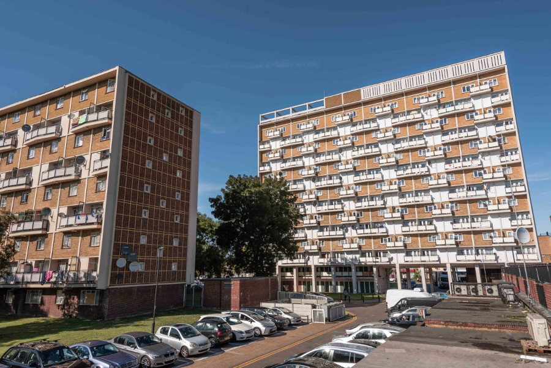
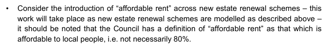

795 homes on Enfield's Joyce Avenue and Snells Park estates in Edmonton have been [earmarked for demolition](https://new.enfield.gov.uk/services/housing/housing-development-and-renewal/joyce-avenue-and-snells-park-leaflet-housing.pdf) by Enfield Council.

The Council is [reported](https://enfielddispatch.co.uk/major-estate-plans-to-go-to-vote/) to be intending to hold a ballot in October 2021. Its dedicated website for the scheme provides further details [here](http://www.joyceandsnells.co.uk/).

In 2015, Enfield's Cabinet [agreed](https://governance.enfield.gov.uk/documents/g9278/Public%20reports%20pack%2018th-Nov-2015%2020.15%20Cabinet.pdf?T=10) to consider charging affordable rent for new council homes built as part of its estate renewals, albeit not necessarily at the full 80% of market rent.

The redevelopment plans date back to October 2015, when the Council's Cabinet agreed an Estate Renewal Programme (2016-2025) setting out its plans for redeveloping a number of its council estates (item 24):
[https://governance.enfield.gov.uk/documents/s54537/final1610Estate%20Renewal%20Cabinet%20Report%20-%20Oct%202015%20Final%20v12%2015.10.15%202.pdf](https://governance.enfield.gov.uk/documents/s54537/final1610Estate%20Renewal%20Cabinet%20Report%20-%20Oct%202015%20Final%20v12%2015.10.15%202.pdf)

Appendix 2 to that report, which lists the estates earmarked for renewal, has been witheld by the Council on grounds of commercial sensitivity.

In September 2021, the Council [applied for a scoping opinion](https://planningandbuildingcontrol.enfield.gov.uk/online-applications/simpleSearchResults.do?action=firstPage) for up to 1,992 new homes on the estate footprint. The [scoping report](https://planningandbuildingcontrol.enfield.gov.uk/online-applications/files/757E9B87467516101DC9D4D98221C1EA/pdf/21_03691_SCOP-Scoping_Opinion-2532448.pdf) confirmed that of the 795 existing homes, 430 were social rent plus 155 resident leaseholders and 210 non-resident leaseholders.

A ballot of estate residents was held in November 2021. 78% of eligible residents voted in favour of redevelopment on an 85% turnout.

The Mayor has pledged £150m grant funding to the scheme and Enfield approved its own planning application in September 2022 for 1900 new homes, half of which will be 'affordable'.

In July 2024, it was [reported](https://www.constructionenquirer.com/2024/07/23/go-ahead-for-850m-north-london-estate-rebuild/) that Enfield Council is seeking a development partner for the scheme.

---

__Links:__  
[Application for scoping opinion (ref:21/03691/SCOP)](https://planningandbuildingcontrol.enfield.gov.uk/online-applications/simpleSearchResults.do?action=firstPage)

[Better Homes Enfield - report](https://betterhomes-enfield.org/2022/11/28/the-demolition-of-joyce-avenue-snells-park/)

---

<!------------THE CODE BELOW RENDERS THE MAP - DO NOT EDIT! ---------------------------->

---