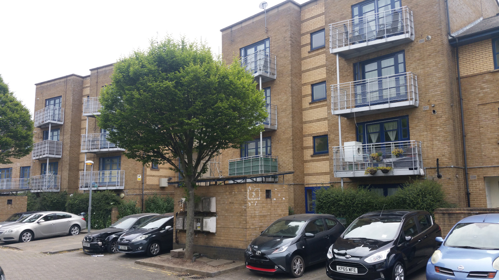

Circa 200 homes on Camden's Juniper Crescent and Gilbey's yard estates have been earmarked for redevelopment as part of the [Camden Goods Yard regeneration](https://www.camden.gov.uk/documents/20142/145786127/Site+Allocations+2020+-+05+Camden+Goods+Yard.pdf)

The neighbouring estates overlook the Regents Canal and are located between Camden Market and Camden Roundhouse.

In July 2019, housing association One Housing entered into a joint venture with developer Countryside Properties for the redevelopment of the estates.

One Housing had already started 'decanting' secure tenants by offering them rehousing in its existing stock elsewhere in the borough. It has filled the vacant homes with short-term intermediate rent tenants.

A ballot was supposed to be held by housing association One Housing Group in late March 2020, but this was [postponed](https://onehousing.co.uk/__data/assets/pdf_file/0020/16319/Juniper-Crescent-and-Gilbeys-Yard-project-FAQs-2020.pdf) because of the coronavirus crisis. The ballot was postponed until 8th June and consultation sessions were [instead carried out via zoom](https://onehousing.co.uk/__data/assets/pdf_file/0019/17416/Juniper-Crescent-and-Gilbeys-Yard-News-May-2020.pdf):

Residents were told in the [consultation documents](/images/juniperno.pdf) that if they vote against demolition in the ballot then their homes would only in future receive essential maintenance:

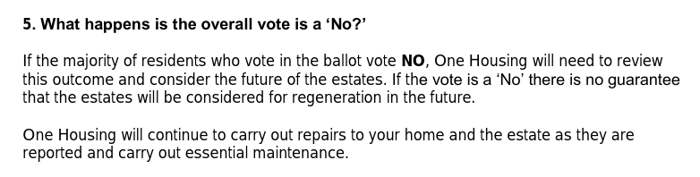

This was reiterated in the formal ['Landlord Offer'](/images/juniperoffer.pdf) made to residents ahead of the ballot:

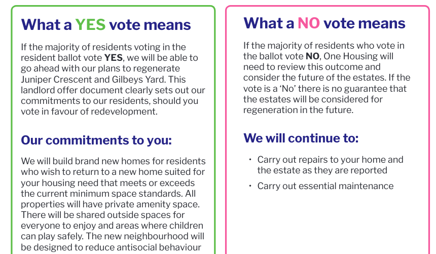

In July 2020, it was confirmed that residents had voted against demolition in the ballot, which was held by Civica on behalf of the estate's Landlord - [One Housing](https://www.onehousing.co.uk/).

A [letter](http://estatewatch.london/images/gilbeyresults.jpg)) sent to residents following the ballot, confirms that of the 185 eligible residents, 91 voted against demolition while 68 voted in favour (26 failed to cast their votes).

One Housing's head of Regeneration subsequently [wrote to residents](http://estatewatch.london/images/gilbeyletter.jpg)) indicating that the housing association may try and run the ballot again, with revised proposals 'based on feedback'.

A [newsletter](http://estatewatch.london/images/gilbeynewsletter.pdf) from the TRA and [report](http://estatewatch.london/images/gilbeyreport.pdf) from its Vice Chair Karl Lewkowicz, sets out residents' reasons for rejecting the proposals, including:

* Lack of clarity on the amount of social housing proposed
* Lack of detailed information about proposed tenures and security of tenure
* Concerns about space standards of the proposed replacement affordable housing
* Concerns about increased Service Charges and Council Tax on the redeveloped estate

The report concludes with the Vice Chair summing up negotiations with the housing association prior to the ballot:

_"On a personal note, as the Vice Chair of GY TRA I have found negotiations with One Housing unsatisfactory and frustrating. They seem to me to want to appear to be complying with the regulations of the GLA and Camden Council whilst taking no real interest in the needs of the tenants. There are many complaints about them from tenants regarding repairs and maintenance and their staff turnover is very high so that any continuity in communications or development of an on-going relationship with the estate officer is made very difficult."_

_"It feels to me as though repairs and maintenance have been considerably run down prior to the ballot in the run up to the ballot and that any real and tangible progress in the substance of the landlord offer was obstructed."_

One Housing decided to ballot residients once again but this time just the Juniper Crescent estate, not Gilbey's Yard. The ballot was held in December 2022. In total, 116 votes were cast by Juniper Crescent residents with 73 saying yes (63 per cent) and 43 voting no. 

Camden's [2024 draft Local Plan](https://res.cloudinary.com/commonplace-digital-limited/image/upload/v1705053253/projects/6544c670ccc53fe121da307b/media-upload/Draft%20Local%20Plan%20-%20Chapter%204%20-%20Central%20Camden.pdf/enqrxvow32pawu4yhyw1.pdf) lists Gilbey's Yard estate within its site allocations and describes the current situation as follows:

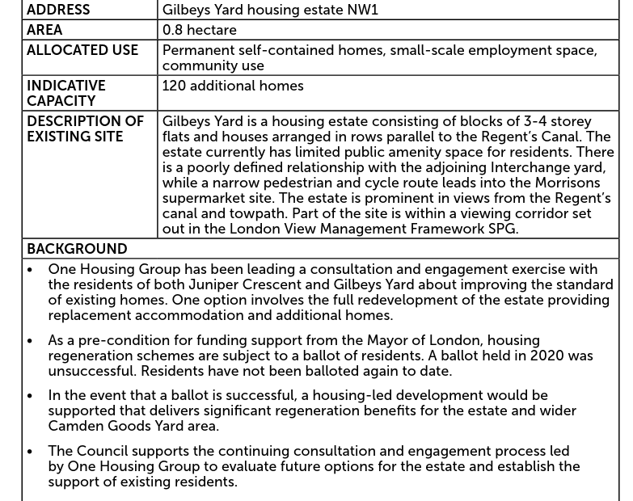

---

__Links:__

Article in the local press: [http://camdennewjournal.com/article/now-listen-to-us-say-tenants-who-won-vote-against-demolition-bid](http://camdennewjournal.com/article/now-listen-to-us-say-tenants-who-won-vote-against-demolition-bid)

---

<!------------THE CODE BELOW RENDERS THE MAP - DO NOT EDIT! ---------------------------->

---

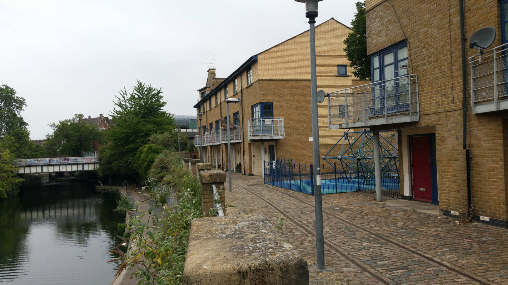
  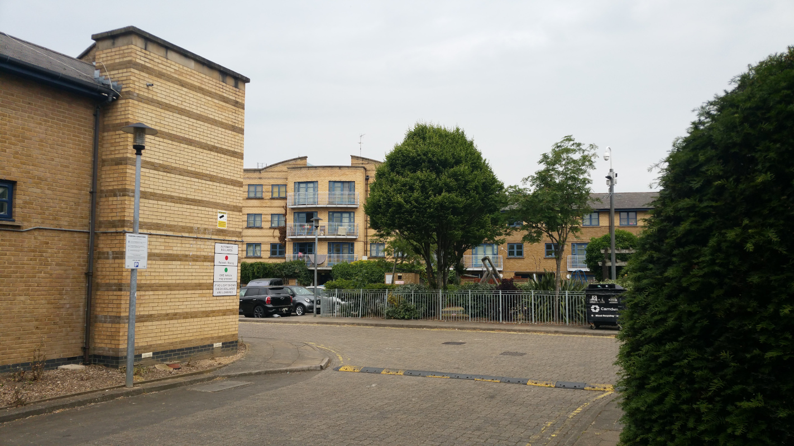
  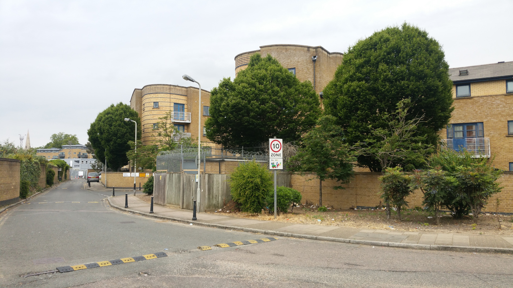
  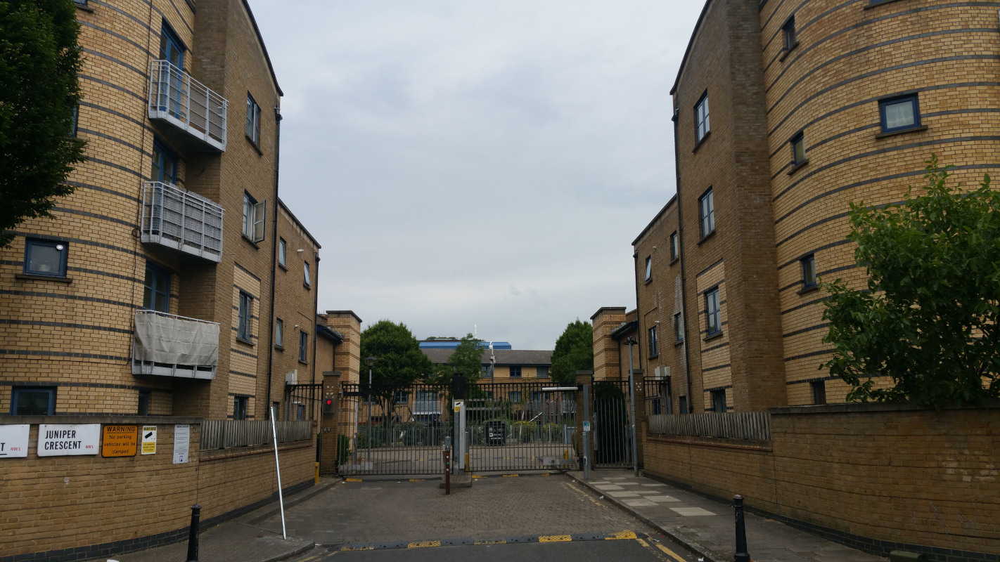
  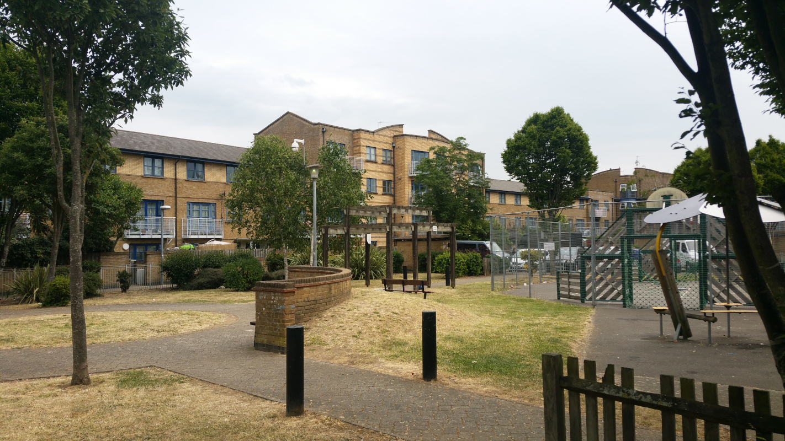
  
  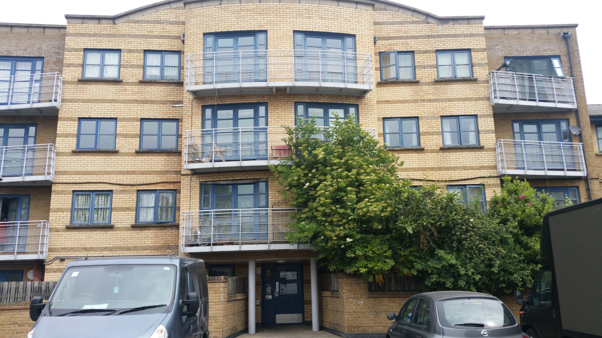
  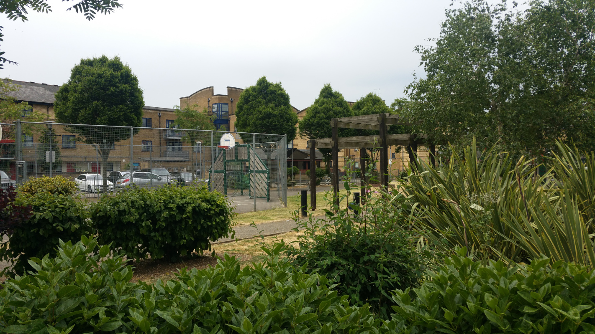
  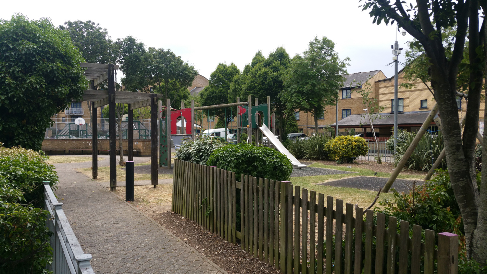
  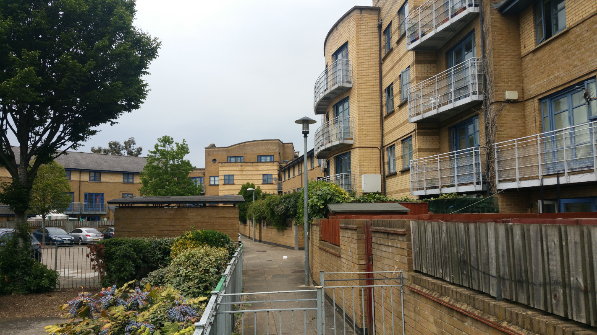
  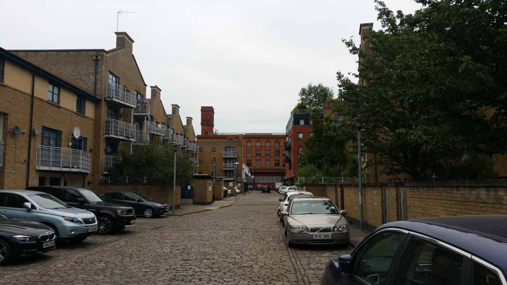
  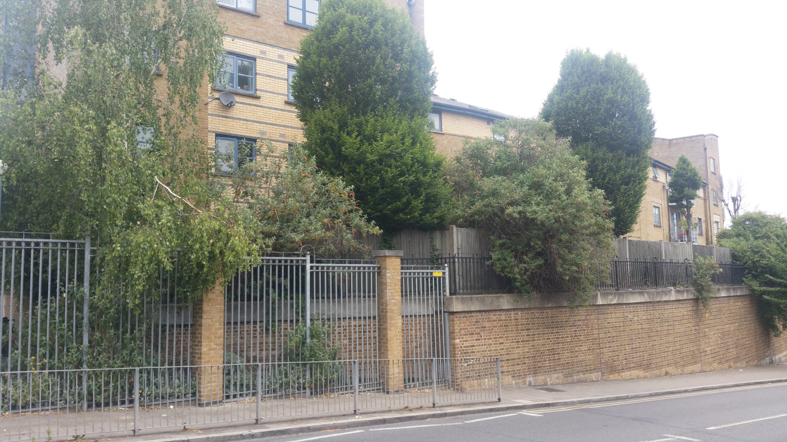
  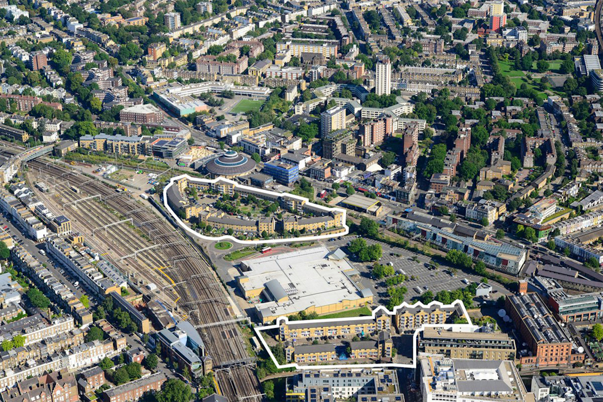

