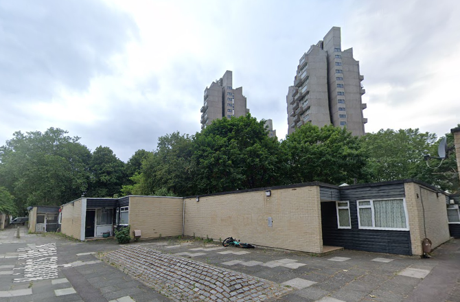

 
Knight’s Walk is a group of bungalows and two-storey flats belonging to the Cotton Gardens estate in Kennington. It was designed by architect George Finch in the 1960s to cater for the elderly and people with disabilities. Owing to this, and the fact that the estate is just a 5-minute walk from Elephant & Castle and Kennington Underground Station, Lambeth Council considered its current housing insufficiently dense and placed Knight’s Walk on its six-estate ‘regeneration’ programme in December 2014.
 

In February 2015, the residents were presented with three options, all of which were for full demolition. Due to new design proposals put forward by [Architects for Social Housing (ASH)](https://architectsforsocialhousing.co.uk/), half of the homes were saved from the [demolition plans][https://opengardenestates.com/open-garden-estates-2015/knights-walk/]

The resident-led ‘Save Knights Walk Campaign’ was joined by the life partner of the late George Finch and fellow architect, Kate Macintosh, who delivered an [impassioned speech](https://www.architectsjournal.co.uk/news/public-wealth-is-being-transferred-to-the-pockets-of-property-speculators) on the importance of saving existing social housing and protecting green spaces on them.

Phase 1 was completed in 2021 and provides 14 social rented homes.

In 2022, planning permission was granted for phase 2, and involves the demolition of all of the two-storey units and some of the bungalows.

Phase 2 of the planning permission will deliver a further 68 homes in two much denser apartment blocks, standing at up to seven storeys high. Of these, 11 will be social rented units, 12 will be intermediate, and 45 will be private market homes. 

The tenure mix approved in the [planning committee report](https://moderngov.lambeth.gov.uk/documents/s94015/1705992RG3%20Knights%20Walk.pdf) shows that of the 84 new homes just 14 will be social rented:

In 2025, Lambeth Council revealed that Vistry Group had been chosen to take charge of the regeneration as part of its [‘New Homes Hexagon’](https://haveyoursay.lambeth.gov.uk/en-GB/projects/knights-walk-nhx](https://haveyoursay.lambeth.gov.uk/en-GB/projects/knights-walk-nhx) partnership with the developer.

---

__Links:__

[https://architectsforsocialhousing.co.uk/2018/04/16/knights-walk-the-good-practice-guide-to-gentrification/](https://architectsforsocialhousing.co.uk/2018/04/16/knights-walk-the-good-practice-guide-to-gentrification/)

[https://www.lambeth.gov.uk/better-fairer-lambeth/projects/knights-walk-estate](https://www.lambeth.gov.uk/better-fairer-lambeth/projects/knights-walk-estate)

[Planning Committee report: https://moderngov.lambeth.gov.uk/documents/s94015/1705992RG3%20Knights%20Walk.pdf](https://moderngov.lambeth.gov.uk/documents/s94015/1705992RG3%20Knights%20Walk.pdf)

---

<!------------THE CODE BELOW RENDERS THE MAP - DO NOT EDIT! ---------------------------->

---
