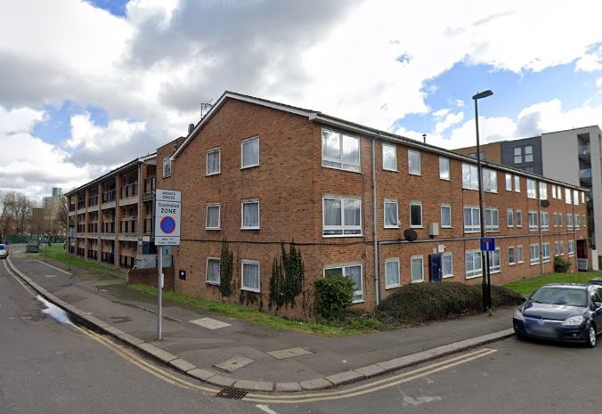
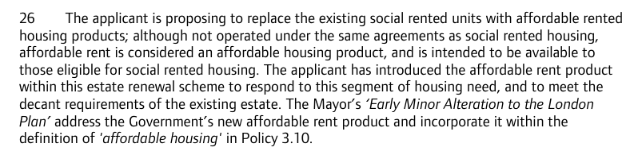

Circa 100 homes remain earmarked for demolition on Enfield's Ladderswood estate. 

Around 60 homes have already been demolished in phase one of the scheme which is nearing completion.

The scheme is being progressed in a joint venture between Enfield Council, developer Mulalley and housing association One Housing.

The redeveloped estate will comprise 517 new homes of which 29% 'affordable'. The Mayor's [planning report](https://www.london.gov.uk/sites/default/files/public%3A//public%3A//PAWS/media_id_205193///ladderswood_estate_report.pdf) confirms that the replacement 'social' housing will be affordable rent:

---

<!------------THE CODE BELOW RENDERS THE MAP - DO NOT EDIT! ---------------------------->

---

