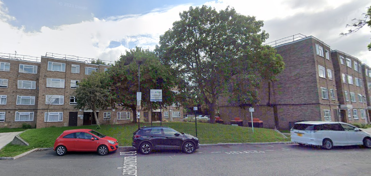
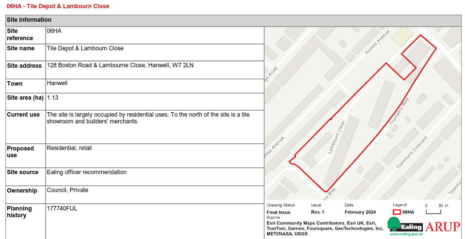

Circa 100 homes at the Lambourne Close estate in Hanwell have been earmarked for potential redevelopment in Ealing's [2024 Local Plan](https://www.ealing.gov.uk/download/downloads/id/19587/appendix_e_-_results.pdf).

It is not known if residents have been made aware of the proposals.

---

<!------------THE CODE BELOW RENDERS THE MAP - DO NOT EDIT! ---------------------------->

---