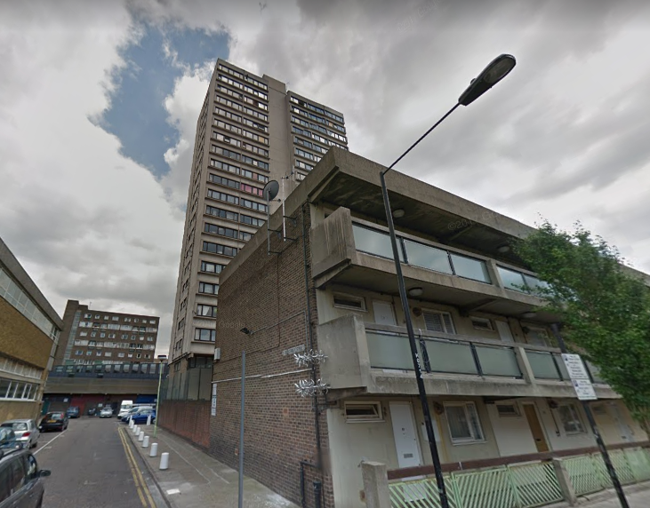
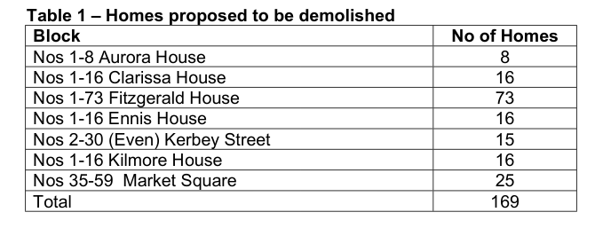
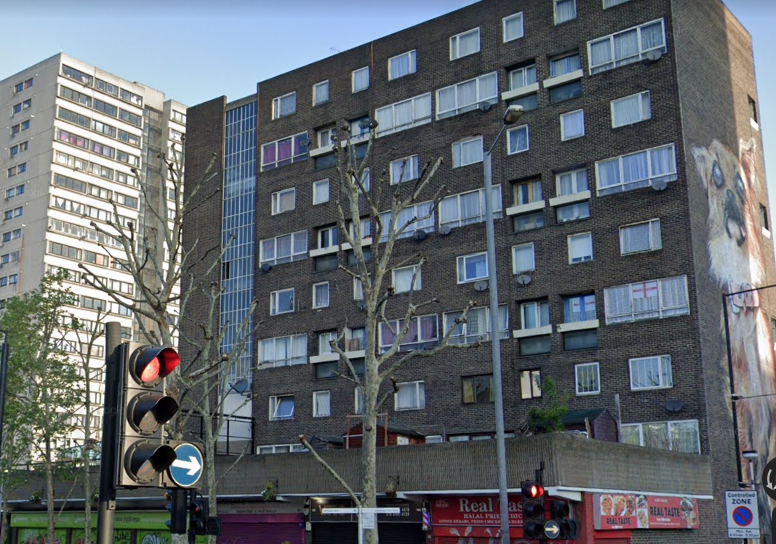

169 homes are earmarked for demolition on the Lansbury (south) estate in Tower Hamlets, as part of Poplar HARCA's regeneration of the Chrisp Street Market area.

Seven blocks on the estate were earmarked for demolition including the 21-storey Fitzgerald House.

The scheme is being funded by the Mayor and exempted from his requirement to ballot residents on the demolition of their homes.

The Mayor's [planning report](https://www.london.gov.uk/sites/default/files/public%3A//public%3A//PAWS/media_id_460890///chrisp_street_market_report.pdf) approving the scheme confirms that the redeveloped site will provide 643 new homes of which 36% will be 'affordable'. None of the affordable homes will be social rent but 163 homes will be London Affordable Rent.

In February 2021, Tower Hamlets served a Compulsory Purchase Order on the 56 remaining retailers and 16 remaining leaseholders on the [Lansbury estate](https://estatewatch.london/estates/towerhamlets/lansbury/), so that Poplar HARCA and Telford Homes can proceed with their [Chrisp Street redevelopment](https://www.poplarharca.co.uk/new-homes-regeneration/development-projects/project/chrisp-street-market/).

The 163 replacement 'social' housing units are being built with £13m of Mayoral funding and provided as London Affordable Rent rather than social rent tenure. 

In 2021, the Council issued a Compulsory Purchase Order to remove the remaining residents and leaseholders. See the supporting documents on the council's website [here](https://www.towerhamlets.gov.uk/News_events/2021/February-2021/Chrisp-Street-CPO.aspx).

Following this the scheme has stalled. Poplar Harca's [web page for the scheme](https://www.poplarharca.co.uk/new-homes-regeneration/development-projects/project/chrisp-street-market/) says that it _"is currently on pause while we make improvements to the plans to make sure they meet the Government’s new fire safety regulations."_

__Links:__  
[Tower Hamlets planning portal - application documents](https://development.towerhamlets.gov.uk/online-applications/applicationDetails.do?activeTab=documents&keyVal=DCAPR_118254)

Mayor's [stage 1 and stage 2 planning reports](https://www.london.gov.uk/sites/default/files/public%3A//public%3A//PAWS/media_id_460890///chrisp_street_market_report.pdf)
