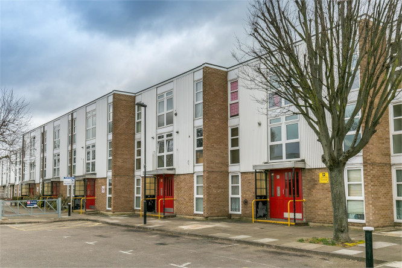
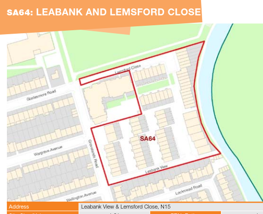

The Leabank View estate comprises circa 60 council homes overlooking the river Lea. The estate have been designated for comprehensive redevelopment in the Council's [Estate Renewal Strategy](https://www.minutes.haringey.gov.uk/documents/s48324/Housing%20Investment%20and%20Estate%20Renewal%20Strategy%20-%20whole%20report%20-%20Paul%20Munday.pdf) and its [Local Plan site allocations DPD](https://www.haringey.gov.uk/sites/haringeygovuk/files/final_haringey_site_allocations_dtp_online.pdf) (site SA64).

---

<!------------THE CODE BELOW RENDERS THE MAP - DO NOT EDIT! ---------------------------->

---

