Circa 500 homes are under threat of potential demolition on Westminster's Lisson Green estate in Maida Vale.

The estate, which is situated beside the Regent's Canal and Regent's Park sits [within](https://lbhf.maps.arcgis.com/apps/webappviewer/index.html?id=7cab3cdf6e344a0fb24df59ed6b9bdc5) an area that has been designated a __Housing Renewal__ zone in Westminster's [draft 2019-2040 Local Plan](https://www.westminster.gov.uk/cityplan2040).

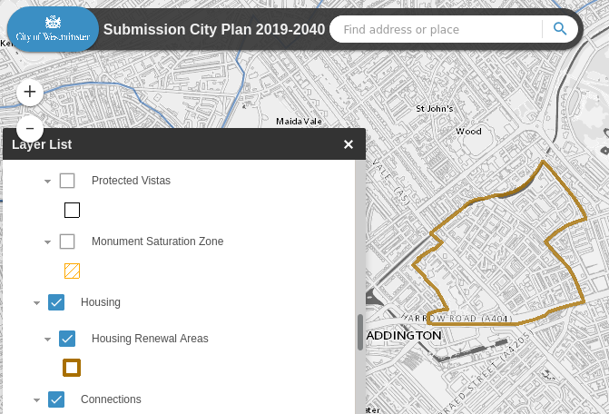

The estate is also inside the boundary of the __Edgeware Road Housing Zone__, one of [30 special housing zones](https://www.london.gov.uk/what-we-do/housing-and-land/increasing-housing-supply/housing-zones#acc-i-42741) designated by the Mayor to deliver accelerated housing development. The Edgeware Road zone is expected to deliver 1700 new homes.

 
In addition, the estate is within the boundary of the Church Street regeneration area. Whilst its redevelopment does not form part of the current Church Street proposals, the [Church Street masterplan](https://www.westminster.gov.uk/sites/default/files/ev_h_008_church_street_masterplan_wcc_2017.pdf) does consider the estate _'suitable for future development'_ and the Council _'intends to develop dialogue with residents .. to better understand how they would like their area to develop and be integrated within the wider regeneration opportunity.'_ 

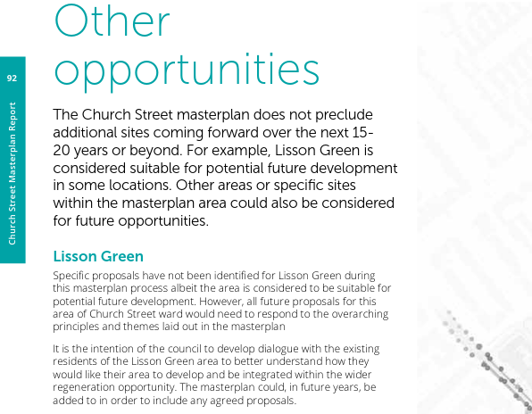

In 2021, two blocks on the Lisson Green estate were incorporated into the Church St regeneration plans and have been demolished.

---

<!------------THE CODE BELOW RENDERS THE MAP - DO NOT EDIT! ---------------------------->

---

  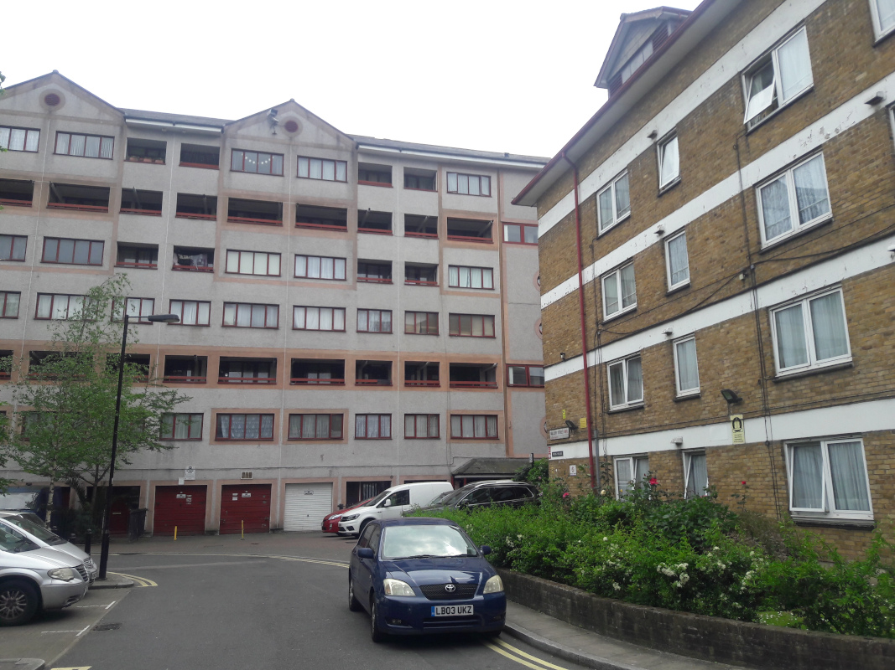
  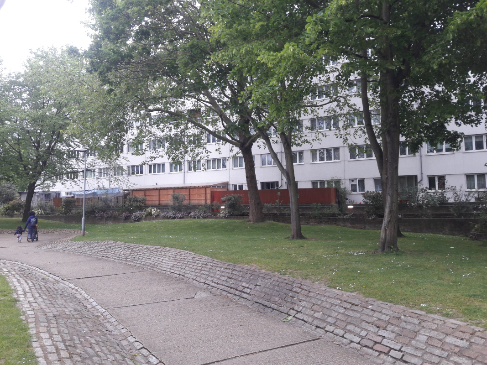
  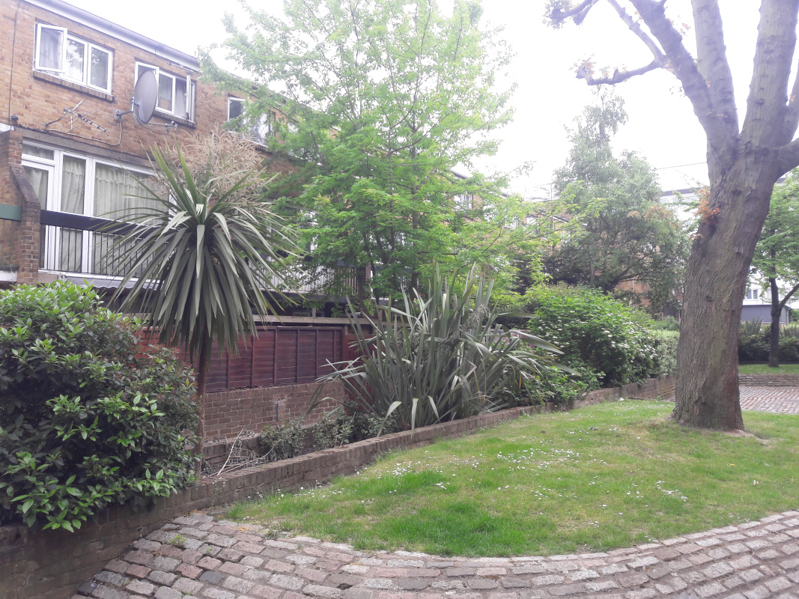
  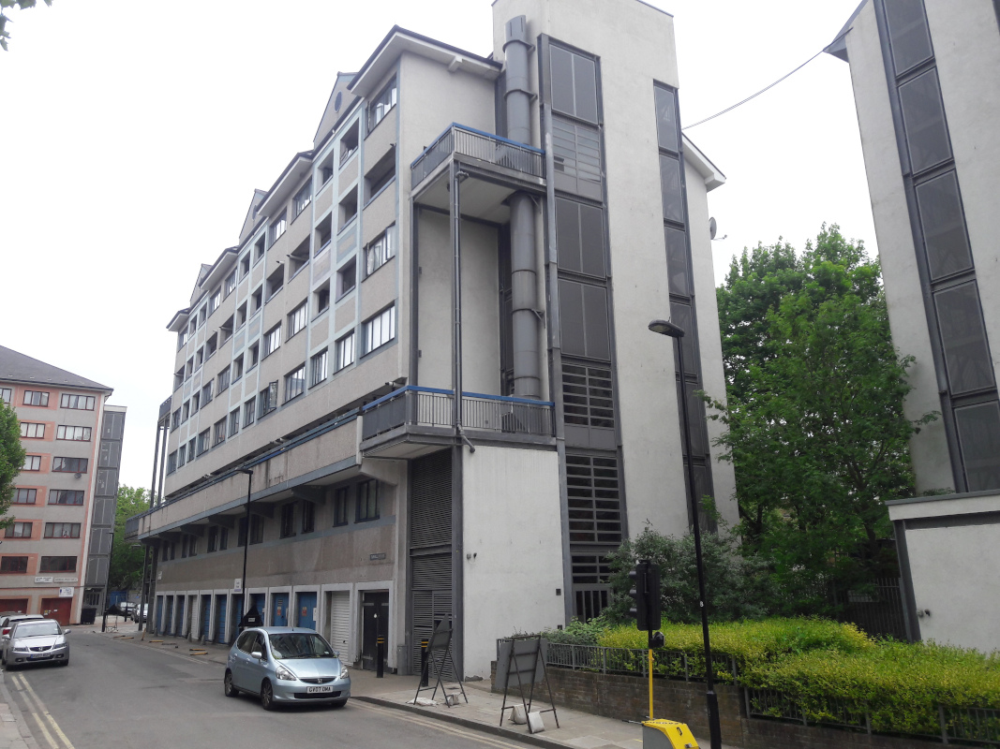
  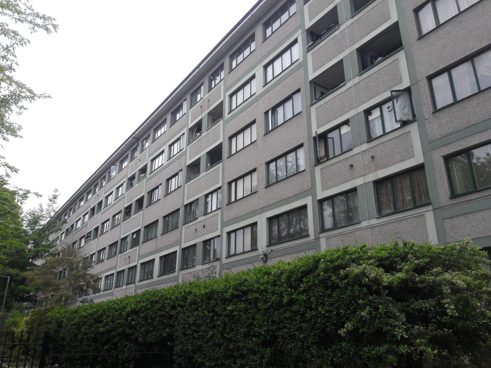
  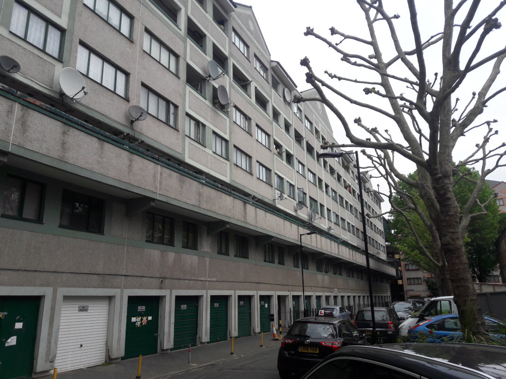
  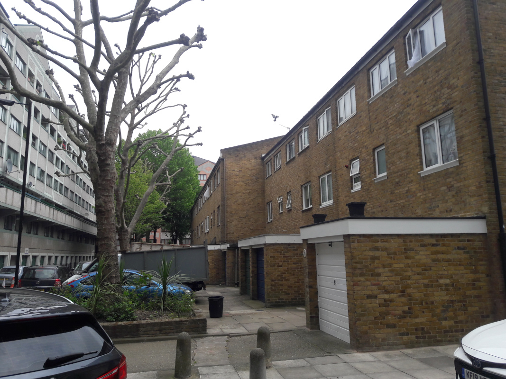
  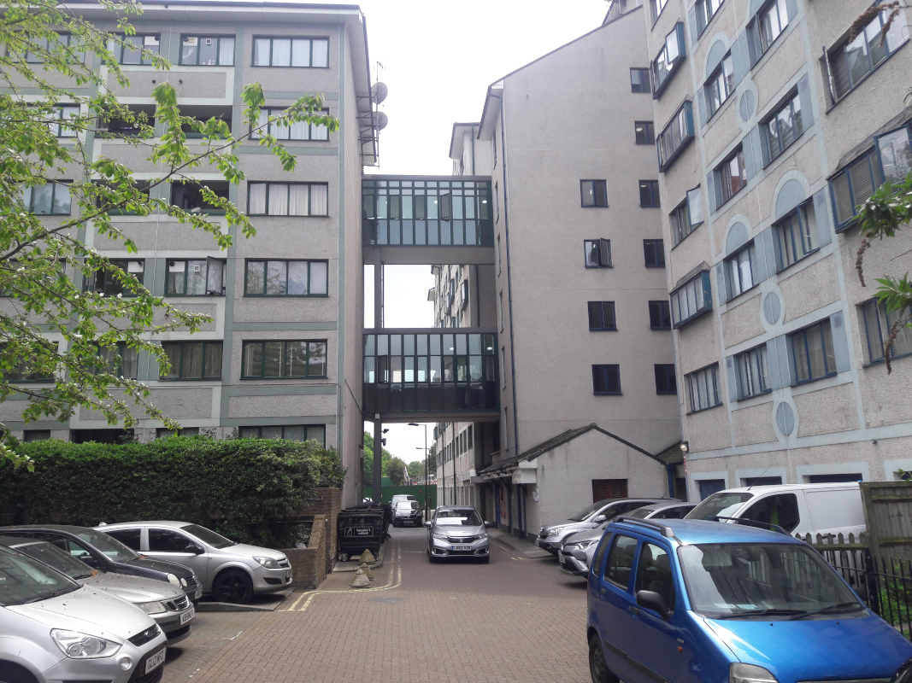
  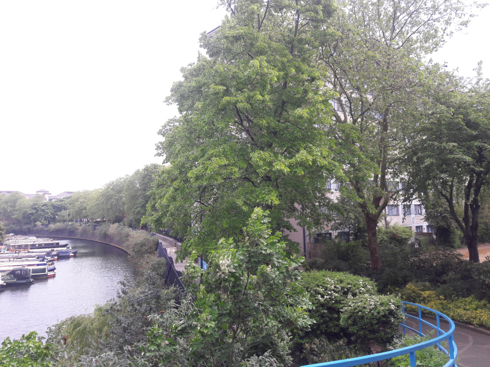
  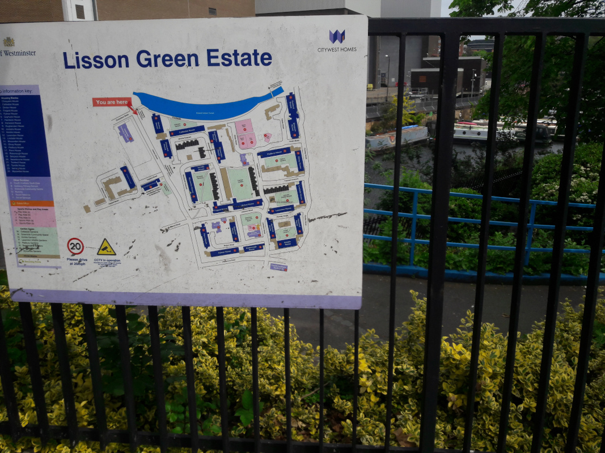
  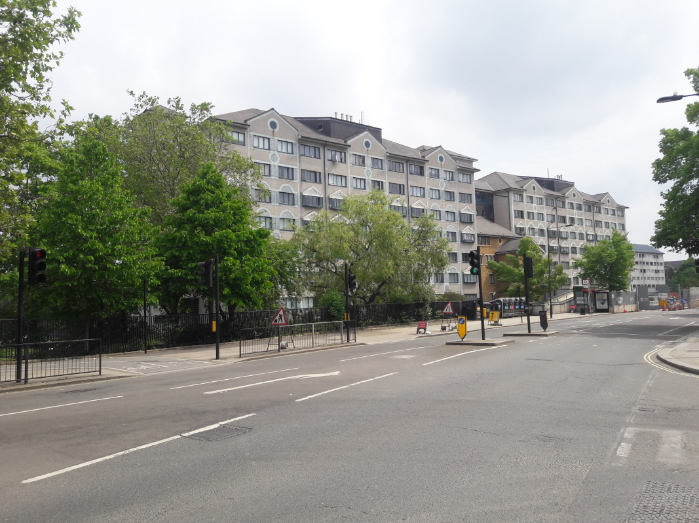
  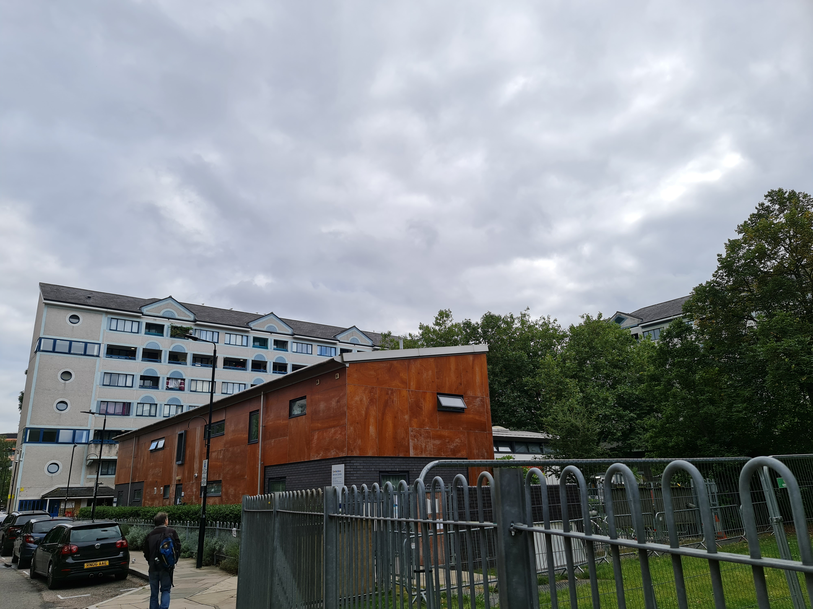
  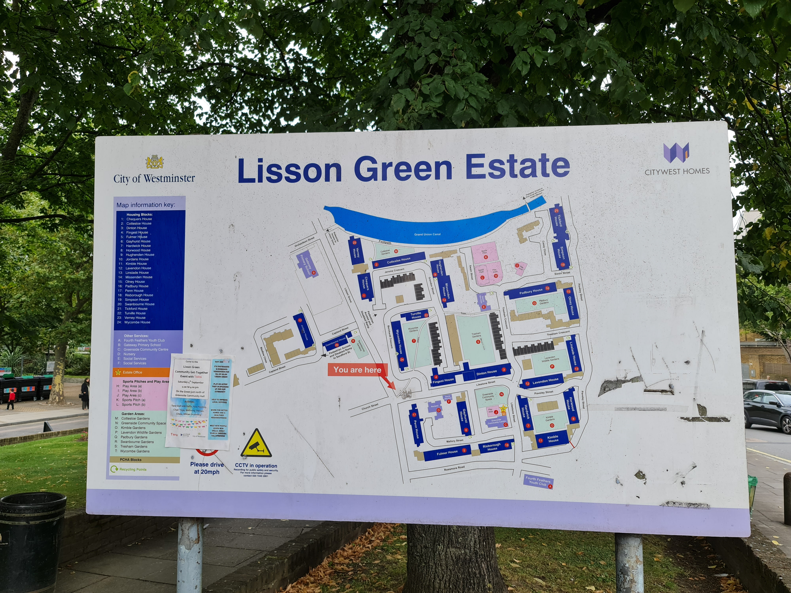
