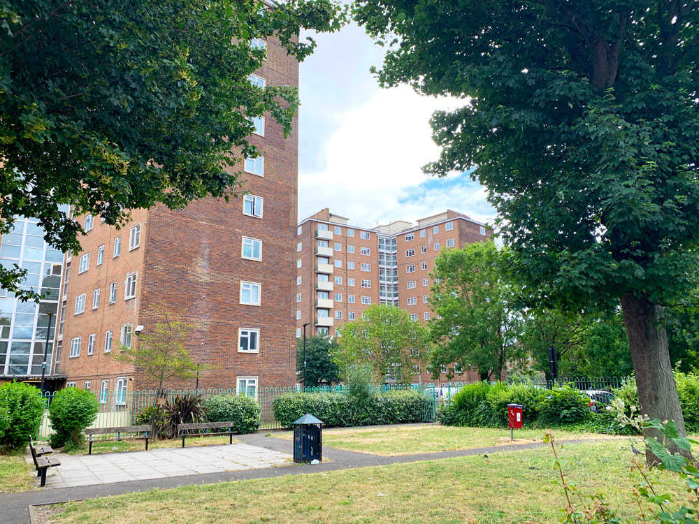
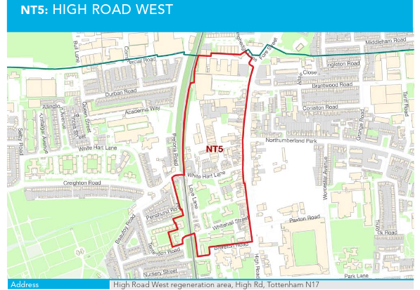

297 council homes on the Love Lane estate have been earmarked for redevelopment as part of [Haringey's regeneration of Tottenham](https://tottenham.london/HighRoadWest).

The estate was originally designated for redevelopment by Haringey Council’s cabinet in December 2014. It was subsequently included as a development site in Haringey's [Tottenham Area Action Plan](https://www.haringey.gov.uk/sites/haringeygovuk/files/final_haringey_tottenham_aap_dtp_online.pdf) (site NT5 - High Road West). 

Haringey Council began rehousing secure tenants in February 2015 and there are now 180 temporary tenants on the estate (temporary tenants can be removed quickly in the run up to demolition). 

In August 2021, Haringey published its [Landlord Offer](https://www.haringey.gov.uk/sites/haringeygovuk/files/love_lane_landlord_offer_final.pdf) to residents.

The offer proposes to replace the estate's 297 homes with 2,600 new homes, of which 40% 'affordable'. Of the affordable homes 500 are set to be council homes at council rent.

A ballot took place in September 2021 in which 69% of 'eligible' residents voted, of which 55% supported the demolition of their homes and 45% did not. This represents just 39% of residents on the estate who were eligible to vote and did so - hardly a convincing mandate.

The residents eligible to vote consisted primarily of temporary residents, which numbered 226 compared with 43 remaining secure tenants and 25 resident leaseholders. During the ballot, temporary residents were offered secure council tenancies in replacement homes if the scheme goes ahead.

In January 2022, it was revealed that Haringey Council spent £350k on its campaign for a YES vote. As a result of this, a [petition](https://www.pilc.org.uk/tell-sadiq-to-say-yes-to-the-resident-empowerment-fund/) has been set up, calling on the Mayor to create a Resident Empowerment Fund that will level the playing field between councils and the local community in estate ballots.

---

<!------------THE CODE BELOW RENDERS THE MAP - DO NOT EDIT! ---------------------------->

---