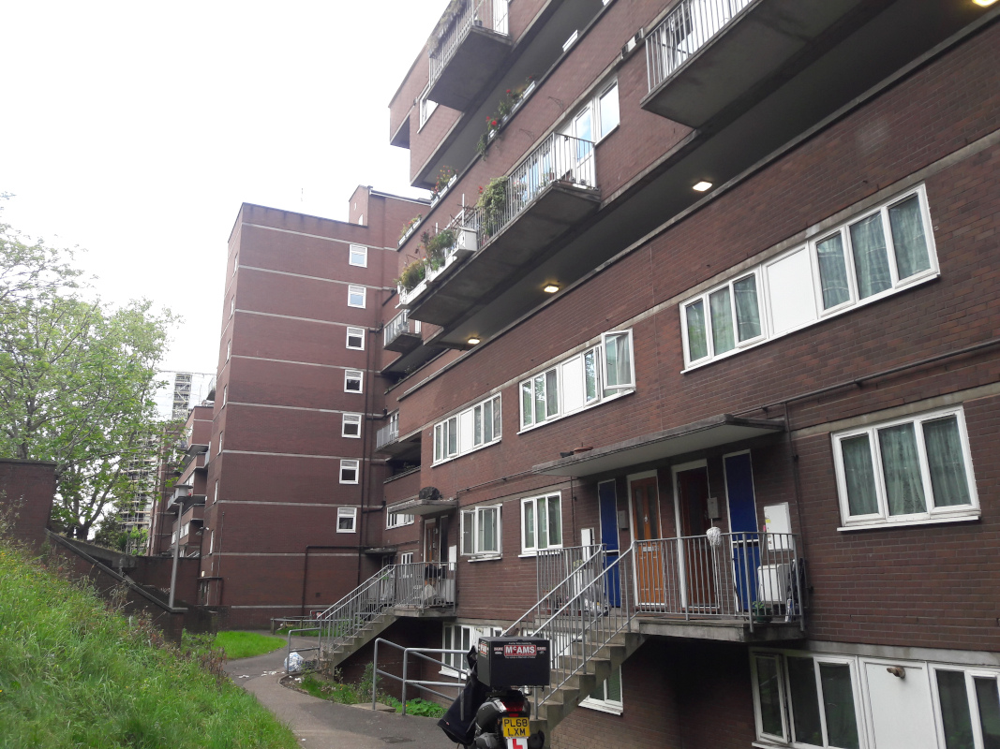

249 homes are under threat of demolition by Guinness housing association on the Mansell Street estate in the City of London.

The estate is listed as a 'Key Area of Change' in the local plan: [https://www.cityoflondon.gov.uk/services/environment-and-planning/planning/planning-policy/local-plan/Documents/draft-city-plan-2036.pdf](https://www.cityoflondon.gov.uk/services/environment-and-planning/planning/planning-policy/local-plan/Documents/draft-city-plan-2036.pdf)

In 2016, Guiness submitted a planning application for redevelopment of the estate but this was subsequently withdrawn after protests from residents.

In June 2019, it was [reported](https://www.citymatters.london/mansell-street-estate-residents-must-final-say/) that the stalled previous plans were currently being reworked before being presented to residents once again.

The City of London's [draft 2024 Local Plan](https://www.cityoflondon.gov.uk/assets/Services-Environment/City-Plan-2040.pdf) lists the redevelopment of the Mansell Street estate as one of its key areas of change:

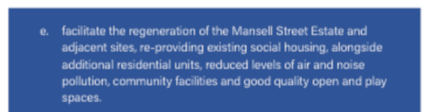

---

__Links:__  
[GLA stage 1 report for the withdrawn 2016 application](https://www.london.gov.uk/what-we-do/planning/planning-applications-and-decisions/planning-application-search/mansell-street-estate-haydon-sqaure)

[Guiness website FAQs on the Mansell Street scheme](https://www.guinnesspartnership.com/case-study/mansell-street-city-london/)

---

<!------------THE CODE BELOW RENDERS THE MAP - DO NOT EDIT! ---------------------------->

---

  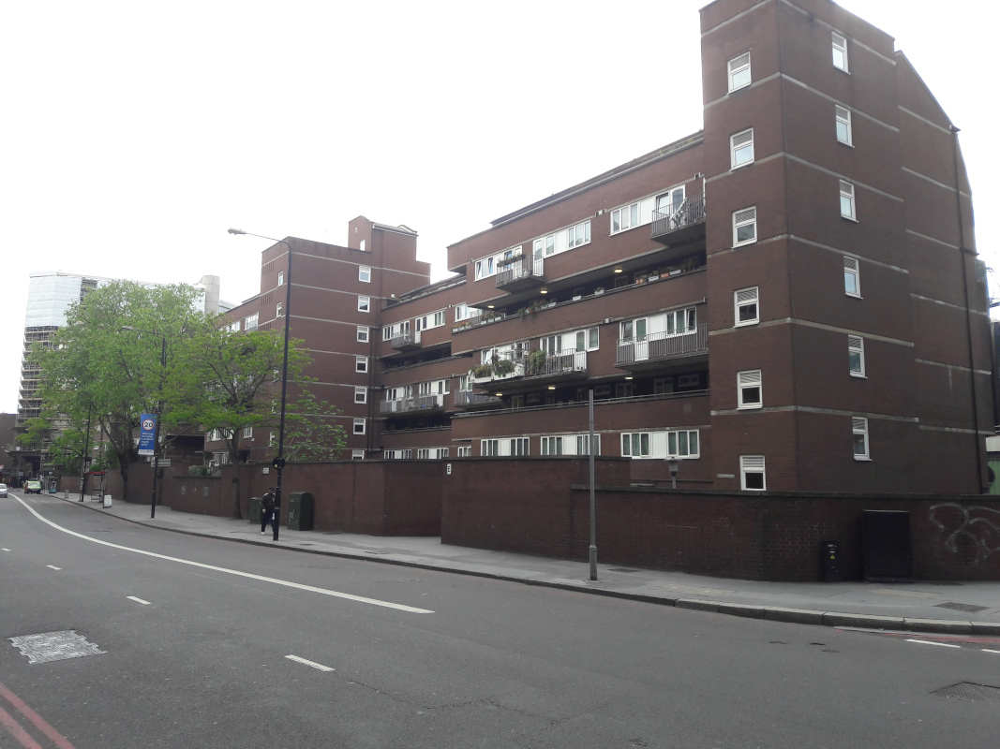
 
  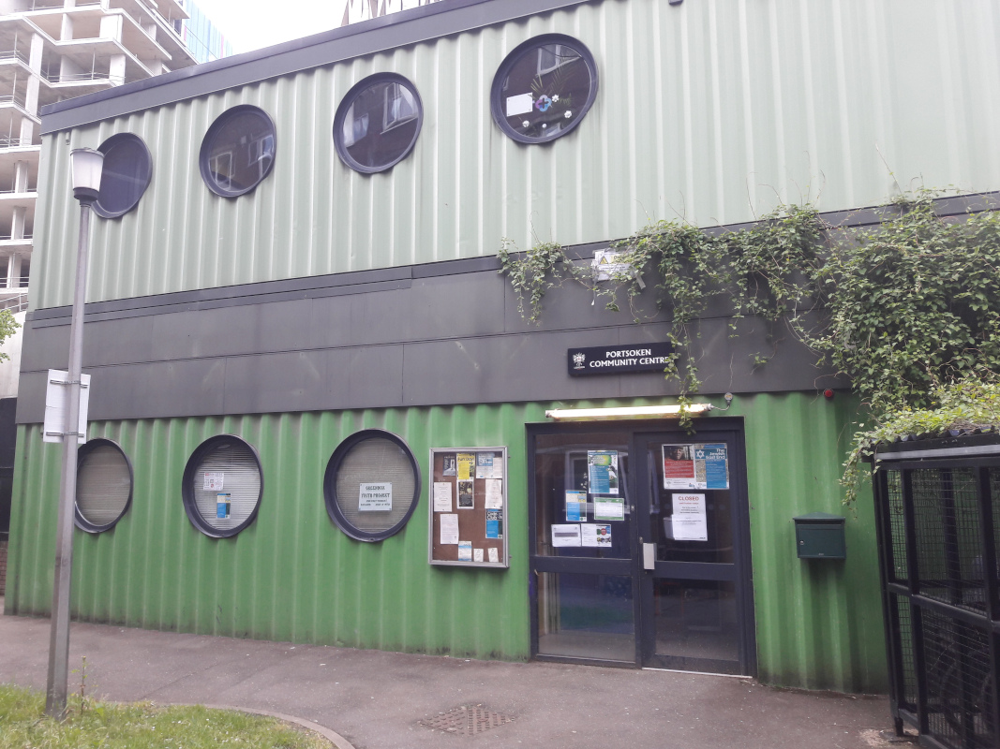
  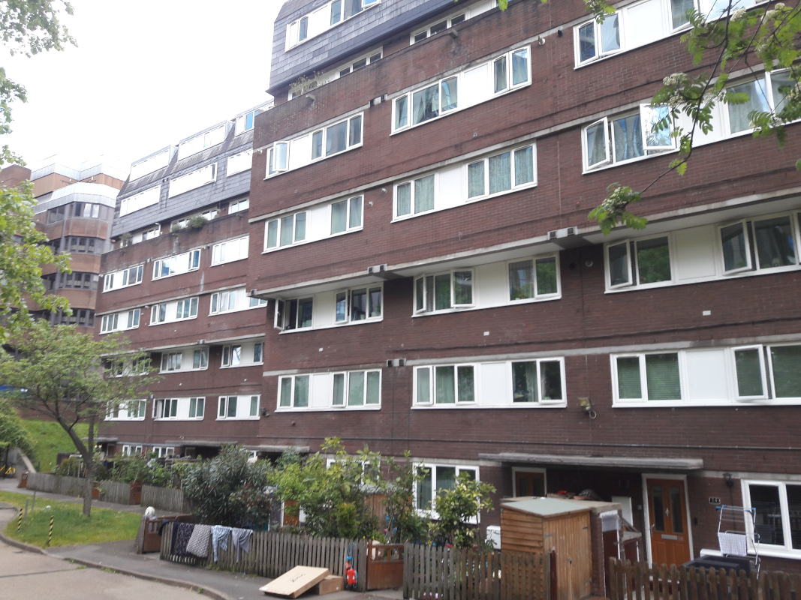
  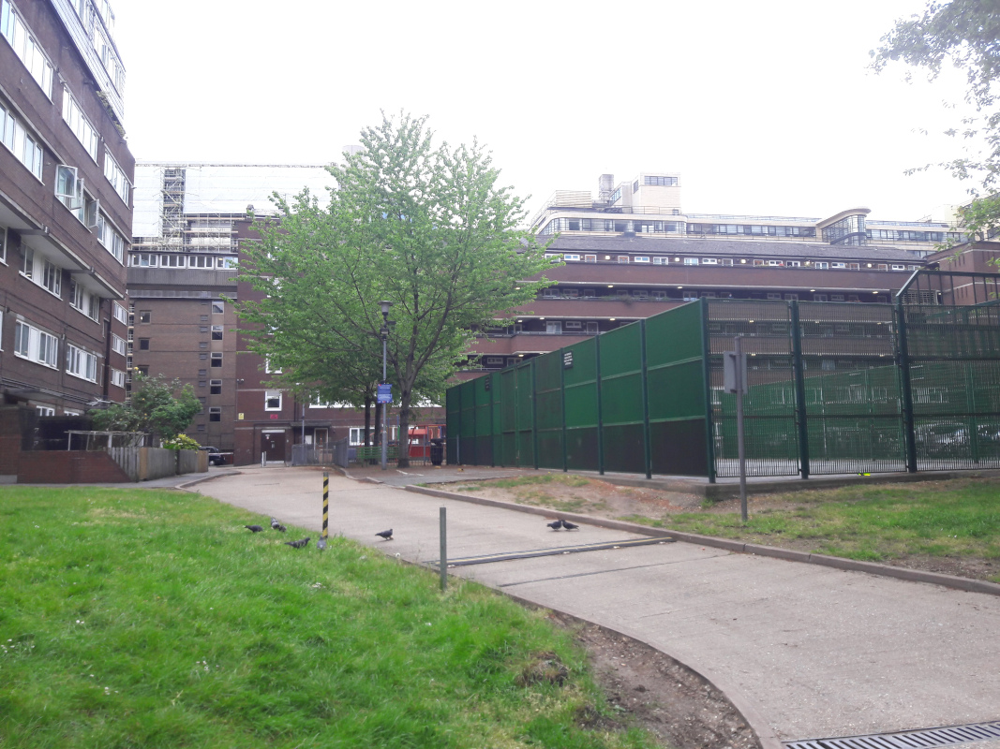
  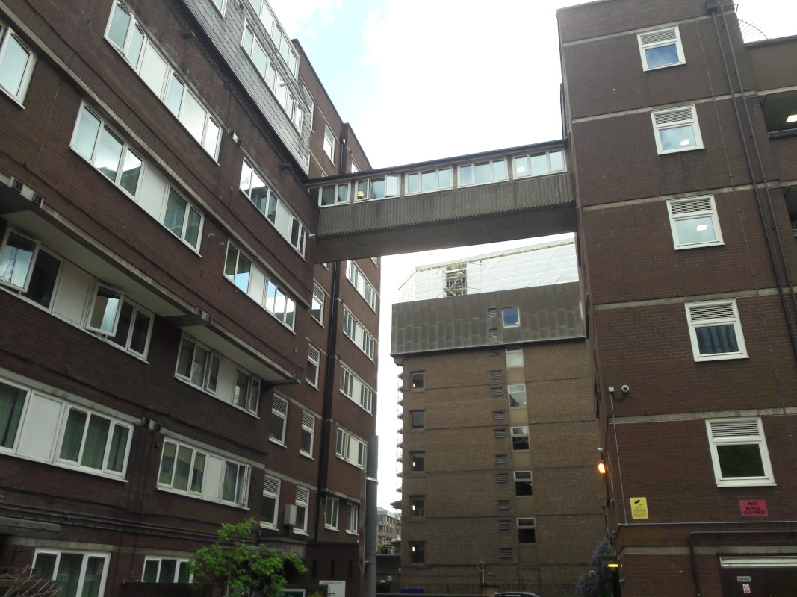
  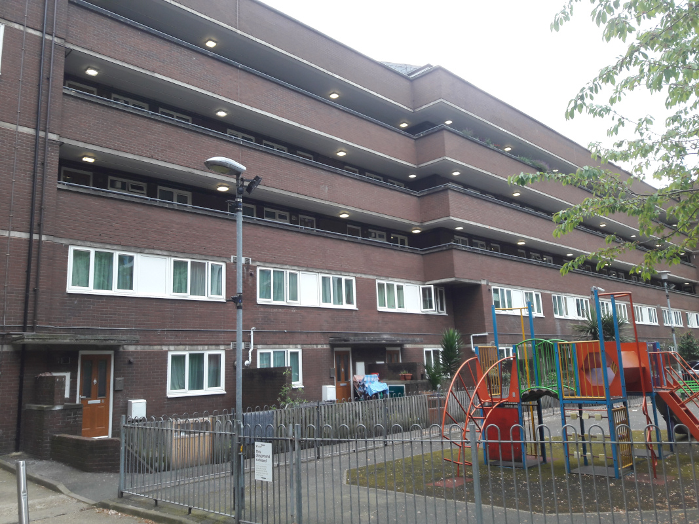
  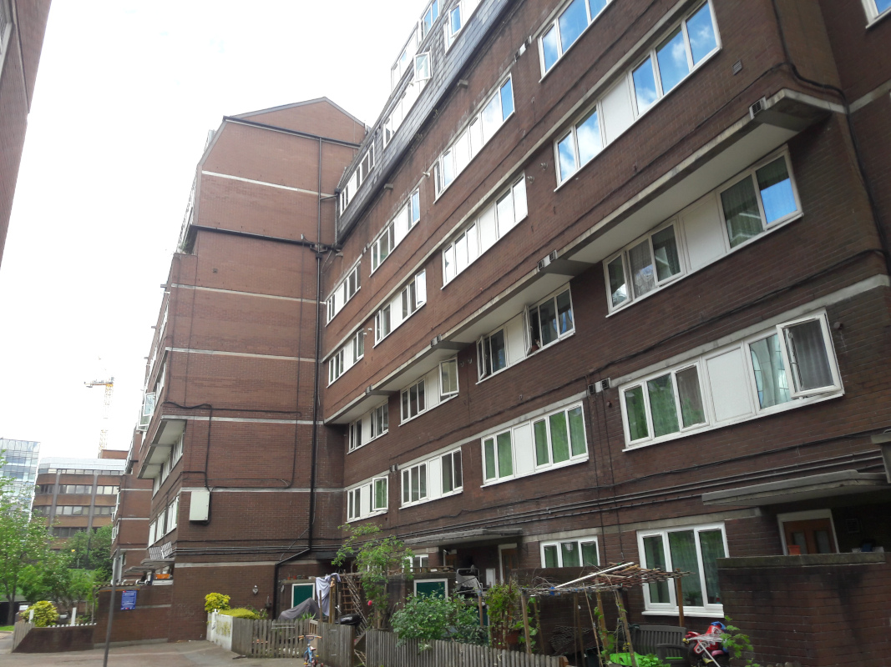
  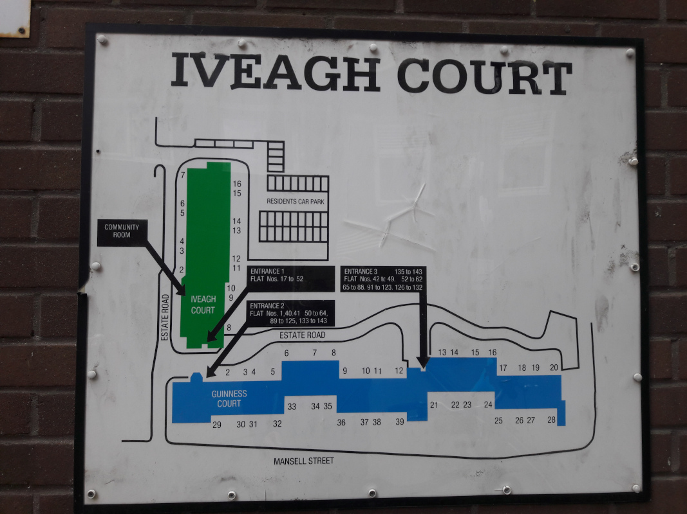
  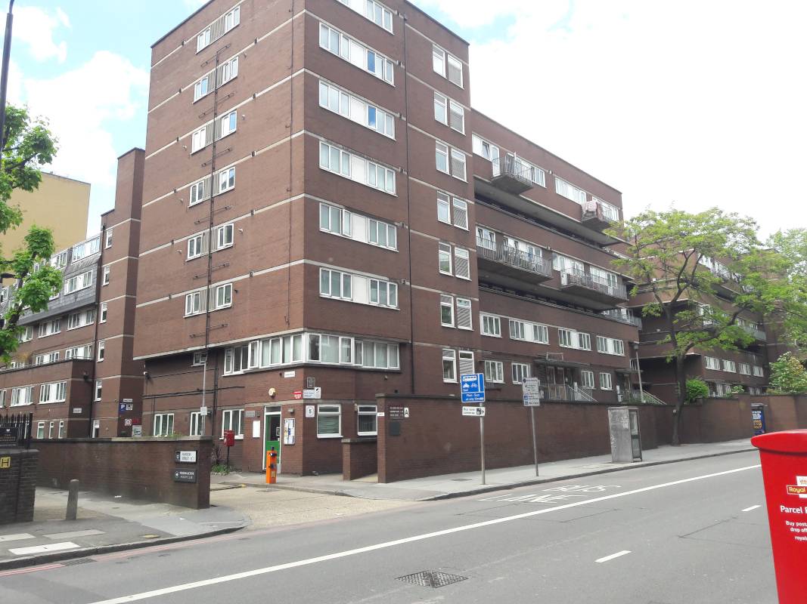
  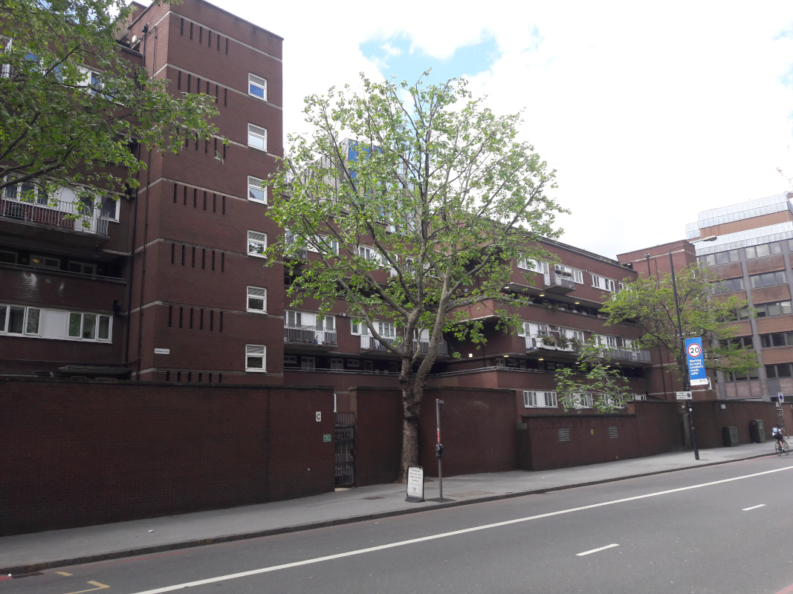

