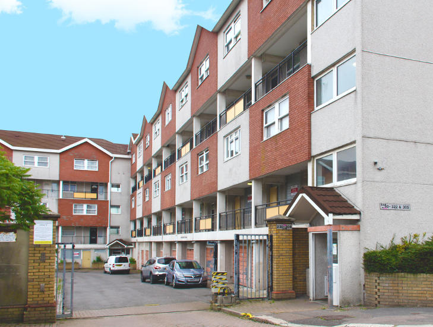

150 homes remain earmarked for demolition on Waltham Forest's Marlowe Road estate in Walthamstow.

The estate was one of 11 estates [identified](https://democracy.walthamforest.gov.uk/documents/s10654/4.2.%20LSP%20report%20-%20Estates%20Review.pdf) for possible redevelopment in a 2010 Estates Capacity Study.

The Estates Review named Marlowe Road as the ‘highest priority’ area for regeneration because it was supposedly run down and _‘badly designed’_.

150 of the estate's 298 council homes will be demolished, with those in the 21-storey Northwood Tower being retained and refurbished.

The scheme is being progressed in three phases via a joint venture with developer Countryside properties. 

Phase 1a of the scheme was completed in June 2018 and comprised 18 shared ownership homes, 34 homes for 'Council rent' and 51 homes for private sale. 

Phase 2 of the scheme commenced in November 2019 and comprises 128 new homes of which 38% will be 'affordable'.

Overall the scheme will provide 436 new homes of which 34% will be 'affordable'.

The redevelopment is being [funded](https://www.london.gov.uk/programmes-strategies/housing-and-land/homes-londoners/estate-regeneration/estate-regeneration-data) by the Mayor and has been granted an [exemption](/approved/ballotrequirements) from his requirement to ballot residents.

Waltham Forest applied for a Compulsory Purchase Order to be able to remove remaining leaseholders in 2019. 

In january 2022, a planning application was submitted to add an extra 144 homes to the scheme, of which only 13 social rent. Residents have [complained](https://www.yellowad.co.uk/residents-fury-over-proposed-changes-to-walthamstow-housing-blocks-plan/) of the move as cynical, underhand and sneaky.

---

__Links:__
Waltham Forest's [Statement of Reasons](/images/MarloweRdCPO.pdf) for its 2019 Compulsory Purchase Order.

[Waltham Forest's planning application docs (ref:151652)](https://planning.walthamforest.gov.uk/planning/search-applications?civica.query.FullTextSearch=151652#VIEW?RefType=APPPlanCase&KeyText=151652)

[The Mayor's Stage 1 and Stage 2 reports](https://gla.force.com/pr/s/planning-application/a0i4J0000003TaCQAU/20163106as2?tabset-c2f3b=2)

---

<!------------THE CODE BELOW RENDERS THE MAP - DO NOT EDIT! ---------------------------->

---

