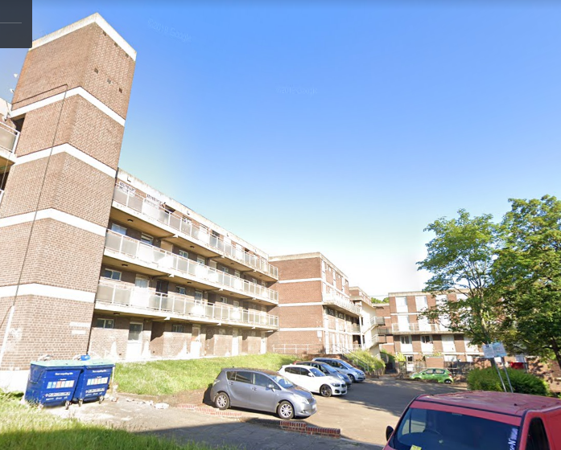
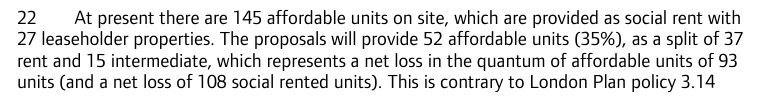
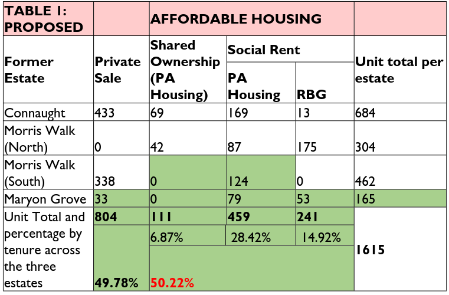

172 homes on Greenwich's Maryon Grove estate in Charlton have been earmarked for demolition by Greenwich Council. 

The estate comprises 172 homes in 16 4-storey blocks. It overlooks Maryon park to the West and the Thames barrier to the North and is adjacent to the [Morris Walk estate](https://www.estatewatch.london/estates/greenwich/morriswalk/) which is also earmarked for demolition. 

Outline permission granted in 2015 for 165 new homes, with just 35% affordable of which 70% affordable rent. The estate is being redeveloped in a joint venture between Greenwich Council and developer [Lovell](https://www.lovell.co.uk/)

The Mayors [report](https://www.london.gov.uk/sites/default/files/public%3A//public%3A//PAWS/media_id_251849///one_woolwich_maryon_road_report.pdf) approving the application acknowledges that there will be a net loss of 108 social rented units.

It also acknowledges that the replacement 'social' housing will be 'affordable rent' in tenure - i.e. up to 80% market rents.

Despite being granted outline planning in 2015, detailed applications for the scheme are still pending and the estate is still fully occupied.

Greenwich Council's [website](https://www.royalgreenwich.gov.uk/info/200200/regeneration/142/woolwich_regeneration/2) says that it has no date for commencing the scheme and that it is 'continuing to put pressure on the developer' to bring the scheme forward.

Meanwhile, the last few homes on the estate are being demolished, having been left in a derelict state and subject to vandalism, as reported [here](https://853.london/2023/03/31/derelict-maryon-grove-estate-left-open-to-the-elements-will-be-fenced-off-soon-council-insists/) and [here](https://www.fromthemurkydepths.co.uk/2024/09/11/one-woowich-estate-project-set-to-see-cut-in-new-greenwich-council-homes/).

*Photo credit: https://fromthemurkydepths.co.uk*

The Maryon Grove estate is the last of Greenwich's 'Three estates' schemes, in which 1,064 homes on three estates (The Connaught, Morris Walk and Maryon Grove estates) are being demolished and replaced with 1,600 new homes of which just 278 council homes. In September 2024, Greenwich applied to modify the planning consent and reduce this number to 241 on grounds of reduced financial viability. The [committee report](https://greenwich.moderngov.co.uk/documents/s8304/Woolwich%20Estates%20Maryon%20Road%20Grove.pdf) approving the reduction claims that refusing the application would result in the developer Lovell walking away from the scheme. 

---

__Links:__

[GLA Stage 1 and 2 reports](https://www.london.gov.uk/sites/default/files/public%3A//public%3A//PAWS/media_id_251849///one_woolwich_maryon_road_report.pdf)

Greenwich Council's [website](https://www.royalgreenwich.gov.uk/info/200200/regeneration/142/woolwich_regeneration/2) page with information about the scheme.

---

<!------------THE CODE BELOW RENDERS THE MAP - DO NOT EDIT! ---------------------------->

---
