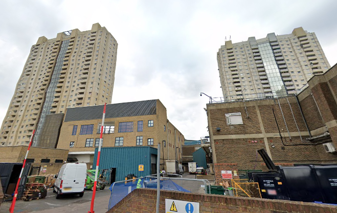
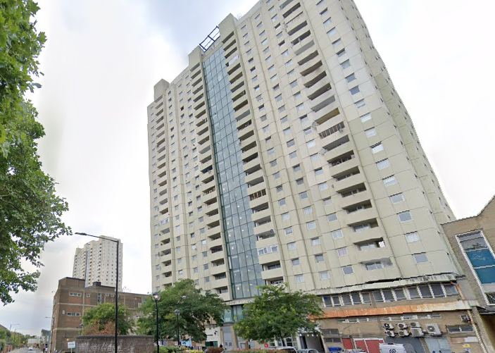
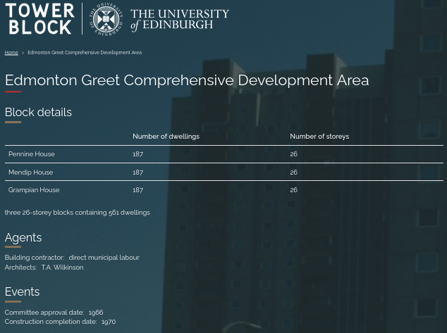

350 homes are under threat of demolition at Mendip and Penine House above the Edmonton Green shopping centre in Enfield.

According to landlord MTVH the blocks which rise to 25 storeys tall – _“require significant structural strengthening work to meet current building safety regulations”_.

In 2023, MTVH commissioned a structural survey in response to new legislation on tall buildings, which reported the issues. The survey is not in the public domain.

MTVH has a website FAQ for residents in which it declares that _"The specialist engineers who completed these surveys, Wilde Carter Clack, advised that the buildings are currently safe to live in. Please be assured that there is no immediate danger to you or your home."_

An [article](https://enfielddispatch.co.uk/wp-content/uploads/2024/03/Dispatch-67.pdf) in the local press points out that there is a third high-rise block next to Mendip and Penine called Grampian House but which is owned by housing association L&Q. 

* Grampian House*

The __Enfield Dispatch__ reports that it contacted L&Q to ask if there are similar problems with the building, but Pete Paton, head of strategic building safety at L&Q said: 

 > “We have carried out a number of surveys at Grampian House in recent years, including in 2016, 2021 and 2023, which have confirmed the building is structurally safe, and have recently shared this reassurance with residents. We’ll continue to work with residents to ensure they feel safe in their homes.

 > “Unlike its neighbouring blocks at Mendip and Pennine House, Grampian House was not built with a large panel system, a type of construction method which was popular in the 1960s. As a result, Grampian House does not have the same issues and L&Q will not be taking the same actions as Metropolitan Thames Valley, the landlord of Mendip and Pennine House.”

 This raises a number of questions, not least because the University of Edinburgh's [archives](https://www.towerblock.eca.ed.ac.uk/development/edmonton-greet-comprehensive-development-area) show that all three blocks were designed and built at the same time by the same architects and contractors. 
 
 

 There also remains a question as to why the surveys were carried out only very recently. If the blocks really do suffer from the same structural defects as Ronan Point, why has it taken over 50 years to establish this?

 Finally, is it a coincidence that the Edmonton Green Shopping Centre has recently been included in the borough's [Local Plan](https://www.enfield.gov.uk/__data/assets/pdf_file/0031/55669/ELP-Reg19-Appendix-C-Site-Allocations-Planning.pdf) as a potential site for redevelopment and provision of over 1,000 new homes? Is the survey (which has not been made publicly available) being used as a means to mask what is essentially a development opportunity?

As of 2024, it was [reported](https://enfielddispatch.co.uk/second-staircases-set-to-be-added-to-major-edmonton-green-redevelopment/) that the Crosstree led Edmonton Green redevelopment will retain and integrate the three towers, however, it is unclear how this resonates with MTV's statements and the L & Q survey. 

---

__Links:__

Local media article: <https://enfielddispatch.co.uk/two-edmonton-towers-face-demolition-over-safety-fears-with-hundreds-of-families-affected/>

[PDF version](https://enfielddispatch.co.uk/wp-content/uploads/2024/03/Dispatch-67.pdf)

Edmonton Green Masterplan: <https://edmontongreencentre.co.uk/wp-content/uploads/2023/09/Crosstree.EdmontonGreen.Boards.Web_.20.11.13.pdf> 

---

<!------------THE CODE BELOW RENDERS THE MAP - DO NOT EDIT! ---------------------------->

---
