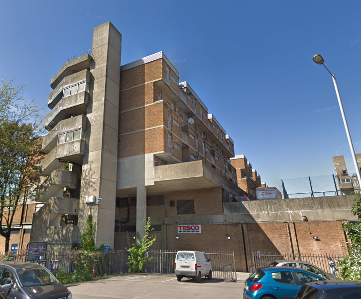

276 homes are under threat of demolition at Lewisham's Milford Towers in Catford.

In September 2011, Lewisham Council agreed to redevelop the 276 council homes in Milford Towers along with the Catford Shopping centre (which it sits above) as part of its regeneration plans for Catford Town Centre. 

Following the decant of most of the secure tenants the scheme stalled and in 2013 Lewisham signed an agreement with Notting Hill Genesis Housing Association to let the homes out at intermediate rents.

In 2018, further delays saw the Council [extend its agreement with Notting Hill](http://councilmeetings.lewisham.gov.uk/documents/s58205/Secretary%20of%20State%20Approval%20Milford%20Towers.pdf) until 2024. In July 2018 there were 17 remaining secure tenants, 18 leaseholders, 49 temporary tenants and a total of 191 homes let to Notting Hill, which it in turn is letting to private tenants at intermediate/market rents.

In October 2021, residents [marched](https://londonnewsonline.co.uk/tower-block-residents-march-on-council-offices-in-protest-of-slum-living/) on the Town Hall in protest at the living conditions on the estate.

In October 2024, it was [reported](https://www.mylondon.news/news/south-london-news/south-london-council-spends-16m-30141640) that the Council has spent over £16 million refurbishing the estate since 2018. This included roof replacements, as well as new windows, kitchens and bathrooms. The second phase, which is due to be finished in March 2025, includes the installation of new lifts and CCTV cameras, as well as the replacement of stairwell windows.

The same meeting documents approved plans to continue leasing out 181 properties on the estate to housing association Notting Hill Genesis for another year due to ongoing delays in the scheme.

---

<!------------THE CODE BELOW RENDERS THE MAP - DO NOT EDIT! ---------------------------->

---
