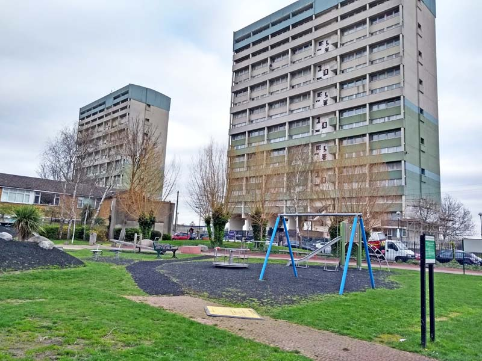

Circa 200 homes in two towers on the Montague road estate have been earmarked for redevelopment.

The estate was initially one of 11 estates [identified](https://democracy.walthamforest.gov.uk/documents/s10654/4.2.%20LSP%20report%20-%20Estates%20Review.pdf) for possible redevelopment in a 2010 Estates Capacity Study.

Two tower blocks (Fred Wigg and John Walsh Towers) were earmarked for possible demolition in the capacity study.
However, in 2018 it was decided to refurbish instead of redevelop the two towers, but the botched commencement of refurbishment works has led the Council to re-consider demolition.

In 2023, Waltham Forest Council came forward with new proposals for redevelopment. Its latest proposals claimed that continuing refurbishment would cost £35-42m, while redevelopment would cost £250m.

The new redevelopment option would involve building circa 450-500 new homes which would be all be “affordable”, split 50:50 between social rent and shared ownership.

The redevelopment plans have been included within the borough's [Local Plan](https://www.walthamforest.gov.uk/sites/default/files/2024-08/Montague%20Road%20Estate%20%28R19116%29_0.pdf) before being subject to consultation and a resident ballot.

---

__Links:__

[https://walthamforestecho.co.uk/2023/07/28/council-confirms-plans-for-comprehensive-redevelopment-of-leytonstone-estate/](https://walthamforestecho.co.uk/2023/07/28/council-confirms-plans-for-comprehensive-redevelopment-of-leytonstone-estate/)

[Local Plan site allocation - 2024](https://www.walthamforest.gov.uk/sites/default/files/2024-08/Montague%20Road%20Estate%20%28R19116%29_0.pdf) 

---

<!------------THE CODE BELOW RENDERS THE MAP - DO NOT EDIT! ---------------------------->

---