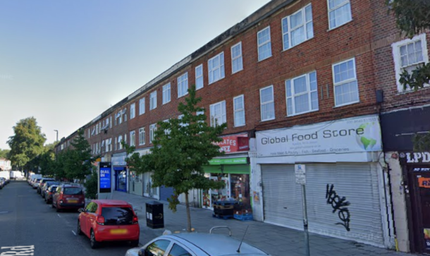
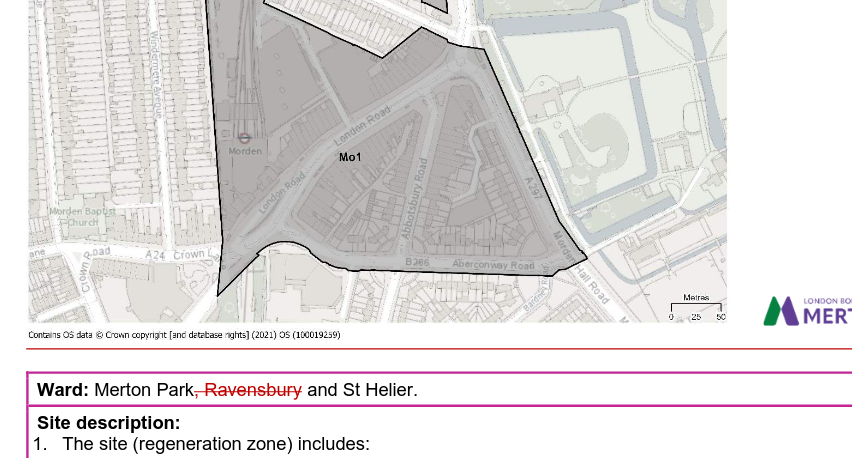

Circa 200 homes have been identified for redevelopment in Merton's draft [2024 Local Plan](https://www.merton.gov.uk/system/files/lbm31_mertons_local_plan_incorporating_proposed_modifications_feb24_final.pdf)

Given that whilst many but not all of the homes involved in this scheme are in council ownership but this is not technically a housing estate, it is unclear whether the Mayor's policies on resident ballots and estate regeneration will apply to this scheme.

---

<!------------THE CODE BELOW RENDERS THE MAP - DO NOT EDIT! ---------------------------->

---

![Morden Regen estate image](src/images/mordenregenzone.png", "morden regen zone" %}