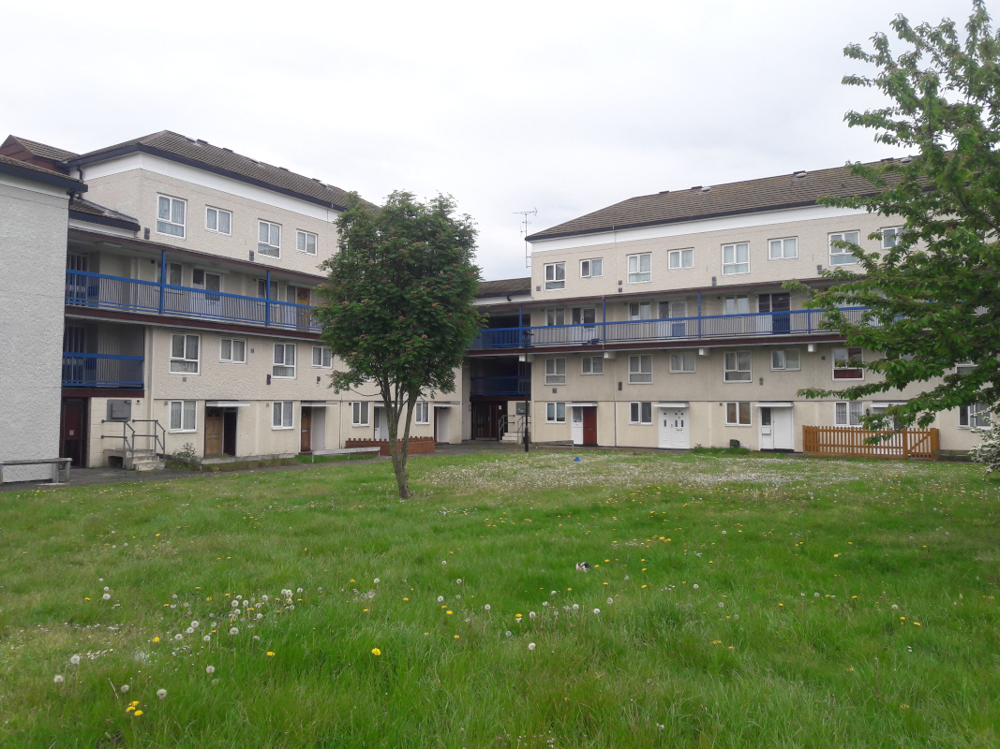

Circa 300 homes are earmarked for potential demolition on Hounslow's Norman Crescent estate.

In January 2020, Hounslow's Cabinet [agreed a comprehensive review](https://democraticservices.hounslow.gov.uk/documents/s157644/CEX432%20Housing%20Estate%20Regeneration%20Programme.pdf) of its 171 council estates with a view to infill or redevelopment.

In the [Cabinet report](https://democraticservices.hounslow.gov.uk/documents/s157644/CEX432%20Housing%20Estate%20Regeneration%20Programme.pdf) it was agreed that six estates had already been identified as 'poor performing estates' and that these would be considered for early redevelopment.

The six estates are: the Brabazon estate; the Brookwood estate; Charlton House; the Convent Way estate; the Norman Crescent estate and the Oriel estate.

The estate is not listed in Hounslow's most recent [(2024) Local Plan site allocations list](https://lbhounslow.sharepoint.com/sites/InternetLinks/pp/Shared%20Documents/Forms/AllItems.aspx?id=%2Fsites%2FInternetLinks%2Fpp%2FShared%20Documents%2FOther%20%28NOT%20on%20website%29%2FReg%2019%20Local%20Plan%202020%2D2041%20Site%20Allocations%20for%20consultation%20link%20from%20interactive%20Local%20Plan%2FHounslow%20Local%20Plan%202020%2D2041%20Chapter%2012%20%2D%20Site%20Allocations%20%28Reg%2019%29%2Epdf&parent=%2Fsites%2FInternetLinks%2Fpp%2FShared%20Documents%2FOther%20%28NOT%20on%20website%29%2FReg%2019%20Local%20Plan%202020%2D2041%20Site%20Allocations%20for%20consultation%20link%20from%20interactive%20Local%20Plan&p=true&ga=1).

---

<!------------THE CODE BELOW RENDERS THE MAP - DO NOT EDIT! ---------------------------->

---

