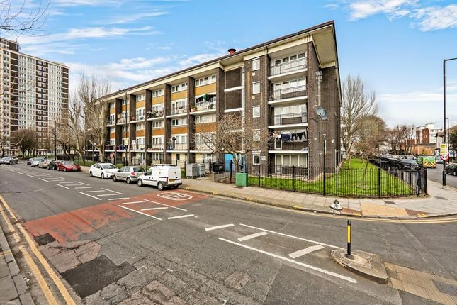
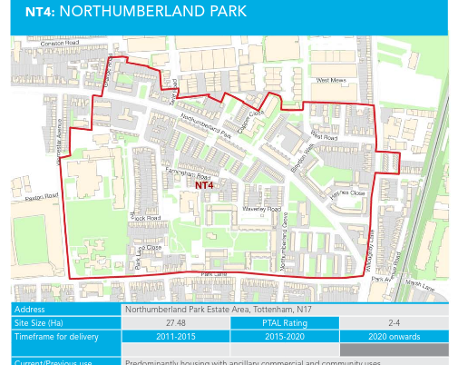

1027 Council homes on Haringey's Northumberland Park estates have been earmarked for redevelopment in Tottenham.

They have been identified for redevelopment in Haringey's [Tottenham Area Action Plan](https://www.haringey.gov.uk/sites/haringeygovuk/files/final_haringey_tottenham_aap_dtp_online.pdf) (site NT4). 

Haringey Council's [dedicated website](https://tottenham.london/NP) provides further details of the scheme.

This recent interview with a resident from one of the Northumberland Park estates highlights the anguish caused by the proposals:

  <iframe class="embed-responsive-item" src="/images/northumberlandpark.mp4" allowfullscreen></iframe>

---

__Links:__
Haringey Council's website for Northumberland Park regeneration: [https://www.haringey.gov.uk/regeneration/tottenham/northumberland-park](https://www.haringey.gov.uk/regeneration/tottenham/northumberland-park)

---

<!------------THE CODE BELOW RENDERS THE MAP - DO NOT EDIT! ---------------------------->

---
