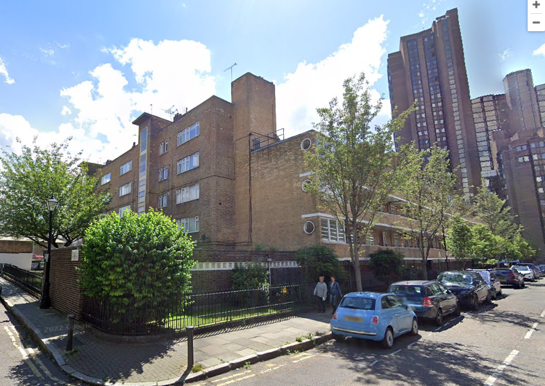
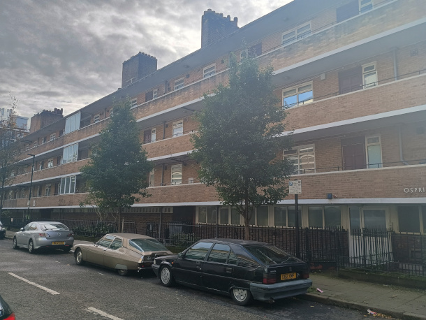

Circa 100 homes have been approved for demolition on the OCCC estate near Waterloo.

The estate – comprising Ospringe House, Croydon House, Charing House, Cornwall Flats and Ethelm House – was built in 1939 by the Church Commissioners.
  
Developer Grainger bought the buildings it now calls the 'OCCC Estate' in 2005 as part of a £70 million deal with the Church Commissioners.

Lambeth approved the redevelopment of the estate in 2019, allowing demolition of the existing buildings and their replacement by 215 new of which 34 homes will be provided for the 34 households on protected tenancies in the existing estate. The remainder will be a mix of private and affordable rented homes at up to 80% market rent.  

One of the smaller blocks on the north-east corner of the estate was demolished in 2022. However as at October 2024, the scheme has progressed no further. The remaining blocks remain occupied and it appears that the scheme has stalled.

---

<!------------THE CODE BELOW RENDERS THE MAP - DO NOT EDIT! ---------------------------->

---

