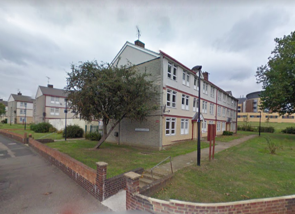
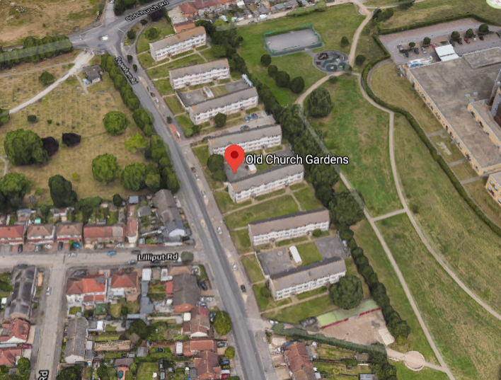

84 homes are under threat of demolition on Havering's Oldchurch Gardens estate in Romford.

The estate has been earmarked for redevelopment as part of Havering's [£1bn joint venture with developer Wates Residential](https://www.wates.co.uk/articles/case-study/borough-of-havering-housing-redevelopment/) which will see 12 of the borough's estates redeveloped.

The scheme has not yet applied for [funding](/approved/funding) from the Mayor or been exempted from his [requirement](/approved/ballotexemptions) to ballot residents on the demolition of their homes. It is unclear whether Havering intends to ballot residents at this stage.

---

<!------------THE CODE BELOW RENDERS THE MAP - DO NOT EDIT! ---------------------------->

---

