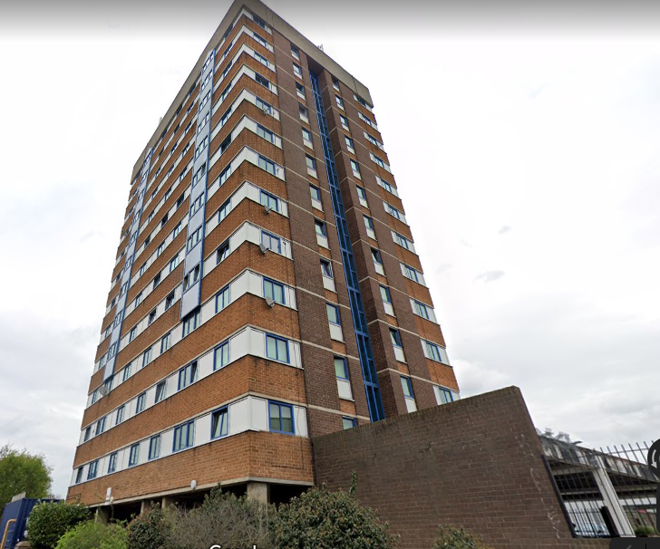

In 2018, Riverside Housing Association (which manages Bromley's council housing), appointed developer Countryside Properties to redevelop the Pike Close estate. The estate comprised circa 100 homes in a series of low-rise maisonettes and a high-rise block.

The Mayor agreed funding in principle for the redevelopment in December 2018 (subject to ballot). In April 2019, a ballot was held and a majority of residents voted in favour of redevelopment. In May 2020, Riverside started final pre-consultation on a [scheme to build 179 new homes of which 92 'affordable'](https://www.riverside.org.uk/wp-content/uploads/2021/05/Pike-Close-Presentation-Final-W10-4YTJ863.pdf). The planning application was approved in March 2022.

More information is available on Riverside's website here: [https://www.riverside.org.uk/redevelopment-projects/pikeclose/](https://www.riverside.org.uk/redevelopment-projects/pikeclose/)

In March 2024, developer Countryside [celebrated](https://www.vistrygroup.co.uk/media-centre/press-releases/riverside-and-countryside-partnerships-mark-success-new-estate) 'topping out' on the first phase of the Pike Close scheme.

