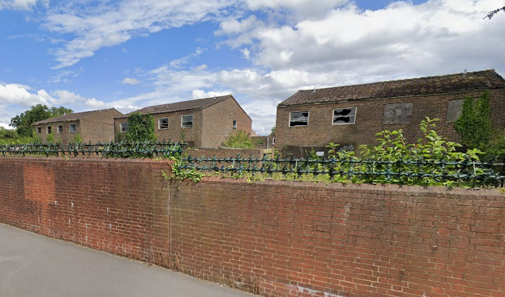

89 homes are earmarked for demolition on the former RAF Uxbridge estate.

The former MOD-owned living accommodation at the former RAF Uxbridge base is now derelict and in ownership of Hillingdon Council.

Hillingdon Council [says](https://www.hillingdon.gov.uk/article/13255/Council-to-bring-historic-former-RAF-site-back-to-life-to-meet-housing-demand) the site will _"provide new affordable homes ranging from one-bedroom properties to large family sized homes, subject to planning permission. Some will be available on the open market while the rest will be rented at London affordable rent."_

---

<!------------THE CODE BELOW RENDERS THE MAP - DO NOT EDIT! ---------------------------->

---

