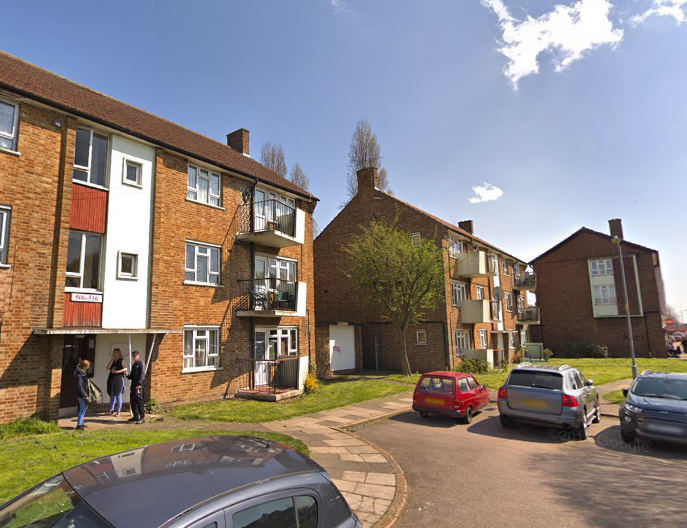
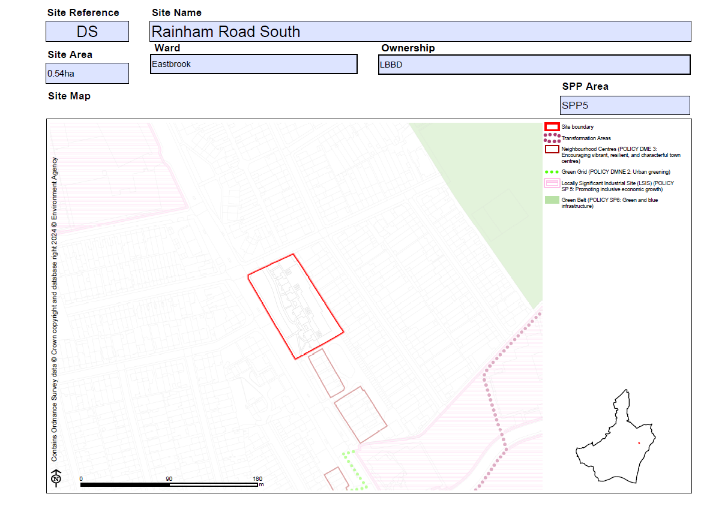

circa 100 council homes on Dagenham's Rainham Road have been earmarked for demolition by Barking and Dagenham Council.

Two blocks at the south of Rainham Road (nos. 265-285) received [planning permission](https://online-befirst.lbbd.gov.uk/planning/index.html?fa=getApplication&id=18275) for redevelopment in 2020.

The plans approved 63 new homes 36% of which _"low-cost rented homes and 64% affordable rented homes (let at up to 80% of market rent)."_

Two further sites on the northern end of Rainham Road containing circa 70 council homes have been identified in LBBD's new [Local Plan](https://www.lbbd.gov.uk/sites/default/files/2024-10/Barking%20and%20Dagenham%20Local%20Plan%202037%20Appendix%202%20Site%20Allocation%20Proformas.pdf) as potential sites for redevelopment (see sites WB & DS):

The schemes are being progressed by the Council in conjunction with its subsidiary affordable housing company [Reside](https://www.lbbd.gov.uk/affordable-rents-reside-housing) which provides intermediate rented housing _"to people who are in employment, but can’t afford to buy or rent privately and have limited access to social housing"_

The Council says that tenants wanting to return to the redeveloped site will pay 'social' rents and that the 5 current leaseholders will have the 'Right to Return' to the redeveloped site. But its [rehousing policy](https://modgov.lbbd.gov.uk/Internet/documents/s131918/Estate%20Renewal%20Report.pdf) provides little detail on how this works in practice - it offers an 'equity loan' scheme but it is discretionary and dependent upon the size of the gap between the value of leaseholders' current homes and the new ones proposed to be built. (para 2.9) 

---

__Links:__

BeFirst consultation website: [https://yourcall.befirst.london/Rainham-Road-South/widgets/8591/faqs](https://yourcall.befirst.london/Rainham-Road-South/widgets/8591/faqs) 

Rainham Rd North [planning docs](https://online-befirst.lbbd.gov.uk/planning/index.html?fa=getApplication&id=18275)

---

<!------------THE CODE BELOW RENDERS THE MAP - DO NOT EDIT! ---------------------------->

