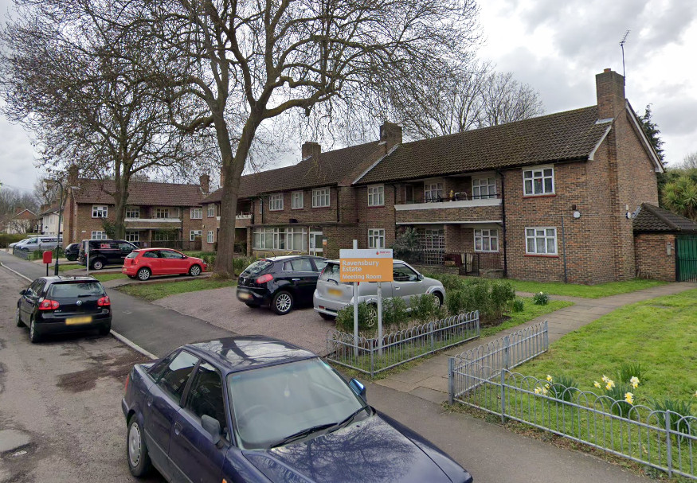
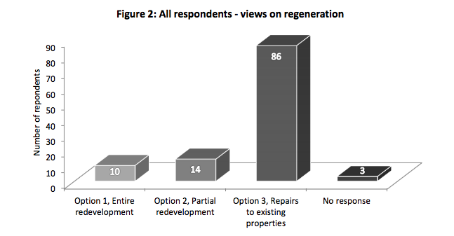
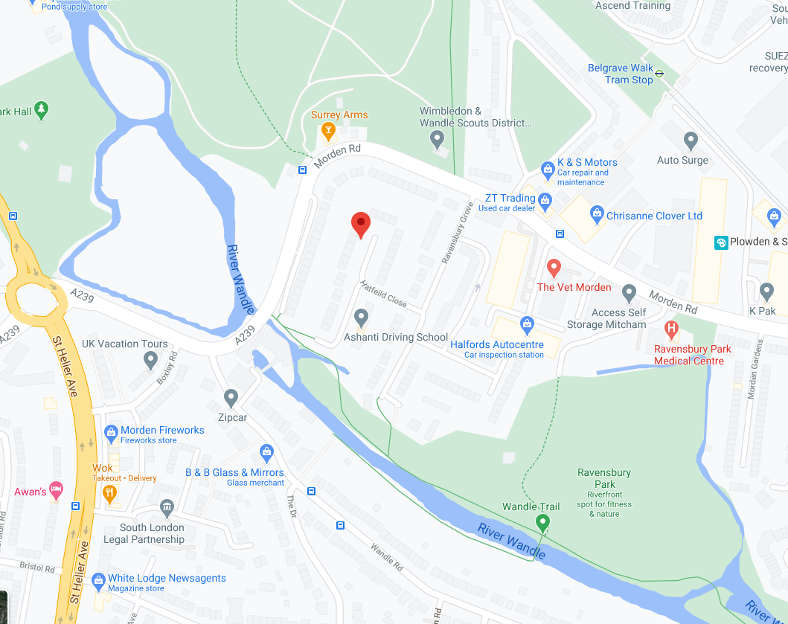
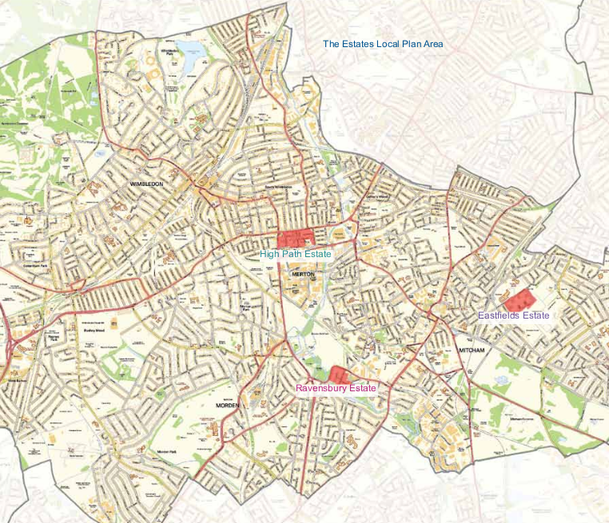
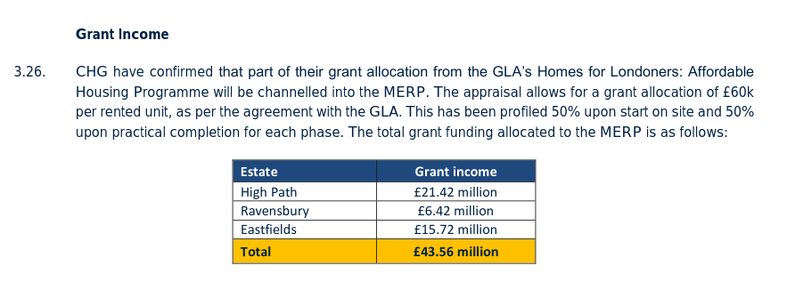
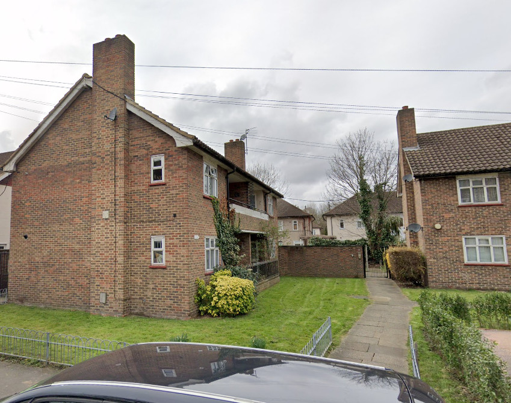
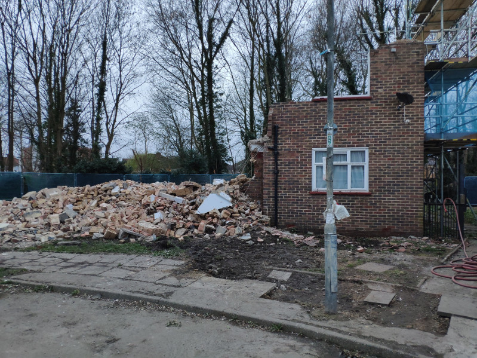
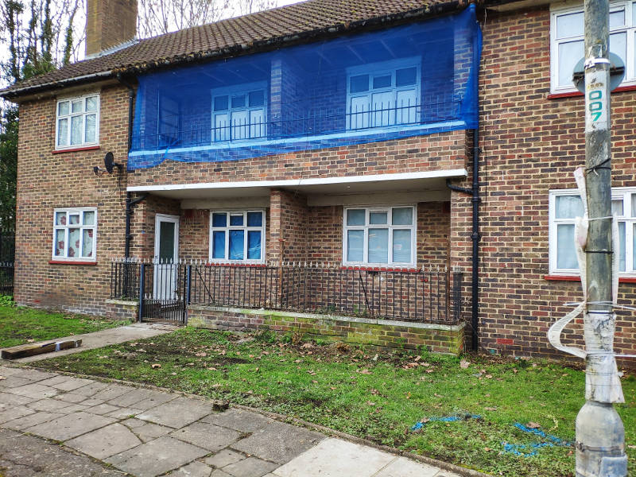

In Nov 2018, the Mayor approved the demolition of 100 homes on Merton's Ravensbury estate, to be replaced by 180 homes of which 50% affordable (affordable rent of up to 80% market rent or [LHA levels](https://www.gov.uk/government/publications/understanding-local-housing-allowances-rates-broad-rental-market-areas) - whichever is lower).

The Mayor's [approval notice](https://www.london.gov.uk/sites/default/files/public%3A//public%3A//PAWS/media_id_437643///ravensbury_estate_report.pdf) confirms the demolition of 97 homes and the replacement tenure of affordable rent, as well as the [exempted](/approved/ballotexemptions) he granted from his requirement to ballot residents on the demolition of their homes.

This is despite Merton having previously carried out its own [consultation](/images/mertonconsultation.pdf) of residents which showed the overwhelming majority in favour of refurbishment.

Indeed the [consultation report](/images/mertonconsultationreport.pdf) itself confers that _' there is little appetite for regeneration of the Estate, with a strong preference for refurbishment of existing properties to bring them up to minimum modern standards.'_

The five-hectare estate overlooks the river wandle and is situated adjacent to the Wandle Valley conservation area.

The scheme is being progressed in phases with the first 'kickstart' phase of 21 homes currently underway. As of September 2020 four homes had been demolished.

The [section 106 agreement](/images/mertons106.pdf) secures the right of any tenants who wish to return to the estate to do so under a social rented tenancy, but enables subsequent re-lets at affordable rent (up to 80 % market rent or LHA rates - whichever is lower).

The scheme is being progressed by Clarion Housing Association (formerly Circle/Affinity Sutton), which took over the Council's housing estate under a 2010 stock transfer agreement. The agreement required Clarion to bring the homes up to Decent Homes Standard by the end of 2015, but Clarion subsequently [persuaded](https://www.merton.gov.uk/assets/Documents/04_merton_report_of_consultation_stage_2_estates_local_plan.pdf) the Council to agree to waiver this requirement for two estates which it claimed would benefit from full redevelopment - [High Path estate](/estates/merton/highpath/) and the Eastfields estate, and partial redevelopment of the smaller Ravensbury estate. 

The three Merton schemes have been [awarded](https://planning.merton.gov.uk/MVM.DMS/Planning%20Application/1000098000/1000098159/17P1721_Clarions%20Financial%20Viability%20Appraisal%20Summary%20Report.pdf) £43m funding by the Mayor from his current affordable housing programme (of which £6.4m for the Eastfields estate) and have all been [granted an exemption](https://www.london.gov.uk/sites/default/files/12.04.19_for_website_-_list_of_exemptions.pdf) from his requirement to ballot residents.

It is worth noting that the three Merton estates provide a somewhat less ungenerous [re-housing offer](http://35percent.org/img/mertonoffer.pdf) to resident leaseholders, which gives them full equity of one of the new-build replacement homes after 11 years. Most other schemes offer only shared equity deals for leaseholders, with the exception of some of the [Poplar HARCA schemes](https://estatewatch.london/estates/towerhamlets/teviot/) in Tower Hamlets, which also offer full equity after a given number of years.

Here is a clip of residents airing their concerns at a residents association meeting with local MP Siobhain McDonagh:

<iframe width="420" height="270" src="https://www.youtube.com/embed/v9qqNeneFl0" frameborder="0" allow="accelerometer; autoplay; clipboard-write; encrypted-media; gyroscope; picture-in-picture" allowfullscreen></iframe>

As of November 2024, the first two phases of the scheme are underway on the South-west corner of the estate. The remainder appears to be still fully occupied.

---

## Links

Mayor's [Stage 1 and Stage 2 planning reports](https://www.london.gov.uk/what-we-do/planning/planning-applications-and-decisions/planning-application-search/ravensbury-estate) - approved Nov 2018

Ravensbury Grove blog - [https://ravensburygrove.wordpress.com](https://ravensburygrove.wordpress.com)

Clarion's website for the scheme - [https://ravensburylive.com](https://ravensburylive.com)

---

---

<!------------THE CODE BELOW RENDERS THE MAP - DO NOT EDIT! ---------------------------->

---

