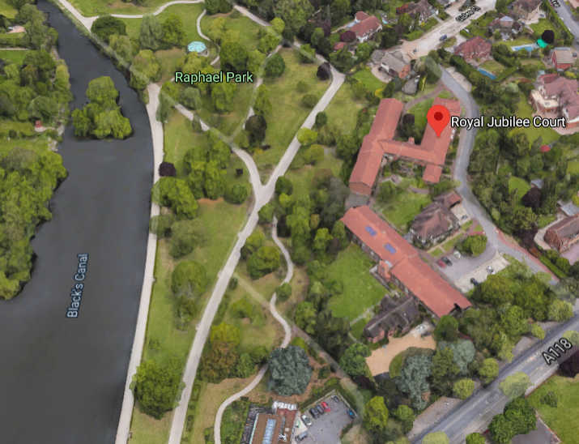

52 homes are under threat of demolition on Havering's Royal Jubilee Court.

The estate has been earmarked for redevelopment as part of Havering's [£1bn joint venture with developer Wates Residential](https://www.wates.co.uk/articles/case-study/borough-of-havering-housing-redevelopment/) which will see 12 of the borough's estates redeveloped.

As of September 2024, Havering's [website](https://www.havering.gov.uk/building-new-homes-havering-1) says that the scheme is under review.

The blocks were originally sheltered housing but are now being used as temporary accommodation for families on Havering's housing waiting list. 

---

<!------------THE CODE BELOW RENDERS THE MAP - DO NOT EDIT! ---------------------------->

---

