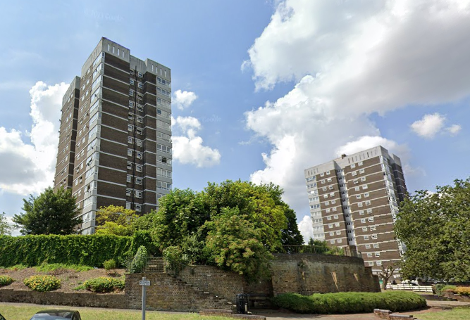

Circa 150 homes on Erith's Saltford Close estate in Belvedere have been earmarked for redevelopment in Bexley's [Local Plan](https://www.bexley.gov.uk/sites/default/files/2023-07/bexley-local-plan-adopted-26-april-2023.pdf) - (site ERI01: 'Erith Western Gateway'). 

The estate is relatively small, comprising around a dozen 4-storey blocks of maisonettes plus two 14-storey tower blocks and is situated within close proximity of Erith Town Centre.

The estate is owned by Orbit Housing Association, which was the recipient of Bexley's stock transfer deal circa 2003. Orbit has recently demolished its nearby Arthur Street estate and also Larner Road estates, now re-branded as Erith Park. 

A masterplan for the redevelopment of the estate and Erith Town Centre is yet to be drawn up.

---

<!------------THE CODE BELOW RENDERS THE MAP - DO NOT EDIT! ---------------------------->

---
