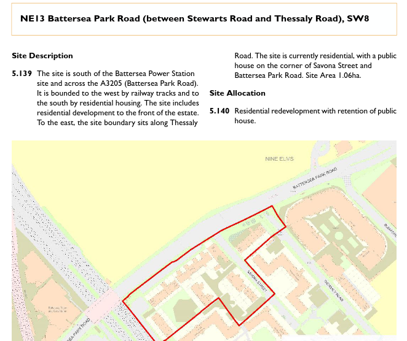

Circa 130 homes have been earmarked for redevelopment in Wandsworth's 2023 [Local Plan](https://www.wandsworth.gov.uk/media/large/adopted_local_plan.pdf)

The blocks situated on Battersea Park road, opposite Batterea Power Station, have been identified as suitable for potential redevelopment with tall buildings up to 13 storeys.

---

<!------------THE CODE BELOW RENDERS THE MAP - DO NOT EDIT! ---------------------------->

---

![Savona estate image](src/images/savona1.jpg", "Savona estate" %}
