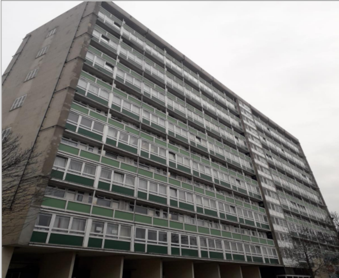

180 council homes are earmarked for demolition on the Sceaux Gardens estate in Peckham. These comprise the Racine and Florian blocks as well as the Marie Curie house block.

Marie Curie House's sister block Lakanal House, was refurbished following the deadly 2009 fire which claimed the lives of six of its residents.

Southwark began emptying Marie Curie House in Spring 2025, when it was discovered that the block had failed fire safety tests.

An October 2025, [council report](https://moderngov.southwark.gov.uk/documents/s129363/Report%20Marie%20Curie%20-%20Recommendation%20to%20demolish%20subject%20to%20Cabinet%20Decision%20in%20December%202025.pdf) on Marie Curie House, revealed that whilst Southwark Council could carry out the necessary remedial works, it would _“still be required to undertake ongoing monitoring and maintenance to ensure the block does not fall into an 'intolerable' condition”_.

The report recommends the full redevelopment of the block on the basis that the costs to retrofit and refurbish the high-rise could total up to £23 million. 

A final decision is due to be taken in December 2025.

---

<!------------THE CODE BELOW RENDERS THE MAP - DO NOT EDIT! ---------------------------->

---
