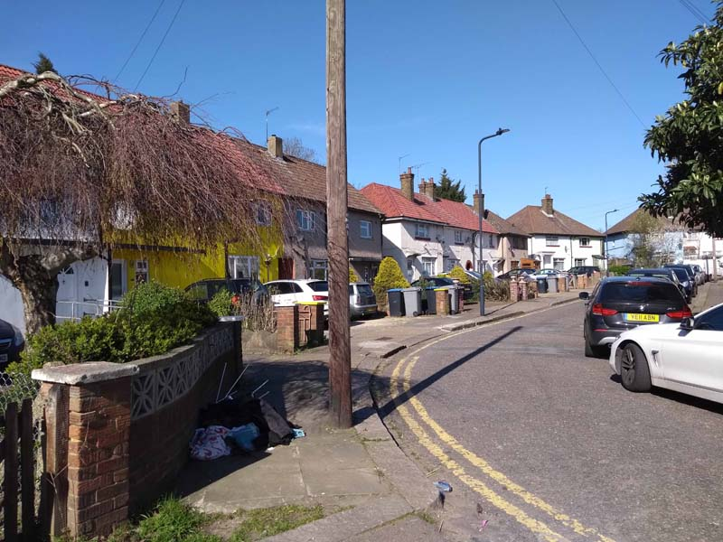

Circa 50 homes on Severn Way Crescent in Brent are under threat of demolition.

The crescent comprises two dozen post-war terraced Council homes which have been earmarked for redevelopment under the NEASDEN STATIONS GROWTH AREA development site in Brent's [Local plan.](https://www.brent.gov.uk/media/16411848/draft-local-plan-east.pdf)

---

<!------------THE CODE BELOW RENDERS THE MAP - DO NOT EDIT! ---------------------------->

---
