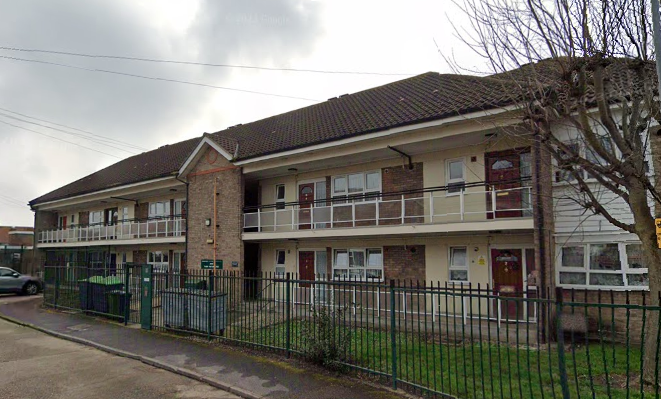
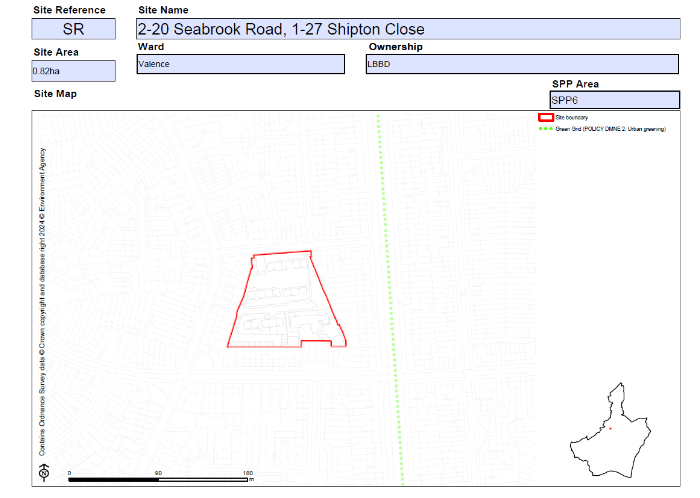

Circa 60 council homes have been earmarked for potential redevelopment on the Shipton Close estate in Dagenham.

The estate has been identified in LBBD's new [Local Plan](https://www.lbbd.gov.uk/sites/default/files/2024-10/Barking%20and%20Dagenham%20Local%20Plan%202037%20Appendix%202%20Site%20Allocation%20Proformas.pdf) as a potential site for redevelopment with capacity for 831 new homes (see site XE):

Like most of the borough's other estate renewal schemes, it is likely to be progressed by the Council in conjunction with its subsidiary affordable housing company [Reside](https://www.lbbd.gov.uk/affordable-rents-reside-housing) which provides intermediate rented housing _"to people who are in employment, but can’t afford to buy or rent privately and have limited access to social housing"_

---

<!------------THE CODE BELOW RENDERS THE MAP - DO NOT EDIT! ---------------------------->

