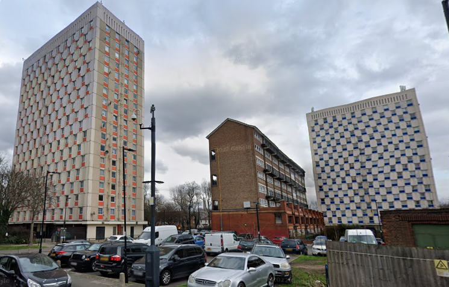
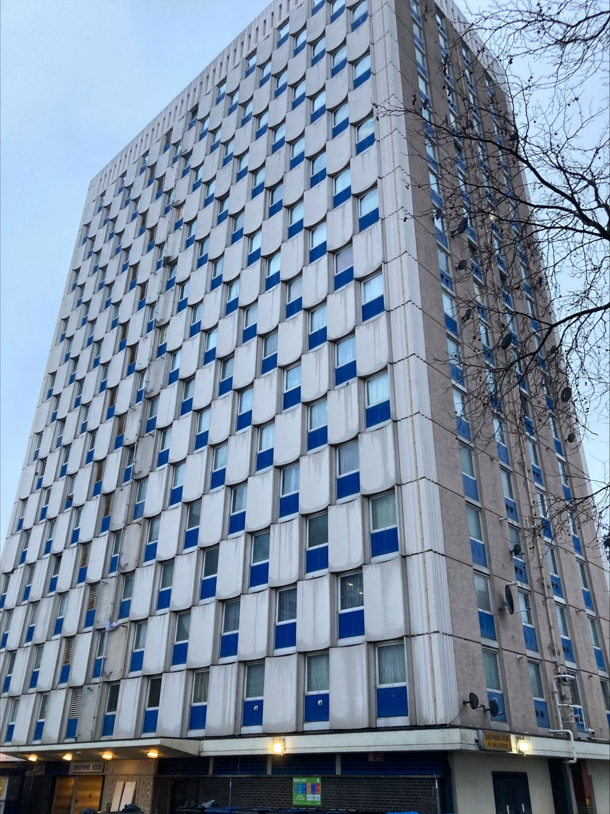

Circa 200 homes are earmarked for potential demolition on Enfield's Shires estate in Edmonton.

Two 18 storey blocks (Shropshire House and Cheshire House) have been earmarked for potential redevelopment by Enfield Council.

Enfield Council says: _“A hugely expensive and massively disruptive repairs programme - to the tune of £53 million - would be required to bring these blocks up to standard in the short term .. A decision on how to move forward will be made by the Summer of 2023."_

In February 2025, the Enfield Dispatch [reported](https://enfielddispatch.co.uk/final-council-tenants-set-to-leave-unsafe-edmonton-tower-blocks/) that the final three tenants were due to move out within the following month and that eighteen leaseholders remain in the towers. 

---

__Links:__  
[https://www.enfield.gov.uk/news-and-events/2023/02/the-future-of-cheshire-house-and-shropshire-house](https://www.enfield.gov.uk/news-and-events/2023/02/the-future-of-cheshire-house-and-shropshire-house)

---

<!------------THE CODE BELOW RENDERS THE MAP - DO NOT EDIT! ---------------------------->

---

