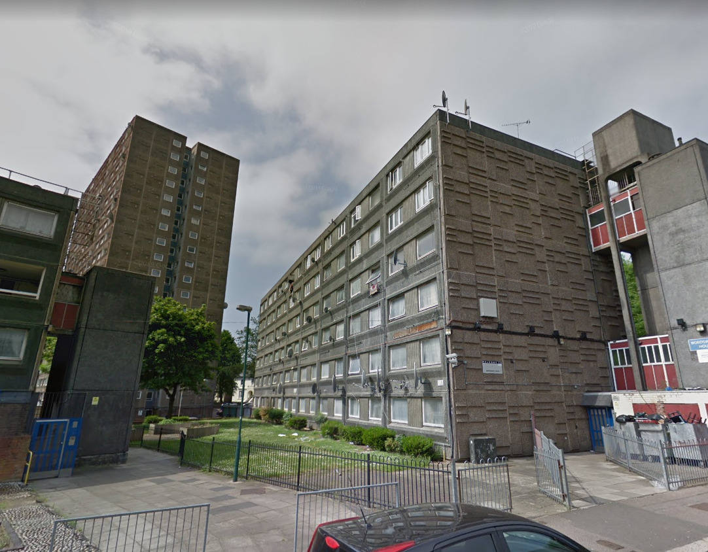
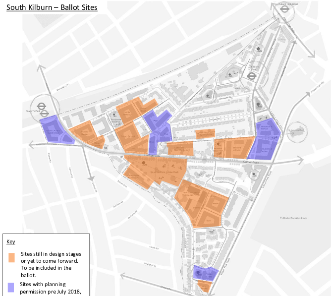

Circa 800 homes remain under threat of demolition at Brent's redevelopment of the South Kilburn estate.

The redevelopment of the current proposals for the South Kilburn estate are based on the [2017 approved masterplan.](https://www.brent.gov.uk/your-community/regeneration/south-kilburn-regeneration/the-development-process/masterplan-and-programme?tab=southkilburnsupplementaryplanningdocument2017). 

The first phase of the scheme has seen four sites (marked in blue below) granted planning permission and which are currently underway. As of July 2019 there remained 17 blocks in the second half of the scheme earmarked for demolition (shaded orange), but these are yet to seek planning consent  - see [this Cabinet report](http://democracy.brent.gov.uk/ieListDocuments.aspx?CId=455&MId=5355&Ver=4), item 7.

A ballot of residents in the second phase of the scheme returned a positive result [in Oct 2019](https://www.kilburntimes.co.uk/news/south-kilburn-votes-yes-1-6331125).

There are no publicly available section 106 agreements for the consented phases so it is impossible to confirm whether the replacement 'social' housing will be social rent or affordable rent (up to 80% market rent).

It is also a breach of the legal “principle of equivalence” which says that persons affected by compulsory purchase should be no worse off in financial terms after the acquisition. 

UCL Bartlett's [Dr Pablo Sendra](https://www.ucl.ac.uk/bartlett/planning/dr-pablo-sendra-fernandez) is currently working with residents on the estate to create an alternative community-led plan, which satisfies the Council's regeneration objectives while retaining the estate's existing buildings.

You can read a summary of the plan [here](/images/cpbrochure.pdf) or the full report [here](/images/cpfullreport.pdf).

There is also a presentation of the plans by Dr Sendra online here: 

<iframe width="560" height="315" src="https://www.youtube.com/embed/I8YKW0fIqfM" frameborder="0" allow="accelerometer; autoplay; clipboard-write; encrypted-media; gyroscope; picture-in-picture" allowfullscreen></iframe>

In february 2022, the Guardian published a [detailed critique](https://www.theguardian.com/artanddesign/2022/feb/22/mellow-yellow-south-kilburn-feelgood-buttery-brick-revived-1960s-estate) of the scheme.

In March 2024, the BBC published an article about the decanted estate being left in a state of severe decay: <https://www.bbc.co.uk/news/uk-england-london-68440067>

In January 2024, Leslie Barson of Granville Community Kitchen in South Kilburn, a long-time community activist, spoke at the 'Unravelling Regeneration - Stories of a Community' Metroland Exhibition.

She gave a first-hand account of the impact of regeneration on the lives of local people and on the community resources that have supported them over the years:

<iframe width="560" height="315" src="https://www.youtube.com/embed/PnYoYygSVGg?si=mDRylrCAWZE9wFtO" title="YouTube video player" frameborder="0" allow="accelerometer; autoplay; clipboard-write; encrypted-media; gyroscope; picture-in-picture; web-share" referrerpolicy="strict-origin-when-cross-origin" allowfullscreen></iframe>

<!------------THE CODE BELOW RENDERS THE MAP - DO NOT EDIT! ---------------------------->

---
