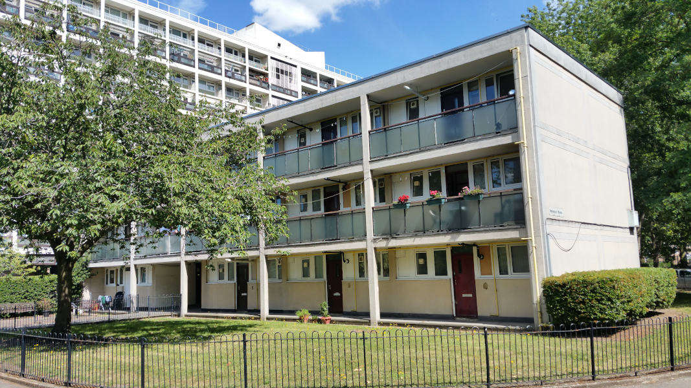
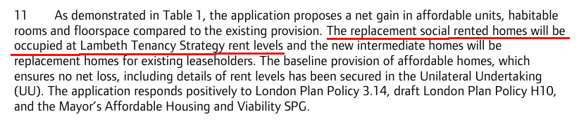
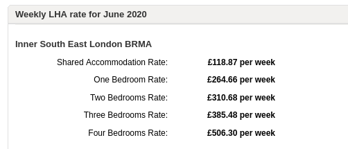
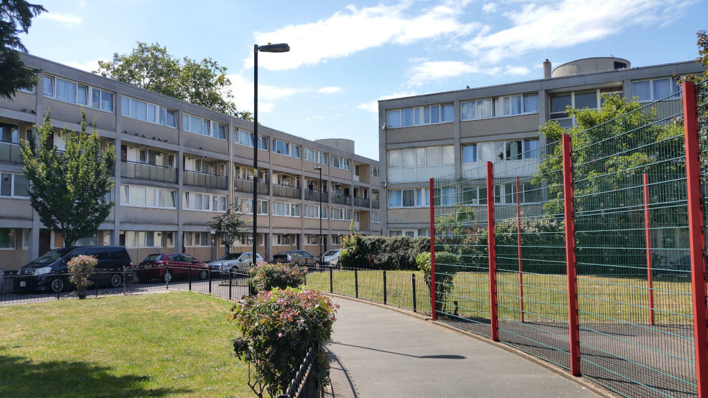
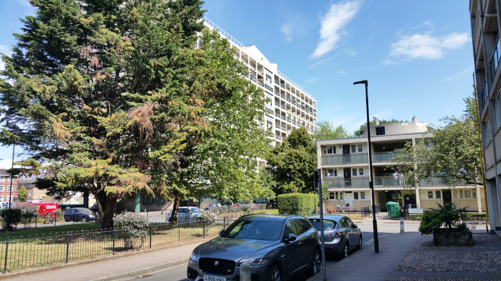
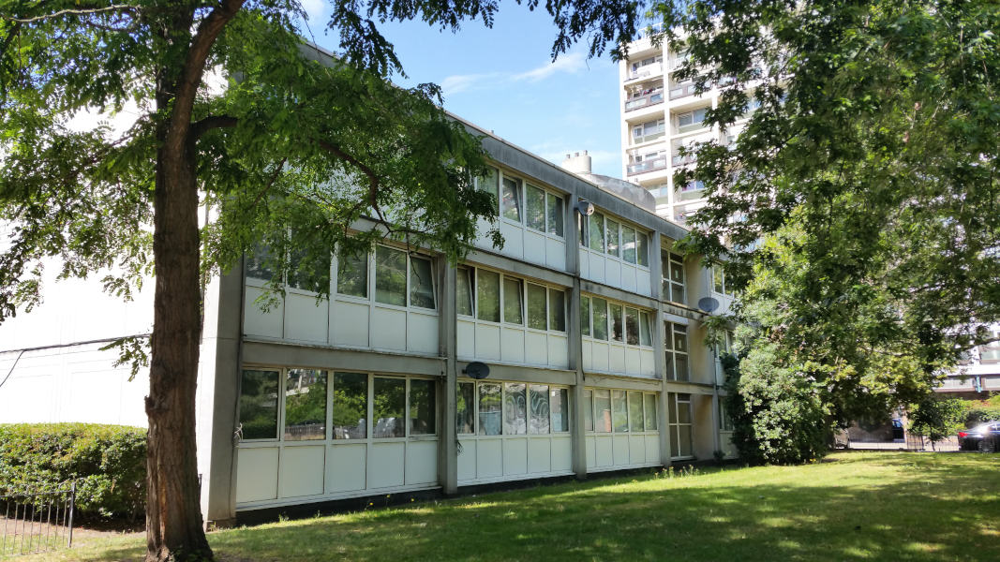
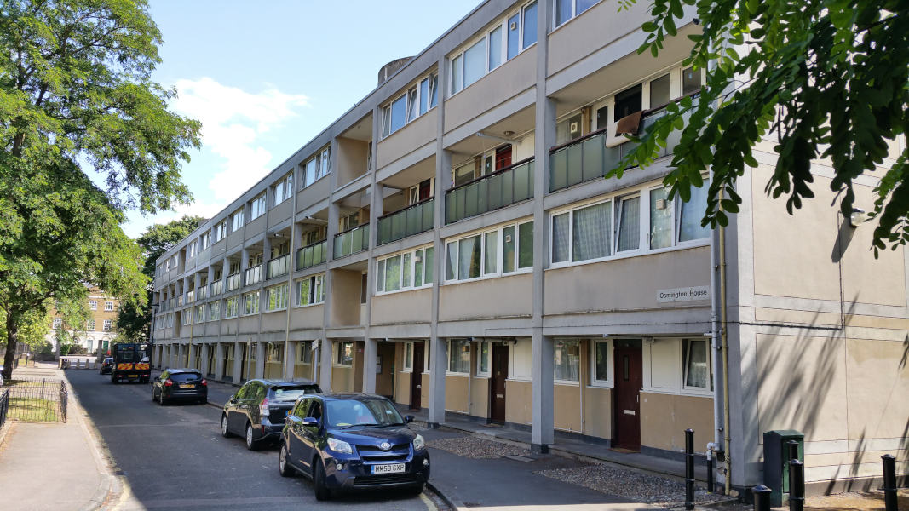

101 homes are earmarked for demolition on Lambeth's South Lambeth estate.

South Lambeth Estate is located on the north-western side of Clapham Road, between Stockwell and Oval underground stations. It is a 2.26 hectare site and comprises six blocks in local authority ownership. The existing estate is comprised of 205 residential units and four retail units. The majority of residents are social housing tenants, although 63 of the dwellings on the estate are owned/occupied by leaseholders.

Lambeth proposes to demolish all homes on the estate with the exception of the high-rise block (Wimborne House) and replace them with 332 new homes of which 42% 'affordable', with the assistance of GLA grant funding.

Planning permission for the redevelopment was granted in March 2018 and the Mayor subsequently granted an [exemption](https://www.london.gov.uk/sites/default/files/list_of_exemptions_-_27_november_2020.pdf) from his requirement to ballot residents on the demolition of their homes. 

The [Mayor's report](https://www.london.gov.uk/sites/default/files/public%3A//public%3A//PAWS/media_id_469672///south_lambeth_estate_report.pdf) approving the scheme says that _"The replacement social rented homes will be occupied at Lambeth Tenancy Strategy rent levels"_.

Lambeth's [Tenancy Strategy](https://www.lambeth.gov.uk/sites/default/files/ho-tenancy-strategy.pdf) says that family homes (3 beds+) must be let at target rents but 1 and 2-bed homes can be let at affordable rent up to local LHA rate levels. [LHA rates](https://lha-direct.voa.gov.uk/SearchResults.aspx?LocalAuthorityId=22&LHACategory=999&Month=6&Year=2020&SearchPageParameters=true) for Lambeth are currently as follows:

In November 2020, residents [complained](https://www.wandsworthguardian.co.uk/news/19119129.south-lambeth-estate-residents-suffering-constant-works/) about ongoing disturbance from demolition works on the first phase of the scheme.

---

__Links:__

[VOA website with LHA rates for Lambeth](https://lha-direct.voa.gov.uk/SearchResults.aspx?LocalAuthorityId=22&LHACategory=999&Month=6&Year=2020&SearchPageParameters=true)

The Mayor's [Stage 1 and Stage 2 reports](https://www.london.gov.uk/sites/default/files/public%3A//public%3A//PAWS/media_id_469672///south_lambeth_estate_report.pdf)

<!------------THE CODE BELOW RENDERS THE MAP - DO NOT EDIT! ---------------------------->

---

 
  
  
  

---

