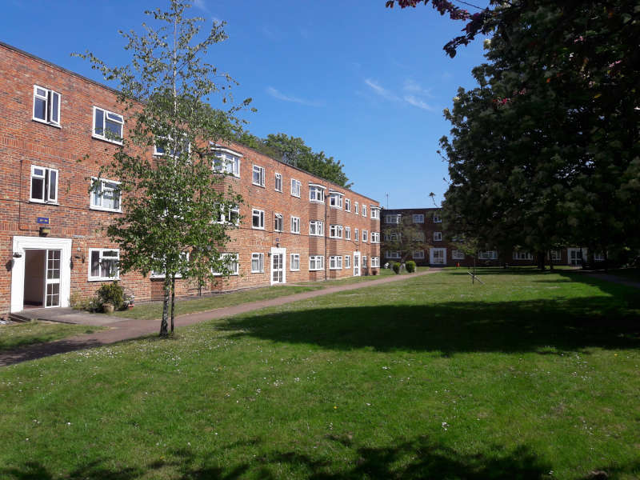
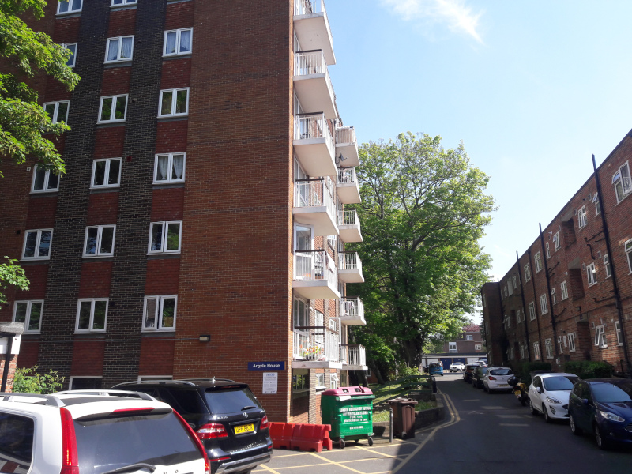
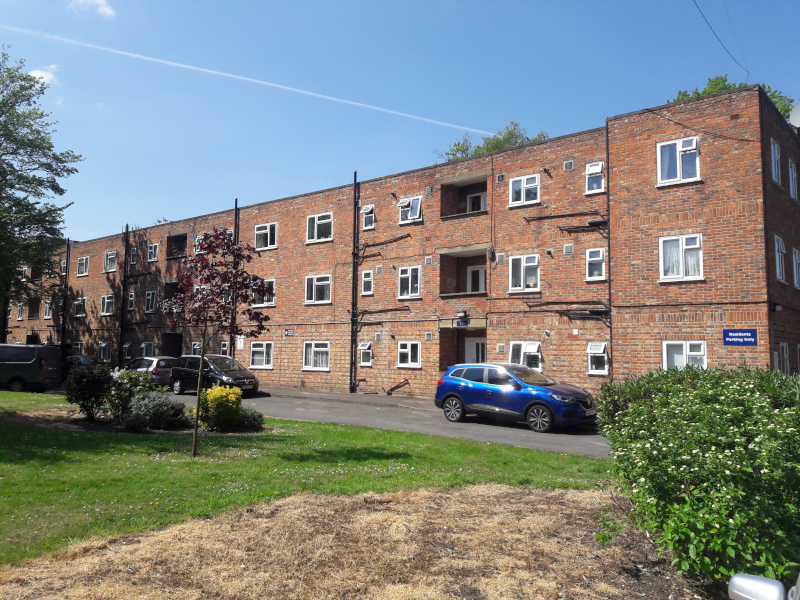
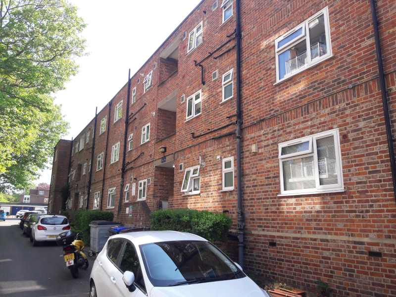
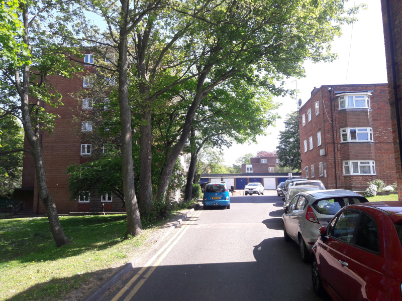
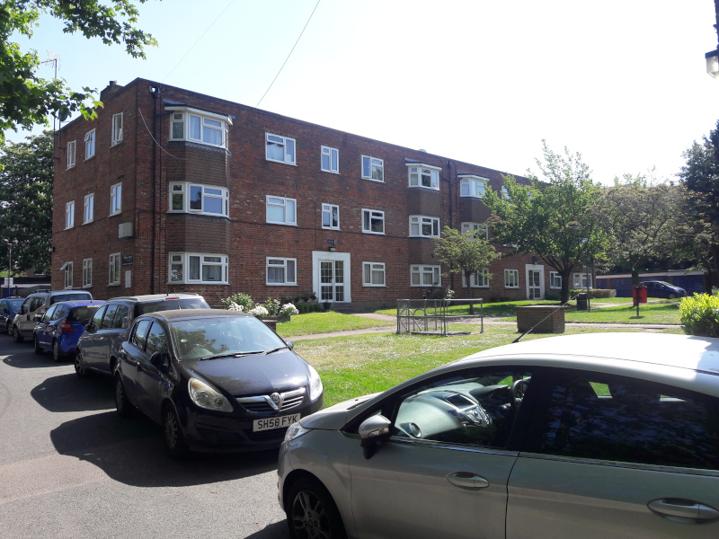
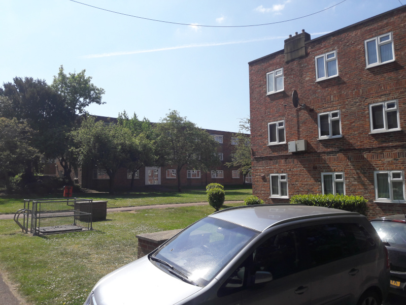
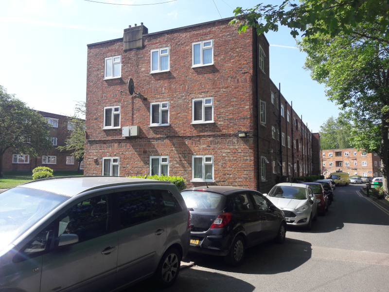

Circa 150 homes have been earmarked for potential demolition at the Sutton Court estate.

The Sutton Court estate is one of seven estates listed in [Sutton's Local Plan (2018)](https://drive.google.com/file/d/1MdX6GlaHDoBdG6CTsvjFaIuPtIa9id5O/view) for potential redevelopment:

It is also earmarked in Sutton's [Policy Map](http://sutton.addresscafe.com/app/exploreit/) as a potential renewal area:

The estate is close to the train station and comprises six 3-storey blocks and two 7-storey blocks of flats set around generous areas of green space, trees and a games court. 

The estate remains identified in Sutton's [draft 2024 Local Plan](https://www.sutton.gov.uk/documents/d/guest/local-plan-issues-and-preferred-options-2024-) as a site for redevelopment.

---

<!------------THE CODE BELOW RENDERS THE MAP - DO NOT EDIT! ---------------------------->

---
 
  
  
  
  
  
  
  

