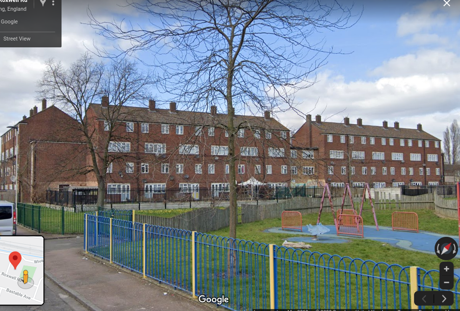
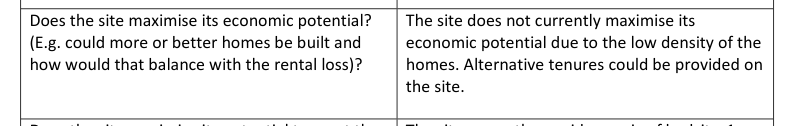

Circa 100 homes on Barking's Thames View estate have been earmarked for demolition by Barking and Dagenham Council.

Barking and Dagenham's [options appraisal report](https://modgov.lbbd.gov.uk/internet/documents/s87069/Estate%20Renewal%20Programme%20Report%20-%20App.%201%20Options%20Appraisal.pdf) claims that the homes on this site require decent homes works (at £10k per dwelling) and they don't maximise their economic potential.

The scheme is being progressed by the Council in conjunction with its subsidiary affordable housing company [Reside](https://www.lbbd.gov.uk/affordable-rents-reside-housing) which provides intermediate rented housing _"to people who are in employment, but can’t afford to buy or rent privately and have limited access to social housing"_

The Council says that tenants wanting to return to the redeveloped site will pay 'social' rents and that the 5 current leaseholders will have the 'Right to Return' to the redeveloped site. But its [rehousing policy](https://modgov.lbbd.gov.uk/Internet/documents/s131918/Estate%20Renewal%20Report.pdf) provides little detail on how this works in practice - it offers an 'equity loan' scheme but it is discretionary and dependent upon the size of the gap between the value of leaseholders' current homes and the new ones proposed to be built. (para 2.9) 

---

<!------------THE CODE BELOW RENDERS THE MAP - DO NOT EDIT! ---------------------------->

