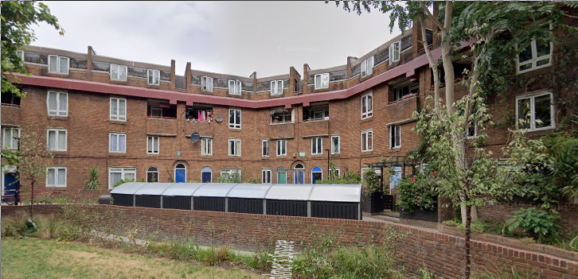
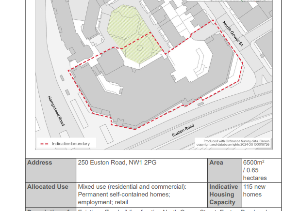
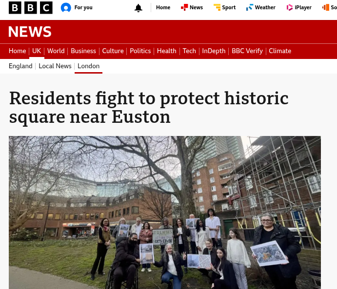

Circa 50 council homes have been earmarked for potential redevelopment on the Tolmers Square estate near Euston.

Part of the estate has been identified in Camden's [Euston Area Plan](https://consultations.wearecamden.org/supporting-communities/eap-update/user_uploads/eap_2026-version_130126-1.pdf) as a potential site for redevelopment.

Residents have launched a campaign to oppose demolition according to an [article](https://www.bbc.co.uk/news/articles/cq8g3zyj92go) by the BBC:

---

<!------------THE CODE BELOW RENDERS THE MAP - DO NOT EDIT! ---------------------------->

---