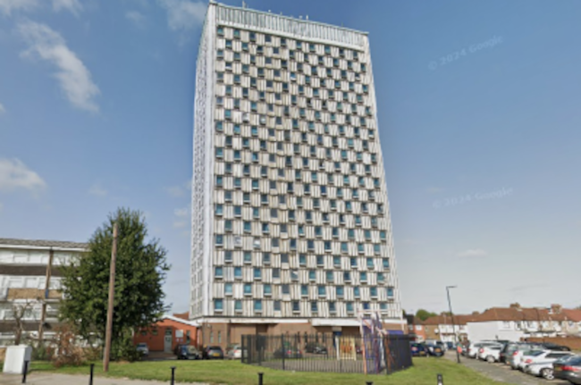

126 council homes are under threat of demolition at Walbrook House in Enfield.

An April 2023 [council report](https://governance.enfield.gov.uk/documents/s97590/HRD2324_007%20Walbrook%20House%20Part%201%20-%2018%20April%2023.pdf) claims that the block requires refurbishment to meet decent homes standard.

The cost of this refurbishment was originally estimated as £14m in 2020 but the report explains that because of external factors this estimate has now risen to £30m. 

The report refers to an options appraisal assessment undertaken by Savills, which summarises that _"refurbishment of the tower to re-let at social rent tenure ... is unviable particularly when compared to the other options."_. This led to [reports](https://enfielddispatch.co.uk/social-housing-block-set-to-be-sold-for-redevelopment-as-refurb-costs-soar/) in 2023 that the council planned to sell the tower for private development, citing spiralling redevelopment costs. 

In February 2025, Enfield council [announced](https://www.enfield.gov.uk/news-and-events/2025/02/relocation-of-walbrook-house-tenants-completes) that the decantment of council tenants from Walbrook House was complete, while it is [reported](https://enfielddispatch.co.uk/final-council-tenants-set-to-leave-unsafe-edmonton-tower-blocks/) that six remaining leaseholders are still living in the building.

As part of their announcement in February 2025, the council once again stated that the escalating costs of construction, compounded by ‘years of underfunding from previous governments’, have rendered the costs of refurbishment unjustifiable. They stated that the council will continue to lobby for refurbishment funding; however, should this not be forthcoming, they will consider a potential disposal of Walbrook House. 

In January 2025, the BBC published an [article](http://bbc.co.uk/articles/ce8n8kjgzxjo) on the mistreatment of leaseholders at Walbrook House, who feel they were not informed about the structural issues relating to the tower. The council is now in the process of buying out the remaining leaseholders in the building. 

---

__Links:__

April 2023 [council report](https://governance.enfield.gov.uk/documents/s97590/HRD2324_007%20Walbrook%20House%20Part%201%20-%2018%20April%2023.pdf)

---

<!------------THE CODE BELOW RENDERS THE MAP - DO NOT EDIT! ---------------------------->

---

