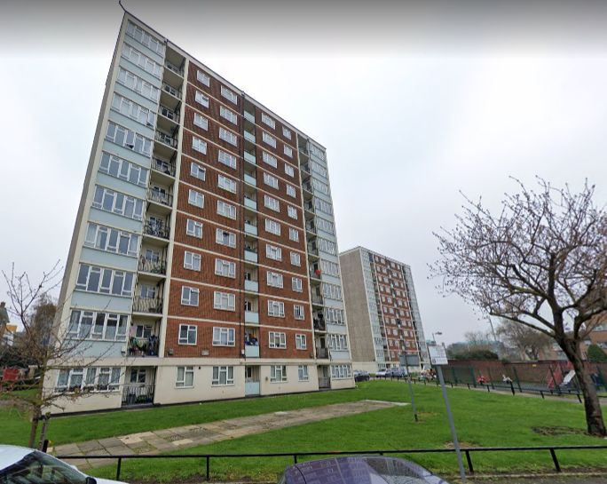
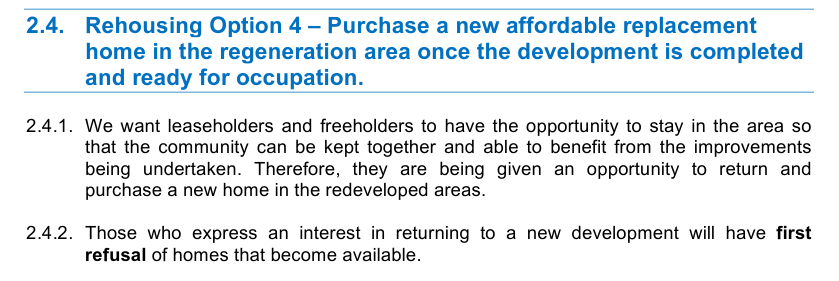

290 homes are under threat of demolition on Havering's Waterloo road and Queen's street estate in Romford.

The estate is situated between Romford Town Centre and lies just a third of a mile away from the site of the new Crossrail station.

It has been earmarked for redevelopment as part of Havering's [£1bn joint venture with developer Wates Residential](https://www.wates.co.uk/articles/case-study/borough-of-havering-housing-redevelopment/) which will see 12 of the borough's estates redeveloped.

In June 2021, Havering's planning committee narrowly approved plans for the estate's redevelopment allowing the demolition of the estate's 343 existing homes and replacement with 1,400 new homes. Despite quadrupling the density of the site only 212 of the new homes will be social rented tenure.

The [committee report](https://democracy.havering.gov.uk/documents/s52710/SPC%20-%20Final%20-%20Waterloo%20Committee%20Report%20-%20John%20K.pdf) for the application claims that this is a net increase of 41 social rented homes because only 171 homes on the estate were council rent, but it fails to take into account the 31 sheltered housing units 12 council-owned residential units in a hostel on the estate.

The application also secures 197 homes at affordable rent and 147 shared ownership, while the remaining 844 homes will all be private market tenure.

The scheme is being [funded](https://www.london.gov.uk/programmes-strategies/housing-and-land/homes-londoners/estate-regeneration/estate-regeneration-data) by the Mayor and has been exempted from his [requirement](/approved/ballotexemptions) to ballot residents on the demolition of their homes.

The Financial Viability Assessment submitted for the scheme shows that the Mayor is providing £18.5m grant funding to the Council and its development partner for the redevelopment of the estate. It also states that Havering Council has spent over £15m decanting the estate (para 7.15).

Havering's [re-housing offer](https://www.havering.gov.uk/download/downloads/id/1877/information_for_property_owners.pdf) for leaseholders displaced by their schemes is by far one of the poorest in comparison with other London boroughs.

It makes no provision for the gap between the value leaesholders receive for their current homes and the cost of the replacement new-builds. It simply gives them 'first refusal' on the purchase of a new home - if they can afford it!

The [re-housing offer](https://www.havering.gov.uk/download/downloads/id/1851/local_lettings_plan.pdf) for tenants is not much better. There is no guarantee of a tenancy in one of the replacement social/affordable homes or a right to return. The only guarantee is two direct offers of a tenancy in a home on an estate elsewhere in the borough, albeit selected by the Council.

The Waterloo road scheme is a good example of how the offer to residents on estates exempted by the Mayor from his ballot requirement, is inferior to those subject to ballots. It is difficult to believe that, had they been asked, residents of the Waterloo Road estate would have voted for demolition based on Havering's poor re-housing offer to residents. 

---

<!------------THE CODE BELOW RENDERS THE MAP - DO NOT EDIT! ---------------------------->

---
