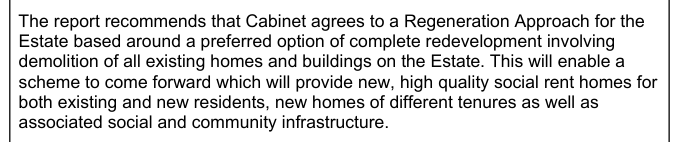
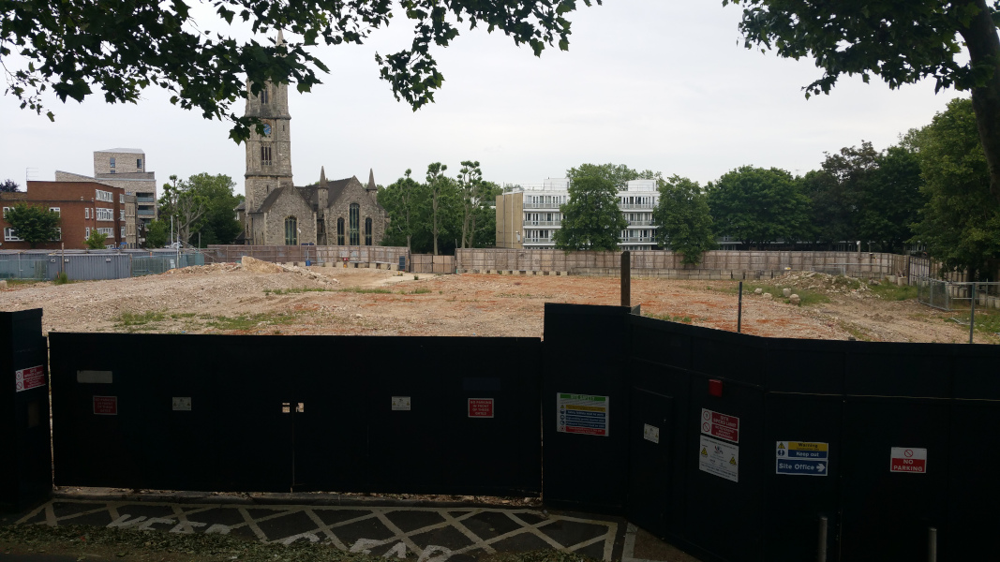
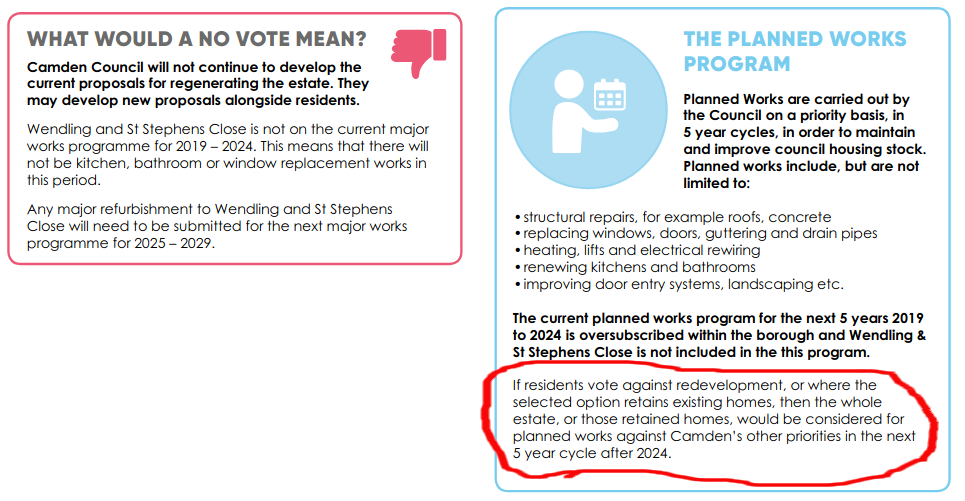
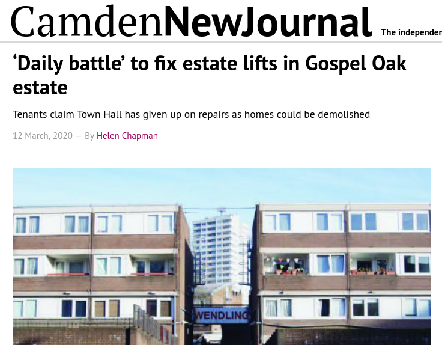

241 homes plus a health centre and nursery on Camden's Wendling estate have been [earmarked for demolition](https://www.camden.gov.uk/wendling-estate-and-st-stephens-close) in a 2019 options appraisal.  

In July 2019, the Council's Cabinet [decided](http://democracy.camden.gov.uk/documents/s81826/12%20The%20Future%20of%20Wendling%20Estate.pdf) that its preferred option is full redevelopment and resolved to ballot residents on this option.

The decision was the cause of some unrest among residents, reported in the local press (April 2020): 
[http://camdennewjournal.com/article/tenants-pass-vote-of-no-confidence-in-camdens-regeneration-chief](http://camdennewjournal.com/article/tenants-pass-vote-of-no-confidence-in-camdens-regeneration-chief)

The Wendling estate overlooks the site of the former Bacton estate where Camden resolved to demolish 100 council homes over 10 years ago. 67 new private and 'affordable' homes were completed on the adjacent 'phase 1' of that scheme in 2015 but in 2021 the main plot of the former estate remains an empty building site. 

<figure class="figure">

<figcaption class="figure-caption text-right">Wendling overlooks the site of the former Bacton low-rise estate</figcaption>
</figure>

In July 2021, Camden held a ballot of Wendling estate residents in which 75% of eligible residents voted in favour of redevelopment on a 72% turn out.

Camden's [Landlord Offer](/images/wendlingoffer.pdf) ahead of the ballot makes it clear that if residents vote against demolition the Council has no immediate plans to resolve the estate's ongoing maintenance issues. As has become [common practice](https://www.estatewatch.london/approved/ballotexemptions/) in estate regeneration ballots - refurbishment is not an option on the ballot paper.

Camden's pre-ballot information [booklets](src/images/wendlingbooklet.pdf) go as far as saying that if residents voted against demolition, then it would be 2025 before the Council would 'consider' resuming cyclical maintenance works and that they would be _'considered against Camden's other priorities'_ at that time.

<figure class="figure">

<figcaption class="figure-caption text-right">Extracts from Camden's <a href="src/images/wendlingbooklet.pdf">information booklets</a> about the scheme.</figcaption>
</figure>

Residents have long since been reporting issues concerning the lack of maintenance on the estate, with the TRA [claiming](http://camdennewjournal.com/article/daily-battle-to-fix-estate-lifts-in-gospel-oak-estate) that the Council has given up on basic maintenance and repairs because the estate is earmarked for redevelopment:

<figure class="figure">

<figcaption class="figure-caption text-right">Article in the <a href="http://camdennewjournal.com/article/daily-battle-to-fix-estate-lifts-in-gospel-oak-estate">Camden New Journal</a> March 2020.</figcaption>
</figure>

---

__Links:__  
Camden Council's website: [https://www.camden.gov.uk/wendling-estate-and-st-stephens-close](hhttps://www.camden.gov.uk/wendling-estate-and-st-stephens-close)

Camden's [Landlord Offer](/images/wendlingoffer.pdf)

Camden New Journal article (March 2020) - [http://camdennewjournal.com/article/daily-battle-to-fix-estate-lifts-in-gospel-oak-estate](http://camdennewjournal.com/article/daily-battle-to-fix-estate-lifts-in-gospel-oak-estate)

---

<!------------THE CODE BELOW RENDERS THE MAP - DO NOT EDIT! ---------------------------->

---
