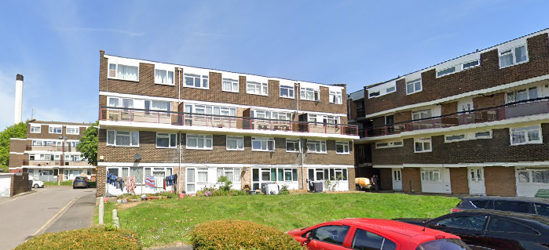
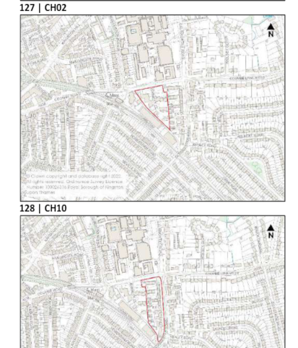

Circa 120 homes have been earmarked for demolition in Kingston's 2023 [Strategic Housing Land Availability Assessment (SHLAA)](https://www.kingston.gov.uk/downloads/file/2187/strategic-housing-land-availability-assessment) at the Wessex Close estate.

The estate has been identified along with neighbouring Jemmet Close as a potential site (CH10 & CH02) for redevelopment and provision of increased density housing given its strategic location next to Norbiton train station.

---

<!------------THE CODE BELOW RENDERS THE MAP - DO NOT EDIT! ---------------------------->

---